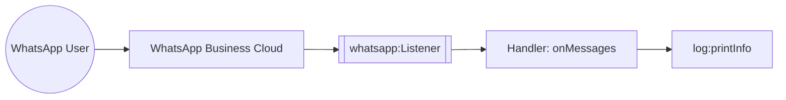

import ThemedImage from '@theme/ThemedImage';
import useBaseUrl from '@docusaurus/useBaseUrl';

# Example

## WhatsApp Business Trigger Example

### What you'll build

This integration reacts to WhatsApp Business Cloud webhook events. When a customer sends a WhatsApp message, the `whatsapp:Listener` receives the webhook and routes it to the `onMessages` handler in your `whatsapp:WhatsAppService`. The handler logs each inbound message or status update.

### Architecture



### Prerequisites

- A Meta app with the WhatsApp product added, and a webhook configured to point at your listener's public URL. See the [Setup Guide](setup-guide.md).

### Setting up the WhatsApp Business integration

> **New to WSO2 Integrator?** Follow the [Create a New Integration](../../../../develop/create-integrations/create-a-new-integration.md) guide to set up your integration first, then return here to add the trigger.

### Adding the WhatsApp Business trigger

Add a WhatsApp Business event integration and implement the listener and service as described in the [WhatsApp Business event integration guide](../../../../develop/integration-artifacts/event/whatsapp-business.md). WSO2 Integrator renders the listener and service on the design canvas, with all available handlers listed under **Event Handlers**.

<ThemedImage
    alt="WSO2 Integrator design canvas showing the whatsappListener connected to WhatsAppService with onMessages and onAccountUpdate handlers"
    sources={{
        light: useBaseUrl('/img/connectors/catalog/communication/whatsapp-business/integration-overview.png'),
        dark: useBaseUrl('/img/connectors/catalog/communication/whatsapp-business/integration-overview.png'),
    }}
/>

Select **whatsapp:WhatsAppService** in the design canvas to open the Service Designer, which lists every pre-registered event handler bound to the `whatsappListener`.

<ThemedImage
    alt="WhatsApp Business Service Designer listing onMessages, onAccountUpdate, onMessageTemplateStatusUpdate, onSecurity, and onError handlers"
    sources={{
        light: useBaseUrl('/img/connectors/catalog/communication/whatsapp-business/service-designer.png'),
        dark: useBaseUrl('/img/connectors/catalog/communication/whatsapp-business/service-designer.png'),
    }}
/>

### Handling WhatsApp Business events

Select the **onMessages** row to open its flow canvas, then narrow the notification with an **If** step (`notification is whatsapp:Messages`) and add a **Foreach** step over the inbound messages or status updates to log each one:

```ballerina
remote function onMessages(whatsapp:MessagesNotification notification) returns error? {
    if notification is whatsapp:Messages {
        foreach whatsapp:InboundMessage message in notification.messages {
            log:printInfo("Inbound WhatsApp message received", sender = message.'from, messageId = message.messageId);
        }
    } else {
        foreach whatsapp:MessageStatusUpdate statusUpdate in notification.statuses {
            log:printInfo("WhatsApp message status update", messageId = statusUpdate.messageId, status = statusUpdate.status);
        }
    }
}
```

### Running the integration

Run the integration from WSO2 Integrator, then send a test message to your WhatsApp Business number. Meta delivers the webhook to your listener, which invokes `onMessages` and logs the inbound message. Verify the log entry in the WSO2 Integrator console output.

## What's next

- [Action Reference](actions.md): send messages, templates, and manage media using the `Client`.
- [Trigger Reference](triggers.md): full listener configuration and service callback reference.
- [Setup Guide](setup-guide.md): create a Meta app and configure the webhook.
