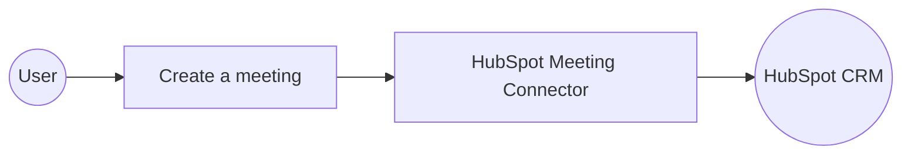

# Example

## What you'll build

Build a WSO2 Integrator automation that creates a HubSpot meeting engagement and logs the response. The integration connects to the HubSpot CRM Engagements API using a private app token and calls the create meeting operation.

**Operations used:**
- **Create a meeting** : Creates a new meeting engagement in HubSpot CRM and returns the created meeting object

## Architecture

## Prerequisites

- A HubSpot account with a private app token that has CRM Engagements > Meetings read/write scope

## Setting up the HubSpot meeting integration

> **New to WSO2 Integrator?** Follow the [Create a New Integration](../../../../develop/create-integrations/create-new-integration.md) guide to set up your integration first, then return here to add the connector.

## Adding the HubSpot meeting connector

Select **Add Artifact → Connection** from the Integration Overview canvas to open the **Add Connection** palette.

### Step 1: Search for and select the HubSpot meeting connector

1. Enter `hubspot.crm.engagement.meeting` in the search box.
2. Select the **Meeting** connector card (`ballerinax/hubspot.crm.engagement.meeting`) to open the **Configure Meeting** form.

## Configuring the HubSpot meeting connection

### Step 2: Bind connection parameters to configurable variables

Bind the connection fields to a configurable variable so credentials aren't hardcoded:

1. In the **Config*** field, select the **Expression** toggle.
2. Select the pencil icon to the right of the expression textbox to open the helper panel.
3. Select the **Configurables** tab and select **+ New Configurable**.
4. Enter `hubspotToken` as the variable name, set the type to `string`, and leave the default value empty.
5. Select **Save** to inject `hubspotToken` into the expression.
6. Clear the **Config*** textbox and enter `{auth: {token: hubspotToken}}`.
7. Confirm **Connection Name** reads `meetingClient`.

- **Config*** : The connection configuration record containing the HubSpot private app token
- **Connection Name*** : The identifier used to reference this connection in the automation

### Step 3: Save the connection

Select **Save Connection** to persist the connection. The `meetingClient` connection now appears on the canvas.

### Step 4: Set actual values for your configurables

1. In the left panel, select **Configurations**.
2. Set a value for each configurable listed below.

- **hubspotToken** (string) : Your HubSpot private app token with CRM Engagements > Meetings read/write scope

## Configuring the HubSpot meeting create a meeting operation

### Step 5: Add an Automation entry point

1. Select **Add Artifact** from the Integration Overview.
2. Select **Automation** under the Automation section.
3. Select **Create** to scaffold the automation canvas showing **Start** and **Error Handler** nodes.

### Step 6: Select and configure the create a meeting operation

Select the **+** button between the **Start** and **Error Handler** nodes to open the node palette, expand **meetingClient**, and select **Create a meeting**.

Configure the operation fields:

- **Payload*** : The meeting details record including properties such as title and timestamp, and an associations array
- **Result*** : The variable name that stores the returned meeting object

1. Select the **Expression** toggle on the **Payload*** field.
2. Enter `{properties: {"hs_meeting_title": "Test Meeting", "hs_timestamp": "2026-07-28T10:00:00.000Z"}, associations: []}` in the expression textbox.
3. In the **Result*** field, enter `result`.
4. Select **Save**.

## Try it yourself

Try this sample in WSO2 Integration Platform.

[View source on GitHub](https://github.com/wso2/integration-samples/tree/main/connectors/hubspot_crm_engagement_meeting_connector_sample)

## More code examples

The `HubSpot CRM Engagement Meeting` connector provides practical examples illustrating usage in various scenarios. Explore these [examples](https://github.com/ballerina-platform/module-ballerinax-hubspot.crm.engagement.meeting/tree/main/examples), covering the following use cases:

1. [Meeting_batch](https://github.com/ballerina-platform/module-ballerinax-hubspot.crm.engagement.meeting/tree/main/examples/meeting_batch)
2. [Meeting_for_contacts](https://github.com/ballerina-platform/module-ballerinax-hubspot.crm.engagement.meeting/tree/main/examples/meeting_for_contacts)
