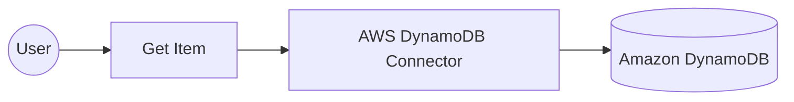

# Example

## What you'll build

Build an automation that reads a single item from an Amazon DynamoDB table by its primary key and logs the result. The integration binds the AWS credentials, region, table name, and item key to configurable variables, so nothing environment-specific is stored in the integration itself.

**Operations used:**
- **Get Item** : Retrieves a single item from a DynamoDB table by its primary key

## Architecture

## Prerequisites

- An active AWS account. If you don't have one, [sign up for a free AWS account](https://aws.amazon.com/free/).
- A DynamoDB table with at least one item, keyed by a simple primary key: a string partition key named `id` and no sort key. To create one, follow the [DynamoDB getting started guide](https://docs.aws.amazon.com/amazondynamodb/latest/developerguide/getting-started-step-1.html), setting the partition key to `id` and leaving the sort key empty. `GetItem` needs the complete primary key, so a table that also has a sort key needs that second attribute added to the key in step 7. If your partition key uses a different name or type, adjust step 7 to match.
- An IAM user with an access key. Grant it `dynamodb:GetItem` on the table you read.

## Setting up the AWS DynamoDB integration

> **New to WSO2 Integrator?** Follow the [Create a New Integration](../../../../develop/create-integrations/create-a-new-integration.md) guide to set up your integration first, then return here to add the connector.

## Adding the AWS DynamoDB connector

### Step 1: Open the connector palette

Select **Add Connection** in the **Connections** section.

### Step 2: Select the AWS DynamoDB connector

1. Enter `aws.dynamodb` in the search field.
2. Select the **DynamoDB** connector card.

## Configuring the AWS DynamoDB connection

### Step 3: Bind the connection parameters to configurable variables

This connector takes its whole connection configuration as a single record. Switch **Config** to **Expression** mode and enter a record that references configurable variables, so no credential is stored in the integration.

- **Config** : The connection configuration. Its `auth` field takes the AWS credentials and its `region` field takes the AWS region

### Step 4: Save the connection

Select **Save Connection** and verify that the connection appears in the **Connections** section.

### Step 5: Set actual values for your configurables

1. Select **Configurations** at the bottom of the project tree under **Data Mappers**.
2. Enter a value for each configurable listed below before you run the integration.

- **accessKeyId** (`string`) : The access key ID of the IAM user that reads the table.
- **secretAccessKey** (`string`) : The secret access key that pairs with the access key ID.
- **region** (`string`) : The AWS region code that hosts the table, such as `us-east-1`.
- **tableName** (`string`) : The name of the DynamoDB table to read from.
- **itemId** (`string`) : The partition key value of the item to retrieve.

> **Warning:** Treat `accessKeyId` and `secretAccessKey` as secrets. Keep them out of source control.

## Configuring the AWS DynamoDB Get Item operation

### Step 6: Add an automation entry point

1. Select **Add Artifact** on the integration design canvas.
2. Select **Automation**.
3. Select **Create** to accept the default settings.

### Step 7: Expand the connection and configure the Get Item operation

1. Select **+** in the automation flow, between **Start** and **Error Handler**.
2. Expand **dynamodbClient** to display its operations.

3. Select **Get Item** and enter its required values.

- **Item Get Input** : The request payload. Switch it to **Expression** mode and supply the table name and the primary key of the item to read
- **Result** : The name of the variable that holds the returned item

The key is a map of attribute names to typed attribute values, so a string partition key named `id` is written as `{"id": {S: itemId}}`. Use `N` instead of `S` for a numeric key.

4. Select **Save**.

### Step 8: Log the Get Item result

Add a **Log Info** action after the operation, and enter a message that reads the returned item from the result variable. The completed flow runs from **Start**, through the operation and the log action, to **Error Handler**.

## Try it yourself

Try this sample in WSO2 Integration Platform.

[View source on GitHub](https://github.com/wso2/integration-samples/tree/main/integrator-default-profile/connectors/aws.dynamodb_connector_sample)

## More code examples

The `aws.dynamodb` connector provides practical examples illustrating usage in various scenarios. Explore these [examples](https://github.com/ballerina-platform/module-ballerinax-aws.dynamodb/tree/main/examples).

1. [Mobile game high scores](https://github.com/ballerina-platform/module-ballerinax-aws.dynamodb/tree/main/examples/game-scores)
   This example shows how to manage a high-score table for a mobile game: creating the table, recording scores, querying the leaderboard, and updating and deleting entries.

2. [Catalog bulk loader](https://github.com/ballerina-platform/module-ballerinax-aws.dynamodb/tree/main/examples/catalog-bulk-load)
   This example shows how to load a product catalog with `writeBatchItems`, read it back with `getBatchItems`, and scan the whole table. It runs on the default credential provider chain, so it works unchanged on EC2, ECS, and EKS.
