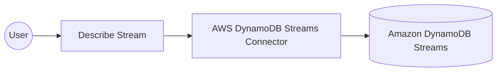

# Example

## What you'll build

This example builds an automation that describes a DynamoDB stream. Describing a stream reports its current status, its shard composition, and the table it belongs to, so it's the call a consumer makes before it starts reading records. The automation logs the returned stream status.

**Operations used:**
- **Describe Stream** : Returns the status, shards, and source table of a DynamoDB stream.

## Architecture

## Prerequisites

- An AWS account with a DynamoDB table that has a stream enabled. The stream's **Latest stream ARN** is the value this example needs.
- An access key ID and secret access key for an IAM identity that's allowed to call `dynamodb:DescribeStream` on that stream.

## Setting up the AWS DynamoDB Streams integration

> **New to WSO2 Integrator?** Follow the [Create a New Integration](../../../../develop/create-integrations/create-a-new-integration.md) guide to set up your integration first, then return here to add the connector.

## Adding the AWS DynamoDB Streams connector

### Step 1: Open the connector palette

Select **Add Connection** in the **Connections** section.

### Step 2: Select the AWS DynamoDB Streams connector

1. Enter `aws.dynamodbstreams` in the search field.
2. Select the **Dynamodbstreams** connector card.

## Configuring the AWS DynamoDB Streams connection

### Step 3: Bind the connection parameters to configurable variables

Switch **Config** to **Expression** mode, then bind its credential and region fields to configurable variables.

- **Config** : Connection configuration holding the authentication details and the AWS region.
- **Connection Name** : Name that identifies this connection in the project tree.

### Step 4: Save the connection

Select **Save Connection** and verify that the connection appears in the **Connections** section.

### Step 5: Set actual values for your configurables

1. Select **Configurations** at the bottom of the project tree under **Data Mappers**.
2. Enter a value for each configurable listed below before you run the integration.

- **accessKeyId** (`string`) : Access key ID of the IAM identity that reads the stream.
- **secretAccessKey** (`string`) : Secret access key that pairs with the access key ID.
- **region** (`string`) : AWS region that hosts the table, such as `us-east-1`.
- **streamArn** (`string`) : Latest stream ARN of the DynamoDB table whose stream you want to describe.

## Configuring the AWS DynamoDB Streams Describe Stream operation

### Step 6: Add an automation entry point

1. Select **Add Artifact** on the **Design** canvas.
2. Select **Automation**.
3. Select **Create** to accept the settings.

### Step 7: Expand the connection and configure the Describe Stream operation

1. Select **+** on the automation flow between **Start** and **Error Handler**.
2. Expand **dynamodbstreamsClient** to display its operations.

3. Select **Describe Stream** and enter its required values.

- **Request** : Details of the stream to describe, carrying the stream ARN.
- **Result** : Name of the variable that holds the returned stream description.

4. Select **Save**.

### Step 8: Log the Describe Stream result

Add a **Log Info** action that reports the returned stream status, then return to the visual flow.

## Try it yourself

Try this sample in WSO2 Integration Platform.

[View source on GitHub](https://github.com/wso2/integration-samples/tree/main/integrator-default-profile/connectors/aws.dynamodbstreams_connector_sample)

## More code examples

The `aws.dynamodbstreams` connector provides practical examples illustrating usage in various scenarios. Explore these [examples](https://github.com/ballerina-platform/module-ballerinax-aws.dynamodbstreams/tree/main/examples).

1. [Real-time order processing](https://github.com/ballerina-platform/module-ballerinax-aws.dynamodbstreams/tree/main/examples/order-management)
   This example shows how to tail a DynamoDB stream with `pollRecords` to react to order changes as they happen.

2. [Checkpointed shard consumer](https://github.com/ballerina-platform/module-ballerinax-aws.dynamodbstreams/tree/main/examples/shard-checkpointing)
   This example shows how to read a stream with `getRecords`, persisting each record's sequence number so that a restarted consumer resumes where it stopped. It runs on the default credential provider chain, so it works unchanged on EC2, ECS, and EKS.
