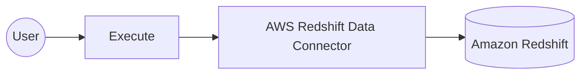

# Example

## What you'll build

Build an automation that runs a SQL query against an Amazon Redshift database through the Redshift Data API. The integration binds the AWS credentials, region, and database access settings to configurable variables, then submits a read-only query and logs the returned statement ID. Because the Redshift Data API is asynchronous, the operation returns a statement ID that you can use to track the query and retrieve its results.

**Operations used:**
- **Execute** : Runs a SQL statement, which can be data manipulation language (DML) or data definition language (DDL), and returns the submitted statement ID

## Architecture

## Prerequisites

- An active AWS account. If you don't have one, [sign up for a free AWS account](https://aws.amazon.com/free/).
- A provisioned Amazon Redshift cluster with a database you can query. To create one, follow the [Amazon Redshift getting started guide](https://docs.aws.amazon.com/redshift/latest/gsg/new-user.html).
- An IAM user with an access key. Attach the `AmazonRedshiftDataFullAccess` managed policy, or scope a custom policy to the `redshift-data` actions you call.
- Permission for the IAM user to obtain a database credential. A cluster that authenticates with a database user needs `redshift:GetClusterCredentials`, and one that authenticates through a secret needs `secretsmanager:GetSecretValue`.

## Setting up the AWS Redshift Data integration

> **New to WSO2 Integrator?** Follow the [Create a New Integration](../../../../develop/create-integrations/create-a-new-integration.md) guide to set up your integration first, then return here to add the connector.

## Adding the AWS Redshift Data connector

### Step 1: Open the connector palette

Select **Add Connection** in the **Connections** section.

### Step 2: Select the AWS Redshift Data connector

1. Enter `aws.redshiftdata` in the search field.
2. Select the **Redshiftdata** connector card.

## Configuring the AWS Redshift Data connection

### Step 3: Bind the connection parameters to configurable variables

Bind each connection field to a configurable variable so that no credential or environment value is stored in the integration. Keep the default static credentials variant for **Auth**, and switch the record fields to **Expression** mode to reference the configurable variables you create.

- **Auth** : Authentication settings for AWS. The default variant takes a static access key ID and secret access key
- **Region** : The AWS region that hosts your Redshift cluster
- **Db Access Config** : The cluster identifier and database name that the Redshift Data API runs statements against

Leave **Endpoint** at its default empty value unless you target a FIPS, dualstack, or custom endpoint.

> **Note:** This example targets a provisioned cluster. The connector also supports serverless workgroups: select the `WorkGroup` variant for **Db Access Config**, which takes the workgroup `name` and `database` in place of the cluster `id` and `database`. A workgroup needs `redshift-serverless:GetCredentials` instead of `redshift:GetClusterCredentials`.

### Step 4: Save the connection

Select **Save Connection** and verify that the connection appears in the **Connections** section.

### Step 5: Set actual values for your configurables

1. Select **Configurations** at the bottom of the project tree under **Data Mappers**.
2. Enter a value for each configurable listed below before you run the integration.

- **accessKeyId** (`string`) : The access key ID of the IAM user that calls the Redshift Data API.
- **secretAccessKey** (`string`) : The secret access key that pairs with the access key ID.
- **region** (`string`) : The AWS region code, such as `us-east-1`.
- **clusterId** (`string`) : The identifier of the Redshift cluster that hosts the database.
- **databaseName** (`string`) : The name of the database that the query runs against.

> **Warning:** Treat `accessKeyId` and `secretAccessKey` as secrets. Keep them out of source control.

## Configuring the AWS Redshift Data Execute operation

### Step 6: Add an automation entry point

1. Select **Add Artifact** on the integration design canvas.
2. Select **Automation**.
3. Select **Create** to accept the default settings.

### Step 7: Expand the connection and configure the Execute operation

1. Select **+** in the automation flow, between **Start** and **Error Handler**.
2. Expand **redshiftdataClient** to display its operations.

3. Select **Execute** and enter its required values.

- **Statement** : The SQL statement to run. This example uses a read-only query that returns at most 10 rows
- **Result** : The name of the variable that holds the returned execution response

4. Select **Save**.

### Step 8: Log the Execute result

Add a **Log Info** action after the operation, and enter a message that reads the statement ID from the result variable. The completed flow runs from **Start**, through the operation and the log action, to **Error Handler**.

## Try it yourself

Try this sample in WSO2 Integration Platform.

[View source on GitHub](https://github.com/wso2/integration-samples/tree/main/integrator-default-profile/connectors/aws.redshiftdata_connector_sample)

## More code examples

The `aws.redshiftdata` connector provides practical examples illustrating usage in various scenarios. Explore these [examples](https://github.com/ballerina-platform/module-ballerinax-aws.redshiftdata/tree/main/examples).

1. [Manage users](https://github.com/ballerina-platform/module-ballerinax-aws.redshiftdata/tree/main/examples/manage-users/) - This example demonstrates how to use the Ballerina Redshift Data connector to perform SQL operations on an AWS Redshift cluster. It includes creating a table, inserting data, and querying data.

2. [Music store](https://github.com/ballerina-platform/module-ballerinax-aws.redshiftdata/tree/main/examples/music-store) - This example illustrates the process of creating an HTTP RESTful API with Ballerina to perform basic CRUD operations on a database, specifically AWS Redshift, involving setup, configuration, and running examples.
