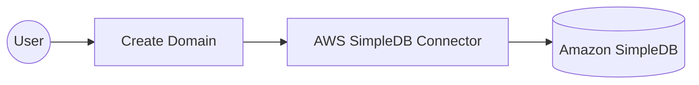

# Example

## What you'll build

This example builds an automation that creates a domain in Amazon SimpleDB. A domain is the schemaless container that holds items and their attributes, so creating one is the first step in any SimpleDB integration. The automation logs the service response so you can confirm the call succeeded.

**Operations used:**
- **Create Domain** : Creates a SimpleDB domain with the given name.

## Architecture

## Prerequisites

- An AWS account with Amazon SimpleDB available in the region you plan to use. SimpleDB runs in eight regions only, including `us-east-1`, `eu-west-1`, and `ap-southeast-1`.
- An access key ID and secret access key for an IAM identity that's allowed to call `sdb:CreateDomain` on the domain you name in this example.

## Setting up the AWS SimpleDB integration

> **New to WSO2 Integrator?** Follow the [Create a New Integration](../../../../develop/create-integrations/create-a-new-integration.md) guide to set up your integration first, then return here to add the connector.

## Adding the AWS SimpleDB connector

### Step 1: Open the connector palette

Select **Add Connection** in the **Connections** section.

### Step 2: Select the AWS SimpleDB connector

1. Enter `aws.simpledb` in the search field.
2. Select the **Simpledb** connector card.

## Configuring the AWS SimpleDB connection

### Step 3: Bind the connection parameters to configurable variables

Switch **Config** to **Expression** mode, then bind its credential and region fields to configurable variables.

- **Config** : Connection configuration holding the authentication details and the AWS region.
- **Connection Name** : Name that identifies this connection in the project tree.

### Step 4: Save the connection

Select **Save Connection** and verify that the connection appears in the **Connections** section.

### Step 5: Set actual values for your configurables

1. Select **Configurations** at the bottom of the project tree under **Data Mappers**.
2. Enter a value for each configurable listed below before you run the integration.

- **accessKeyId** (`string`) : Access key ID of the IAM identity that calls SimpleDB.
- **secretAccessKey** (`string`) : Secret access key that pairs with the access key ID.
- **region** (`string`) : AWS region that serves the domain, such as `us-east-1`.

## Configuring the AWS SimpleDB Create Domain operation

### Step 6: Add an automation entry point

1. Select **Add Artifact** on the **Design** canvas.
2. Select **Automation**.
3. Select **Create** to accept the settings.

### Step 7: Expand the connection and configure the Create Domain operation

1. Select **+** on the automation flow between **Start** and **Error Handler**.
2. Expand **simpledbClient** to display its operations.

3. Select **Create Domain** and enter its required values.

- **Domain Name** : Name of the domain to create.
- **Result** : Name of the variable that holds the service response.

4. Select **Save**.

### Step 8: Log the Create Domain result

Add a **Log Info** action that reports the returned value, then return to the visual flow.

## Try it yourself

Try this sample in WSO2 Integration Platform.

[View source on GitHub](https://github.com/wso2/integration-samples/tree/main/integrator-default-profile/connectors/aws.simpledb_connector_sample)

## More code examples

The `aws.simpledb` connector provides practical examples illustrating usage in various scenarios. Explore these [examples](https://github.com/ballerina-platform/module-ballerinax-aws.simpledb/tree/main/examples).

1. [Domain management](https://github.com/ballerina-platform/module-ballerinax-aws.simpledb/tree/main/examples/domain-management)
   This example shows how to create a domain, inspect its metadata, list the domains in the account, and delete it.

2. [Product catalogue](https://github.com/ballerina-platform/module-ballerinax-aws.simpledb/tree/main/examples/product-catalogue)
   This example shows how to store item attributes and query them back with a `select` expression.
