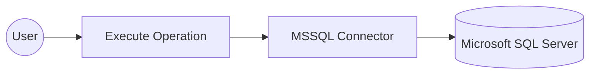

# Example

## What you'll build

Build a WSO2 Integrator integration that connects to a Microsoft SQL Server database using the MSSQL connector and inserts a record into a `customers` table via an Automation entry point. All credentials are secured through configurable variables.

**Operations used:**
- **execute** — Runs a SQL INSERT statement against the MSSQL database and returns an execution result

## Architecture

## Prerequisites

- A running Microsoft SQL Server instance

## Setting up the MSSQL integration

> **New to WSO2 Integrator?** Follow the [Create a New Integration](../../../../develop/create-integrations/create-new-integration.md) guide to set up your integration first, then return here to add the connector.

## Adding the MSSQL connector

### Step 1: Open the connector palette and search for MSSQL

1. From the integration canvas, click **+ Add Artifact** (or the connection **+** icon).
2. In the artifact picker, scroll to **Other Artifacts** and select **Connection**.
3. In the connector search palette, type `mssql`.
4. Select **MS SQL** from the search results.

## Configuring the MSSQL connection

### Step 2: Bind all connection parameters to configurable variables

The **Configure MS SQL** form opens. All connection parameters are under **Advanced Configurations** — click **Expand** if collapsed. For each field, use the **Open Helper Panel** → **Configurables** tab → **+ New Configurable** workflow to create a Configurable variable and bind it to the field:

- **host**: The MSSQL server hostname
- **user**: The database username
- **password**: The database password
- **database**: The name of the target database
- **port**: The TCP port for the MSSQL server

After all fields are bound, set the **Connection Name** to `mssqlClient`.

### Step 3: Save the connection

Click **Save Connection** at the bottom of the form to persist the connection.

The canvas returns to the main integration view and displays the `mssqlClient` connection node. The left-hand sidebar lists it under **Connections → mssqlClient**.

### Step 4: Set actual values for your configurables

1. In the left panel, click **Configurations**.
2. Set a value for each configurable listed below:
   - **mssqlHost** : string : hostname of your MSSQL server
   - **mssqlUser** : string : database username
   - **mssqlPassword** : string : database password
   - **mssqlDatabase** : string : name of the target database
   - **mssqlPort** : int : TCP port for the MSSQL server

## Configuring the MSSQL execute operation

### Step 5: Add an automation entry point

1. Click **+ Add Artifact** on the canvas.
2. In the Artifacts panel, click **Automation** under the "Automation" section.
3. In the **Create New Automation** form, leave the defaults and click **Create**.

The automation flow editor opens showing a **Start** node and an **Error Handler**.

### Step 6: Select and configure the execute operation

1. In the automation flow, click the **+** button between **Start** and **Error Handler**.
2. In the node panel, under **Connections**, click **mssqlClient** to expand its available operations.

3. Click **Execute** to add it to the flow and configure the following parameters:

- **sqlQuery** — The SQL INSERT statement to run against the database
- **result** — The variable that stores the execution result (auto-generated as `sqlExecutionresult`)

4. Click **Save**.

## Try it yourself

Try this sample in WSO2 Integration Platform.

[View source on GitHub](https://github.com/wso2/integration-samples/tree/main/connectors/mssql_connector_sample)
