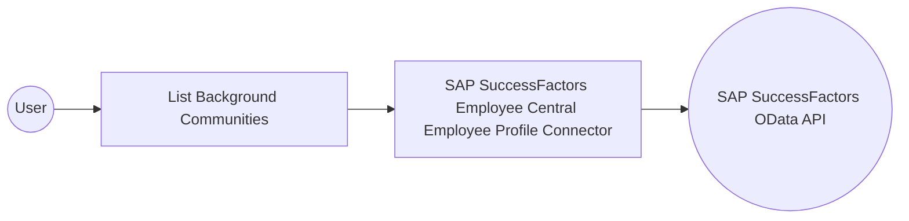

# Example

## What you'll build

Build an integration that connects to SAP SuccessFactors Employee Central and retrieves background community records through the SAP SuccessFactors Employee Central Employee Profile connector. The integration exposes an automation entry point that calls the operation and stores the result in a variable you can process further.

**Operations used:**
- **List Background Communities** : Queries the Background_Community collection and returns a page of entities, optionally filtered, sorted, and paged through OData query options.

## Architecture

## Prerequisites

- Access to a SAP SuccessFactors OData API server (see the [setup guide](setup-guide.md))
- A company ID, username, and password, or OAuth 2.0 credentials

## Setting up the SAP SuccessFactors Employee Central Employee Profile integration

> **New to WSO2 Integrator?** Follow the [Create a New Integration](../../../../develop/create-integrations/create-a-new-integration.md) guide to set up your integration first, then return here to add the connector.

## Adding the SAP SuccessFactors Employee Central Employee Profile connector

### Step 1: Open the connector palette

1. Select **Add Artifact**.
2. Select **Connection** to open the connector search palette.

### Step 2: Select the SAP SuccessFactors Employee Central Employee Profile connector

1. Enter `ecemployeeprofile` in the search field.
2. Select the **Ecemployeeprofile** connector card.

## Configuring the SAP SuccessFactors Employee Central Employee Profile connection

### Step 3: Bind the connection parameters to configurable variables

Bind every required connection field to a configurable variable.

- **Config** : Expression containing the `auth` credentials for the SAP SuccessFactors OData server — bind `username` to a `sfUsername` configurable variable and `password` to a `sfPassword` configurable variable.
- **Hostname** : The SAP SuccessFactors OData API server hostname — bind to a `sfHostname` configurable variable.

### Step 4: Save the connection

Select **Save Connection** and verify that **ecemployeeprofileClient** appears in the **Connections** section.

### Step 5: Set actual values for your configurables

1. Select **Configurations** at the bottom of the project tree under **Data Mappers**.
2. Enter a value for each configurable listed below before you run the integration.

- **sfUsername** (`configurable string`) : The SAP SuccessFactors login username, formatted as `<username>@<companyID>`.
- **sfPassword** (`configurable string`) : The SAP SuccessFactors login password.
- **sfHostname** (`configurable string`) : The SAP SuccessFactors OData API server hostname, for example `api68sales.successfactors.com`.

## Configuring the SAP SuccessFactors Employee Central Employee Profile List Background Communities operation

### Step 6: Add an automation entry point

1. Select **Add Artifact**.
2. Select **Automation**.
3. Select **Create** to accept the default settings.

### Step 7: Expand the connection and configure the List Background Communities operation

1. Select the **+** icon between **Start** and **Error Handler**.
2. Expand **ecemployeeprofileClient** to display its operations.

3. Select **List Background Communities**. The operation has no required parameters, so review the auto-generated result variable.

- **Result** : Name of the variable that stores the returned Background_Community records.

4. Select **Save**. The operation step appears in the automation flow between **Start** and **Error Handler**.

## Try it yourself

Try this sample in WSO2 Integration Platform.

[View source on GitHub](https://github.com/wso2/integration-samples/tree/main/integrator-default-profile/connectors/ecemployeeprofile_connector_sample)

## More code examples

The SAP SuccessFactors Employee Central connectors provide practical examples illustrating usage in various scenarios. Explore these [examples](https://github.com/ballerina-platform/module-ballerinax-sap.successfactors.employeecentral/tree/main/examples), covering use cases like syncing employee data and sending notifications.

1. [Google Sheets to SuccessFactors](https://github.com/ballerina-platform/module-ballerinax-sap.successfactors.employeecentral/tree/main/examples/google-sheets-to-successfactors) : Read employee records from a Google Sheets roster and create Personal Information records in SuccessFactors.
2. [SuccessFactors to Slack](https://github.com/ballerina-platform/module-ballerinax-sap.successfactors.employeecentral/tree/main/examples/successfactors-to-slack) : Poll SuccessFactors for newly onboarded employees and send welcome notifications to a Slack channel.
