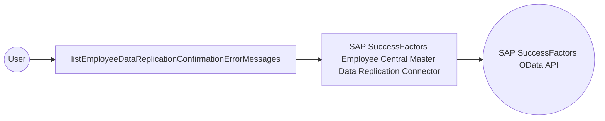

# Example

## What you'll build

Build an integration that connects to SAP SuccessFactors Employee Central using the SAP SuccessFactors Employee Central Master Data Replication connector and retrieves EmployeeDataReplicationConfirmationErrorMessage records. The integration sets up an automation entry point that invokes the operation and returns the result.

**Operations used:**
- **listEmployeeDataReplicationConfirmationErrorMessages** : Queries the EmployeeDataReplicationConfirmationErrorMessage collection and returns a page of entities, optionally filtered, sorted, and paged via OData query options.

## Architecture

## Prerequisites

- Access to a SAP SuccessFactors OData API server (see [Setup Guide](setup-guide.md))
- A Company ID, username, and password (or OAuth2 credentials)

## Setting up the SAP SuccessFactors Employee Central Master Data Replication integration

> **New to WSO2 Integrator?** Follow the [Create a New Integration](../../../../develop/create-integrations/create-a-new-integration.md) guide to set up your integration first, then return here to add the connector.

## Adding the SAP SuccessFactors Employee Central Master Data Replication connector

### Step 1: Open the connector palette and add the SAP SuccessFactors Employee Central Master Data Replication connector

1. From the project canvas, select **+ Add Artifact** → **Connection**.
2. In the connector search palette, enter `sap.successfactors.ecmasterdatareplication`.
3. Locate **ballerinax/sap.successfactors.ecmasterdatareplication** and select **Add**.

## Configuring the SAP SuccessFactors Employee Central Master Data Replication connection

### Step 2: Fill in the connection parameters

Bind each connection field to a configurable variable to keep credentials out of source code.

- **auth** : Record containing `username` and `password` — bound to `sfUsername` and `sfPassword` configurable variables
- **hostname** : The SAP SuccessFactors API server hostname — bound to the `sfHostname` configurable variable
- **connectionName** : Logical name for this connection — leave the default value `ecmasterdatareplicationClient`

### Step 3: Save the connection

Select **Save Connection**. The connection is saved and `ecmasterdatareplicationClient` appears in the **Connections** section of the project tree.

### Step 4: Set actual values for your configurables

1. In the left panel, select **Configurations**.
2. Set a value for each configurable listed below.

- **sfUsername** (string) : The SF login username, formatted as `<username>@<companyID>`
- **sfPassword** (string) : The SF login password
- **sfHostname** (string) : The SAP SuccessFactors API server hostname (for example, `api<n>.successfactors.com`)

## Configuring the SAP SuccessFactors Employee Central Master Data Replication listEmployeeDataReplicationConfirmationErrorMessages operation

### Step 5: Add an automation entry point

1. Select **+ Add Artifact**.
2. Select **Automation** to create an automation that can be invoked periodically or manually.
3. In the **Create New Automation** form, leave the default name and select **Create**.

### Step 6: Select and configure the listEmployeeDataReplicationConfirmationErrorMessages operation

1. In the automation flow canvas, select the **+** button between the **Start** node and the **Error Handler** node.
2. In the step-addition panel, expand **ecmasterdatareplicationClient** under the **Connections** section.
3. Select **listEmployeeDataReplicationConfirmationErrorMessages**.

Configure the operation with the following values:

- **resultVariable** : Auto-generated — leave the default value

Select **Save**. The operation step is added to the automation flow.

## More code examples

The SAP SuccessFactors Employee Central connectors provide practical examples illustrating usage in various scenarios. Explore these [examples](https://github.com/ballerina-platform/module-ballerinax-sap.successfactors.employeecentral/tree/main/examples), covering use cases like syncing employee data and sending notifications.
