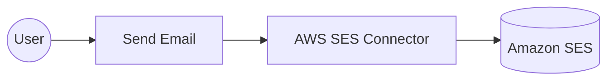

# Example

## What you'll build

In this example, you'll build an automation that sends a transactional email through Amazon SES. The integration assembles a simple message from a subject and a plain-text body, hands it to Amazon SES for delivery, and logs the message ID that Amazon SES returns on acceptance. Sender and recipient addresses are bound to configurable variables, so the same integration can send from any verified identity without a code change.

**Operations used:**

- **Send Email** : Sends an email message that Amazon SES assembles from the supplied subject and body

## Architecture

## Prerequisites

- An active [AWS account](https://aws.amazon.com/) with access to the [Amazon SES console](https://console.aws.amazon.com/ses/)
- A verified email identity to send from. Amazon SES only sends from an address or domain you have proved you own, so verify one under **Identities** > **Create identity** in the Amazon SES console.
- A recipient address that Amazon SES will accept. A new account is in the Amazon SES sandbox, where mail can be sent only to verified addresses, so verify the recipient as well or request production access first.
- An IAM user with an access key, granted the `ses:SendEmail` action. See the [Setup Guide](setup-guide.md) for the full policy.

## Setting up the AWS SES integration

> **New to WSO2 Integrator?** Follow the [Create a New Integration](../../../../develop/create-integrations/create-a-new-integration.md) guide to set up your integration first, then return here to add the connector.

## Adding the AWS SES connector

### Step 1: Open the connector palette

Select **Add Connection** in the **Connections** section.

### Step 2: Select the AWS SES connector

1. Enter `ses` in the search field.
2. Select the **Ses** connector card.

## Configuring the AWS SES connection

### Step 3: Bind the connection parameters to configurable variables

The connector takes its whole connection configuration as one record, so switch **Config** to **Expression** mode and supply a record that references a configurable variable for each credential and the Region.

- **Config** : The configuration required to initialize the client. Enter `{auth: {accessKeyId: accessKeyId, secretAccessKey: secretAccessKey}, region: region}`, creating each configurable variable with **New Configurable** in the helper panel as you reference it.
- **Connection Name** : The name the operations refer to this connection by. Enter `sesClient`.

### Step 4: Save the connection

Select **Save Connection** and verify that the connection appears in the **Connections** section.

### Step 5: Set actual values for your configurables

1. Select **Configurations** at the bottom of the project tree under **Data Mappers**.
2. Enter a value for each configurable listed below before you run the integration.

- **accessKeyId** (`string`) : The access key ID of the IAM user
- **secretAccessKey** (`string`) : The secret access key of the IAM user
- **region** (`string`) : The AWS Region the Amazon SES identities live in, such as `us-east-1`
- **senderEmail** (`string`) : The verified identity to send from
- **recipientEmail** (`string`) : The address to send the message to

## Configuring the AWS SES send email operation

### Step 6: Add an automation entry point

1. Select **Add Entry Point** next to **Entry Points**.
2. Select **Automation**.
3. Select **Create** to accept the settings.

### Step 7: Expand the connection and configure the send email operation

1. Select **Add Step** in the automation flow.
2. Expand **sesClient** to display its operations.

3. Select **Send Email** and enter its required values.

- **Request** : The details of the message to send. Switch to **Expression** mode and enter `{fromEmailAddress: senderEmail, destination: {toAddresses: [recipientEmail]}, content: {simple: {subject: {data: "Hello from the WSO2 Integrator"}, body: {text: {data: "This message was sent with the Amazon SES connector."}}}}}`.
- **Result** : The name of the variable holding the response. Enter `sendEmailResponse`.

4. Select **Save**.

### Step 8: Log the send email result

Add a **Log Info** step after the operation and set **Msg** to `Email accepted by Amazon SES with message ID: ${sendEmailResponse.messageId.toString()}`, then return to the visual flow.

## Try it yourself

Try this sample in WSO2 Integration Platform.

[View source on GitHub](https://github.com/wso2/integration-samples/tree/main/integrator-default-profile/connectors/aws.ses_connector_sample)

## More code examples

The `aws.ses` connector provides practical examples illustrating usage in various scenarios. Explore these [examples](https://github.com/ballerina-platform/module-ballerinax-aws.ses/tree/master/examples).

1. [Send a transactional email](https://github.com/ballerina-platform/module-ballerinax-aws.ses/tree/master/examples/send-transactional-email)
   This example shows how to send an order confirmation as a one-off HTML message, through a stored template, and as a bulk send with per-recipient replacement values.

2. [Manage a contact list](https://github.com/ballerina-platform/module-ballerinax-aws.ses/tree/master/examples/manage-contact-list)
   This example shows how to run a newsletter list end to end: create the list and its topic, subscribe contacts, send only to the ones opted in, and let the unsubscribe link maintain the list. It runs on the default credential provider chain, so it works unchanged on EC2, ECS, and EKS.
