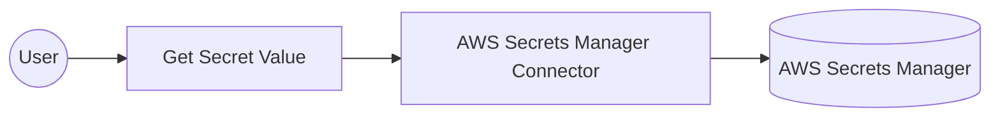

# Example

## What you'll build

Build an automation that retrieves a secret from AWS Secrets Manager and logs the secret's name and version. The integration binds the AWS credentials, region, and secret identifier to configurable variables, so no credential and no secret identifier is stored in the integration itself. The retrieved secret value stays in memory and is never written to the log.

**Operations used:**
- **Get Secret Value** : Retrieves the contents of the encrypted fields from the specified version of a secret

## Architecture

## Prerequisites

- An active AWS account. If you don't have one, [sign up for a free AWS account](https://aws.amazon.com/free/).
- A secret stored in AWS Secrets Manager. To create one, follow the [create a secret guide](https://docs.aws.amazon.com/secretsmanager/latest/userguide/create_secret.html).
- An IAM user with an access key. Grant it `secretsmanager:GetSecretValue` on the secrets you read, and `kms:Decrypt` on the KMS key that encrypts them when that key is customer managed.

## Setting up the AWS Secrets Manager integration

> **New to WSO2 Integrator?** Follow the [Create a New Integration](../../../../develop/create-integrations/create-a-new-integration.md) guide to set up your integration first, then return here to add the connector.

## Adding the AWS Secrets Manager connector

### Step 1: Open the connector palette

Select **Add Connection** in the **Connections** section.

### Step 2: Select the AWS Secrets Manager connector

1. Enter `aws.secretmanager` in the search field.
2. Select the **Secretmanager** connector card.

## Configuring the AWS Secrets Manager connection

### Step 3: Bind the connection parameters to configurable variables

Bind each connection field to a configurable variable so that no credential is stored in the integration. Keep the default static credentials variant for **Auth**, and switch both fields to **Expression** mode to reference the configurable variables you create.

- **Auth** : Authentication settings for AWS. The default variant takes a static access key ID and secret access key
- **Region** : The AWS region that holds your secrets

Leave **Endpoint** at its default empty value unless you target a FIPS, dualstack, or custom endpoint.

### Step 4: Save the connection

Select **Save Connection** and verify that the connection appears in the **Connections** section.

### Step 5: Set actual values for your configurables

1. Select **Configurations** at the bottom of the project tree under **Data Mappers**.
2. Enter a value for each configurable listed below before you run the integration.

- **accessKeyId** (`string`) : The access key ID of the IAM user that reads the secret.
- **secretAccessKey** (`string`) : The secret access key that pairs with the access key ID.
- **region** (`string`) : The AWS region code that holds the secret, such as `us-east-1`.
- **secretId** (`string`) : The friendly name or ARN of the secret to retrieve.

> **Warning:** Treat `accessKeyId` and `secretAccessKey` as secrets. Keep them out of source control.

## Configuring the AWS Secrets Manager Get Secret Value operation

### Step 6: Add an automation entry point

1. Select **Add Artifact** on the integration design canvas.
2. Select **Automation**.
3. Select **Create** to accept the default settings.

### Step 7: Expand the connection and configure the Get Secret Value operation

1. Select **+** in the automation flow, between **Start** and **Error Handler**.
2. Expand **secretmanagerClient** to display its operations.

3. Select **Get Secret Value** and enter its required values.

- **Secret Id** : The friendly name or ARN of the secret. Bind it to a configurable variable so the integration isn't tied to one secret
- **Result** : The name of the variable that holds the retrieved secret

4. Select **Save**.

### Step 8: Log the Get Secret Value result

Add a **Log Info** action after the operation, and enter a message that reads the secret's name and version from the result variable. The completed flow runs from **Start**, through the operation and the log action, to **Error Handler**.

> **Warning:** Log only metadata such as the secret's name, ARN, or version. Never log the `value` field, because it holds the decrypted secret and log output is rarely as well protected as the secret store.

## Try it yourself

Try this sample in WSO2 Integration Platform.

[View source on GitHub](https://github.com/wso2/integration-samples/tree/main/integrator-default-profile/connectors/aws.secretmanager_connector_sample)
