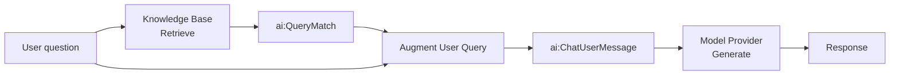

import ThemedImage from '@theme/ThemedImage';
import useBaseUrl from '@docusaurus/useBaseUrl';

# RAG Query

The query integration runs on every user request. It retrieves relevant chunks from the vector knowledge base populated during ingestion, combines them with the user's question, and calls the LLM to produce a grounded response.

This page covers building the query integration in WSO2 Integrator: wiring up retrieve, augment, and generate nodes, and testing the endpoint.

:::info
Complete [RAG ingestion](rag-ingestion.md) before starting this page. The query integration reads from the same Knowledge Base that ingestion writes to.
:::

---

## What the RAG query does



The four nodes, **Retrieve**, **Augment User Query**, **Generate**, and **Return**, map directly to Steps 2-6 below.

---

:::info Prerequisites

- The ingestion integration from [RAG ingestion](rag-ingestion.md) has been run at least once so the Knowledge Base contains vectors.
- The same Knowledge Base and Embedding Provider used during ingestion are available in this project.
- A configured model provider. The default WSO2 provider works out of the box. Run `Ballerina: Configure default WSO2 model provider` if you haven't already.
- An **HTTP service** with a `POST /query` resource and a `userQuery` string payload parameter. See Step 1 below.

:::

---

## Step 1: Create an HTTP service

1. On the **Design** tab, select **Add Artifact manually** (below the WSO2 Integrator Copilot's quick-start cards). If the project already has other artifacts, this same button appears directly as **+ Add Artifact** instead.

    <ThemedImage
        alt="Artifacts page listing artifact types including HTTP Service under Integration as API."
        sources={{
            light: useBaseUrl('/img/genai/develop/rag-v5.1/rag-query/01-add-artifact-v5.1.png'),
            dark: useBaseUrl('/img/genai/develop/rag-v5.1/rag-query/01-add-artifact-v5.1.png'),
        }}
    />

2. Under **Integration as API**, select **HTTP Service**. On the **Create HTTP Service** form, leave **Design From Scratch** selected, leave **Service Base Path** as `/`, and select **Create**.

    <ThemedImage
        alt="Create HTTP Service form with Service Contract set to Design From Scratch and Service Base Path set to /."
        sources={{
            light: useBaseUrl('/img/genai/develop/rag-v5.1/rag-query/02-http-service-form-create-v5.1.png'),
            dark: useBaseUrl('/img/genai/develop/rag-v5.1/rag-query/02-http-service-form-create-v5.1.png'),
        }}
    />

3. In the HTTP Service editor, select **+ Add Resource**. A method selection panel opens on the right.

    <ThemedImage
        alt="HTTP Service editor showing no resources and the Select HTTP Method to Add panel."
        sources={{
            light: useBaseUrl('/img/genai/develop/rag-v5.1/rag-query/03-http-service-add-resource-v5.1.png'),
            dark: useBaseUrl('/img/genai/develop/rag-v5.1/rag-query/03-http-service-add-resource-v5.1.png'),
        }}
    />

4. Select **POST** from the method list.

    <ThemedImage
        alt="Select HTTP Method to Add panel listing GET, POST, PUT, DELETE, PATCH, and DEFAULT."
        sources={{
            light: useBaseUrl('/img/genai/develop/rag-v5.1/rag-query/04-select-post-v5.1.png'),
            dark: useBaseUrl('/img/genai/develop/rag-v5.1/rag-query/04-select-post-v5.1.png'),
        }}
    />

5. In the **New Resource Configuration** panel, set **Resource Path** to `query`. Select **+ Define Payload**, switch to the **Create Type Schema** tab, name the type `QueryPayload`, and add a field named `userQuery` of type `string`. Select **Save**.

    <ThemedImage
        alt="New Resource Configuration panel with POST method, query resource path, QueryPayload payload, and the default 201 json / 500 error responses."
        sources={{
            light: useBaseUrl('/img/genai/develop/rag-v5.1/rag-query/05-resource-config-query-v5.1.png'),
            dark: useBaseUrl('/img/genai/develop/rag-v5.1/rag-query/05-resource-config-query-v5.1.png'),
        }}
    />

---

## Step 2: Retrieve from the knowledge base

The **Retrieve** action queries the Knowledge Base for chunks most similar to the user's question.

1. In the flow editor, select **+** to open the **Add Node** panel.
2. Go to **AI > RAG** and select **Knowledge Base**.

    :::info
    If you don't have a Knowledge Base yet, create one first by following [Knowledge Bases](../ai-building-blocks/knowledge-bases.md). Use the same Knowledge Base as ingestion. For the in-memory knowledge base, both ingestion and querying must be done in the same integration.
    :::

    <ThemedImage
        alt="Add Node panel with AI > RAG > Knowledge Base highlighted, tooltip Knowledge bases available in the integration."
        sources={{
            light: useBaseUrl('/img/genai/develop/rag-v5.1/rag-query/06-knowledgebase-select-v5.1.png'),
            dark: useBaseUrl('/img/genai/develop/rag-v5.1/rag-query/06-knowledgebase-select-v5.1.png'),
        }}
    />

3. The **Knowledge Bases** panel lists your existing connection (for example `aiVectorknowledgebase`, the same one created during ingestion). Select it to expand it, then select **Retrieve**, *"Retrieves relevant chunk for the given query."*

    <ThemedImage
        alt="aiVectorknowledgebase connection expanded showing Ingest, Retrieve, and Delete By Filter actions, with the Retrieve tooltip visible."
        sources={{
            light: useBaseUrl('/img/genai/develop/rag-v5.1/rag-query/07-retrieve-action-selected-v5.1.png'),
            dark: useBaseUrl('/img/genai/develop/rag-v5.1/rag-query/07-retrieve-action-selected-v5.1.png'),
        }}
    />

4. Configure the node:

    | Field | Required | Value |
    | --- | --- | --- |
    | **Query** | Yes | Bind to the incoming user question, for example `payload.userQuery` (Expression mode). |
    | **Top K** | No | Number of chunks to return. Default is `10`. Increase if relevant content is being missed; use `-1` to return all. |
    | **Filters** | No | Metadata filters to restrict results. Useful for multi-tenant scenarios where users should only see their own documents. |
    | **Result** | Yes | For example, `context`. **Result Type** is locked to `ai:QueryMatch[]`. |

5. Select **Save**.

    <ThemedImage
        alt="ai:retrieve form with Query set to payload.userQuery, Top K default 10, Filters empty, and Result set to context."
        sources={{
            light: useBaseUrl('/img/genai/develop/rag-v5.1/rag-query/08-retrieve-form-v5.1.png'),
            dark: useBaseUrl('/img/genai/develop/rag-v5.1/rag-query/08-retrieve-form-v5.1.png'),
        }}
    />

The result is an array of `ai:QueryMatch` values. Each entry contains a chunk and its similarity score against the query.

:::info
Retrieve is the read-side counterpart to Ingest. It must point to the same Knowledge Base and the same Embedding Provider. Pointing to a different one returns no useful results.
:::

<ThemedImage
    alt="Flow editor showing the ai:retrieve node (context) added after the HTTP service resource."
    sources={{
        light: useBaseUrl('/img/genai/develop/rag-v5.1/rag-query/09-retrieve-node-v5.1.png'),
        dark: useBaseUrl('/img/genai/develop/rag-v5.1/rag-query/09-retrieve-node-v5.1.png'),
    }}
/>

---

## Step 3: Augment the user query

The **Augment User Query** node combines the retrieved chunks with the original question into a single formatted `ai:ChatUserMessage` ready for the LLM.

1. Select **+** after the Retrieve node.
2. Go to **AI > RAG > Augment Query**.
3. Configure the node:

    | Field | Required | Value |
    | --- | --- | --- |
    | **Context** | Yes | Switch to **Expression** mode and set it to the retrieval results, for example `context`. |
    | **Query** | Yes | The original user question, for example `payload.userQuery`. |
    | **Result** | Yes | Auto-fills a generated name, for example `aiChatusermessage`. **Result Type** is locked to `ai:ChatUserMessage`. |

4. Select **Save**.

    <ThemedImage
        alt="ai:augmentUserQuery form with Context set to context (Expression mode), Query set to payload.userQuery, and Result set to aiChatusermessage."
        sources={{
            light: useBaseUrl('/img/genai/develop/rag-v5.1/rag-query/10-augment-form-v5.1.png'),
            dark: useBaseUrl('/img/genai/develop/rag-v5.1/rag-query/10-augment-form-v5.1.png'),
        }}
    />

This step handles prompt construction automatically. You do not need to manually interleave chunks and questions.

<ThemedImage
    alt="Flow editor showing the ai:augmentUserQuery node added after the ai:retrieve node."
    sources={{
        light: useBaseUrl('/img/genai/develop/rag-v5.1/rag-query/11-augment-node-v5.1.png'),
        dark: useBaseUrl('/img/genai/develop/rag-v5.1/rag-query/11-augment-node-v5.1.png'),
    }}
/>

---

## Step 4: Add a model provider

1. Select **+** after the Augment Query node.
2. Go to **AI > Direct LLM > Model Provider**.
3. Select an existing model provider connection, or select **+ Add Model Provider** to create one, for example **Default Model Provider (WSO2)** named `aiWso2modelprovider`.
4. Expand the connection to reveal its **Chat** and **Generate** actions.

    <ThemedImage
        alt="Model Providers panel with aiWso2modelprovider expanded, showing Chat and Generate actions, with the Generate tooltip visible."
        sources={{
            light: useBaseUrl('/img/genai/develop/rag-v5.1/rag-query/12-model-provider-node-v5.1.png'),
            dark: useBaseUrl('/img/genai/develop/rag-v5.1/rag-query/12-model-provider-node-v5.1.png'),
        }}
    />

---

## Step 5: Generate the response

The **Generate** action calls the LLM with the augmented message and returns the model's answer. Select **Generate**, not **Chat**: Generate is the single-shot completion action that fits this flow, while Chat is for multi-turn conversations.

1. Configure the node:

    | Field | Required | Value |
    | --- | --- | --- |
    | **Prompt** | Yes | Switch to **Expression** mode and set it to the augmented message content, for example `check aiChatusermessage.content.ensureType()`. |
    | **Expected Type** | Yes | Set to `string` for plain-text responses. Use a record type to get a structured response. |
    | **Result** | Yes | For example, `response`. |

2. Select **Save**.

    <ThemedImage
        alt="ai:generate form with Prompt set to check aiChatusermessage.content.ensureType(), Expected Type string, and Result set to response."
        sources={{
            light: useBaseUrl('/img/genai/develop/rag-v5.1/rag-query/13-generate-form-v5.1.png'),
            dark: useBaseUrl('/img/genai/develop/rag-v5.1/rag-query/13-generate-form-v5.1.png'),
        }}
    />

    <ThemedImage
        alt="Flow editor showing the ai:generate node (response) added, connected to the aiWso2modelprovider connection."
        sources={{
            light: useBaseUrl('/img/genai/develop/rag-v5.1/rag-query/14-final-flow-v5.1.png'),
            dark: useBaseUrl('/img/genai/develop/rag-v5.1/rag-query/14-final-flow-v5.1.png'),
        }}
    />

---

## Step 6: Return the response

1. Select **+** after the Generate node.
2. Select **Return**.
3. Set the expression to `response`.
4. Select **Save**.

<ThemedImage
    alt="Complete RAG query integration: Start, ai:retrieve, ai:augmentUserQuery, ai:generate, Return, and Error Handler."
    sources={{
        light: useBaseUrl('/img/genai/develop/rag-v5.1/rag-query/15-rag-query-pipeline-v5.1.png'),
        dark: useBaseUrl('/img/genai/develop/rag-v5.1/rag-query/15-rag-query-pipeline-v5.1.png'),
    }}
/>

---

## Running and testing

Select **Run**. Once the integration starts, test the endpoint:

```bash
curl -X POST http://localhost:9090/query \
  -H "Content-Type: application/json" \
  -d '{"userQuery": "<your question>"}'
```

The response will be grounded in the documents you ingested.

---

## Tuning retrieval quality

| Parameter | Where | What it does |
| --- | --- | --- |
| **Top K** | Retrieve node | Controls how many chunks are passed to the LLM. Too few and relevant content is missed; too many and the model gets noisy context. Start at `5`-`10`. |
| **Filters** | Retrieve node | Restrict results by metadata. Use a `source` or `tenantId` field to isolate results per user or document set. |
| **Chunker** | Knowledge Base (ingestion) | Affects chunk boundaries and size. Switch from `AUTO` to a structure-aware chunker (Markdown, HTML) if retrieval quality is poor. Re-ingest after changing. |

---

## What's next

- **[RAG ingestion](rag-ingestion.md)** — populate the knowledge base the query integration reads from.
- **[Knowledge Bases](../ai-building-blocks/knowledge-bases.md)** — retrieve, delete-by-filter, and tuning reference.
- **[Embedding Providers](../ai-building-blocks/embedding-providers.md)** — available providers and dimension requirements.
- **[Chunkers](../ai-building-blocks/chunkers.md)** — controlling how documents are split for better retrieval.
