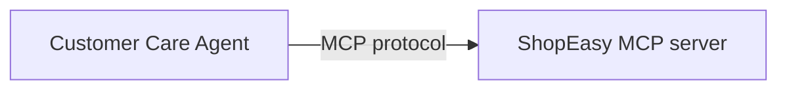

import ThemedImage from '@theme/ThemedImage';
import useBaseUrl from '@docusaurus/useBaseUrl';
import Tabs from '@theme/Tabs';
import TabItem from '@theme/TabItem';

# Build a Customer Care Agent with MCP

## What you'll build



A customer care agent that connects to a ShopEasy MCP server and answers product availability, order status, and return questions over a chat API.

This tutorial shows how to build an agent that consumes an external MCP server using `ai:McpToolKit`. You do not build the MCP server here. It is provided as a running service. Your job is to wire the agent to it, write the system prompt, and expose a chat endpoint.

The agent receives customer messages over HTTP, reasons about which tool to call, invokes the MCP server, and returns a natural language answer.


:::info Prerequisites
- [Model Providers for LLMs](../develop/components/model-providers.md)
- The **ShopEasy MCP server** running locally. Clone the repo and follow its README to start it: [github.com/wso2/integration-samples](https://github.com/wso2/integration-samples/tree/main/integrator-default-profile/samples/customer-care-agent/mcp).
:::

<Tabs>
<TabItem value="ui" label="Visual Designer" default>

## Step 1: Create and configure the agent

1. Open WSO2 Integrator and create or select your project.
2. On the **Design** tab, select **Add Artifact manually** (below the WSO2 Integrator Copilot's quick-start cards).
3. On the Artifacts page, under **AI Integration**, select **Chat Agent Service**.

<ThemedImage
    alt="Artifacts page with Chat Agent Service highlighted under AI Integration, alongside Durable Agentic Workflow and MCP Service"
    sources={{
        light: useBaseUrl('/img/genai/tutorials/customer-care-agent-mcp/create-agent-1.png'),
        dark: useBaseUrl('/img/genai/tutorials/customer-care-agent-mcp/create-agent-1.png'),
    }}
/>

4. On the **Create Chat Agent Service** form, set:
   - **Role** to `Customer Support Agent`.
   - **Instructions** to:

```
You are a helpful customer support agent for ShopEasy, an online retailer.
Help customers with product availability, order tracking, and return requests.
Always use the available tools to look up accurate information — never guess.
Keep responses friendly and concise. Include relevant IDs (order ID, return ID) in your responses.
```

   - **Model** as **Default WSO2 Model Provider**.
   - Leave **Maximum Iterations** at its default (`INFER_TOOL_COUNT`).

<ThemedImage
    alt="Create Chat Agent Service form with Role, Instructions, Model set to Default WSO2 Model Provider, and Maximum Iterations defaulting to INFER_TOOL_COUNT"
    sources={{
        light: useBaseUrl('/img/genai/tutorials/customer-care-agent-mcp/create-agent-2.png'),
        dark: useBaseUrl('/img/genai/tutorials/customer-care-agent-mcp/create-agent-2.png'),
    }}
/>

:::info Why leave Maximum Iterations at its default?
`INFER_TOOL_COUNT` resolves to `max(number of tools, 10)` — at least 10 reasoning-action cycles, or more if the agent has more tools available. Once the MCP toolkit is attached in Step 2, this default already gives the agent enough room to reason, call a tool, and respond, without needing a manual override.
:::

5. Leave **Verbose**, **Tool Loading Strategy**, and **Execute Tool Calls In Parallel** at their defaults.
6. Set **Agent Name** to `CustomerCareAgent`.
7. Set **Service Base Path** to expose the chat service, for example `/customer-care-agent`.
8. Select **Create**.

<ThemedImage
    alt="Bottom of the Create Chat Agent Service form with Agent Name set to CustomerCareAgent and Service Base Path set to /customer-care-agent"
    sources={{
        light: useBaseUrl('/img/genai/tutorials/customer-care-agent-mcp/create-agent-3.png'),
        dark: useBaseUrl('/img/genai/tutorials/customer-care-agent-mcp/create-agent-3.png'),
    }}
/>

This creates an **AI Agent Service** with a `POST /chat` resource and a `chatAgentListener`, plus the `CustomerCareAgent` agent under **Agents**. Select **CustomerCareAgent** under **Agents** to open its canvas: the **AI Agent** node is connected to the model provider, with a **+ Add Memory** button and a `+` icon at its bottom-right corner for adding tools.

<ThemedImage
    alt="AI Agent node for CustomerCareAgent connected to the model provider, with an Add Memory button and a + icon for adding tools"
    sources={{
        light: useBaseUrl('/img/genai/tutorials/customer-care-agent-mcp/create-agent-4.png'),
        dark: useBaseUrl('/img/genai/tutorials/customer-care-agent-mcp/create-agent-4.png'),
    }}
/>

## Step 2: Add the MCP server as a tool

### 2.1 Select the tool type

Select the **+** at the bottom-right corner of the **AI Agent** node. The **Add Tool** panel opens, listing **Use Connection**, **Use Function**, **Use Agent**, **Use MCP Server**, and **Create Custom Tool**. Select **Use MCP Server**.

<ThemedImage
    alt="Add Tool panel listing Use Connection, Use Function, Use Agent, Use MCP Server (highlighted), and Create Custom Tool, each with a short description"
    sources={{
        light: useBaseUrl('/img/genai/tutorials/customer-care-agent-mcp/add-mcp-1.png'),
        dark: useBaseUrl('/img/genai/tutorials/customer-care-agent-mcp/add-mcp-1.png'),
    }}
/>

### 2.2 Configure the server URL

1. Set **Server URL** to `http://localhost:8080/mcp`.
2. Leave **Requires Authentication** off.

<ThemedImage
    alt="Add Tool - Use MCP Server panel with Server URL set to http://localhost:8080/mcp and Requires Authentication unchecked"
    sources={{
        light: useBaseUrl('/img/genai/tutorials/customer-care-agent-mcp/add-mcp-2.png'),
        dark: useBaseUrl('/img/genai/tutorials/customer-care-agent-mcp/add-mcp-2.png'),
    }}
/>

The panel also lists **Info** (the MCP client identity sent to the server, defaults to `{name: "MCP Client", version: "1.0.0"}`), **Tools to Include** (defaults to **All**), and a set of advanced HTTP client options — timeout, redirects, pooling, caching, compression, circuit breaker, retries, and TLS — under further scrolling. Leave these at their defaults for this tutorial.

3. Leave **Result** as the default `aiMcpbasetoolkit` and select **Save**.

The MCP toolkit appears as `aiMcpbasetoolkit` attached to the agent node, connected by a dashed line, and a `McpToolKit` type is added under **Types** in the sidebar. The agent will discover the available tools from the server at startup.

<ThemedImage
    alt="The completed agent flow showing the AI Agent node connected by a dashed line to the aiMcpbasetoolkit"
    sources={{
        light: useBaseUrl('/img/genai/tutorials/customer-care-agent-mcp/add-mcp-3.png'),
        dark: useBaseUrl('/img/genai/tutorials/customer-care-agent-mcp/add-mcp-3.png'),
    }}
/>

## Step 3: Run and test

Make sure the ShopEasy MCP server is running, then select **Run**. WSO2 Integrator applies the `--experimental` flag and compiles and starts the service, with progress shown in the integrated terminal.

Once it's running, open the `chat` resource — its flow shows **Start**, an `agent:run` node (with an **Open Agent** link back to the `CustomerCareAgent` canvas), and **Return**. Select **Chat** in the toolbar (next to **Tracing**) to open the **Agent Chat** panel. Type your message in the input field and press **Enter** to send it.

Try the following messages to exercise all three tools:

- *"Do you have any wireless headphones in stock?"*
- *"What is the status of my order ORD-042?"*
- *"I want to return ORD-001. The item arrived damaged."*

<ThemedImage
    alt="Chat Agent Service resource flow (Start, agent:run, Return) alongside the Agent Chat panel showing a question about order ORD-042 and the agent's answer"
    sources={{
        light: useBaseUrl('/img/genai/tutorials/customer-care-agent-mcp/run-and-test.png'),
        dark: useBaseUrl('/img/genai/tutorials/customer-care-agent-mcp/run-and-test.png'),
    }}
/>

For more detail on using the chat panel, see [Try-It experiences](../../develop/test/built-in-try-it-tool.md#try-it-experiences).

</TabItem>
<TabItem value="code" label="Ballerina Code">

**`connections.bal`**: MCP toolkit connection:

```ballerina
import ballerina/ai;

final AiMcpbasetoolkit aiMcpbasetoolkit = check new ("http://localhost:8080/mcp");
```

The model provider is initialized inline with `ai:getDefaultModelProvider()` in `agents.bal`, so no separate connection is needed for the default WSO2 model provider.

**`agents.bal`**: agent definition:

```ballerina
import ballerina/ai;
import ballerina/mcp;

final ai:Agent CustomerCareAgent = check new (
    systemPrompt = {
        role: string `Customer Support Agent`,
        instructions: string `You are a helpful customer support agent for ShopEasy, an online retailer.
Help customers with product availability, order tracking, and return requests.
Always use the available tools to look up accurate information. Never guess.
Keep responses friendly and concise. Include relevant IDs (order ID, return ID) in your responses.`
    }, model = check ai:getDefaultModelProvider(), tools = [aiMcpbasetoolkit]
);

isolated class AiMcpbasetoolkit {
    *ai:McpBaseToolKit;
    private final mcp:StreamableHttpClient mcpClient;
    private final readonly & ai:ToolConfig[] tools;

    public isolated function init(string serverUrl, mcp:Implementation info = {name: "MCP", version: "1.0.0"},
            *mcp:StreamableHttpClientTransportConfig config) returns ai:Error? {
        do {
            self.mcpClient = check new mcp:StreamableHttpClient(serverUrl, config);
            self.tools = check ai:getPermittedMcpToolConfigs(self.mcpClient, info, self.callTool).cloneReadOnly();
        } on fail error e {
            return error ai:Error("Failed to initialize MCP toolkit", e);
        }
    }

    public isolated function getTools() returns ai:ToolConfig[] => self.tools;

    @ai:AgentTool
    public isolated function callTool(mcp:CallToolParams params) returns mcp:CallToolResult|error {
        return self.mcpClient->callTool(params);
    }
}
```

**`main.bal`**: HTTP chat service:

```ballerina
import ballerina/ai;
import ballerina/http;

listener ai:Listener chatAgentListener = new (listenOn = check http:getDefaultListener());

service /customer\-care\-agent on chatAgentListener {
    resource function post chat(@http:Payload ai:ChatReqMessage request) returns ai:ChatRespMessage|error {
        string stringResult = check CustomerCareAgent.run(request.message, request.sessionId);
        return {message: stringResult};
    }
}
```

To run and test the agent, follow the same steps in the **Visual Designer** tab under [Step 3: Run and test](#step-3-run-and-test).

</TabItem>
</Tabs>

## What you built

- Connected an agent to a live MCP server using `ai:McpToolKit`
- The agent dynamically discovered three tools (`searchProducts`, `getOrderStatus`, `submitReturnRequest`) at startup with no hardcoded tool definitions
- Exposed the agent as an HTTP chat service with session-scoped memory

## What's next

- [Exposing a service as an MCP server](../develop/mcp/exposing-as-mcp.md) — Build your own MCP server like the one used in this tutorial
- [Consuming MCP from an agent](../develop/mcp/consuming-mcp-from-agent.md) — Deeper reference for `ai:McpToolKit` options
- [Adding memory to an agent](../develop/agents/memory.md) — Persist conversation history across sessions
- [AI agent observability](../develop/agents/observability.md) — Trace tool calls and monitor agent performance
