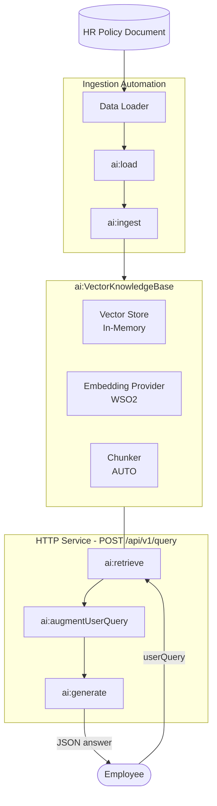

import ThemedImage from '@theme/ThemedImage';
import useBaseUrl from '@docusaurus/useBaseUrl';

# Building an HR Knowledge Base with RAG

Build a complete HR retrieval-augmented generation pipeline in the WSO2 Integrator visual designer. You'll create two artifacts in one integration: an Automation that ingests HR policy documents into a vector knowledge base, and an HTTP Service that answers employee questions over HTTP, grounded in the ingested chunks.

**What you'll learn:**

- How to load and ingest documents into a vector knowledge base.
- How to configure a vector store, embedding provider, and chunker visually.
- How to retrieve relevant chunks and ground an LLM response with them.
- How to expose the result over HTTP as a reusable service.

**Time:** 30 minutes

:::info Prerequisites
- An HR policy document in plain-text form (for example, a leave policy or code of conduct). A short `.md` file is enough to follow the tutorial.
:::

## What you'll build



The Automation flow walks documents through a chunker, embedding model, and vector store. The query flow walks an employee question through retrieval, augmentation, generation, and a JSON response.

## Step 1: Open the integration

Open or create an integration project in WSO2 Integrator. On the **Design** tab of a new, empty project, select **Add Artifact manually** below the WSO2 Integrator Copilot's quick-start cards.

<ThemedImage
    alt="Empty integration overview"
    sources={{
        light: useBaseUrl('/img/genai/tutorials/hr-knowledge-base-rag-v5.1/01-empty-integration-v5.1.png'),
        dark: useBaseUrl('/img/genai/tutorials/hr-knowledge-base-rag-v5.1/01-empty-integration-v5.1.png'),
    }}
/>

The Artifacts page opens, grouping the artifact types by category.

<ThemedImage
    alt="Artifacts page grouped by category"
    sources={{
        light: useBaseUrl('/img/genai/tutorials/hr-knowledge-base-rag-v5.1/02-add-artifact-catalog-v5.1.png'),
        dark: useBaseUrl('/img/genai/tutorials/hr-knowledge-base-rag-v5.1/02-add-artifact-catalog-v5.1.png'),
    }}
/>

You will create two artifacts in this project. An **Automation** (under **Automation**) for ingestion, then an **HTTP Service** (under **Integration as API**) for querying.

## Step 2: Create the ingestion automation

### 2.1 Pick the automation artifact

Select the **Automation** card. The **Create New Automation** dialog opens. Accept the defaults and select **Create**.

<ThemedImage
    alt="Create New Automation dialog"
    sources={{
        light: useBaseUrl('/img/genai/tutorials/hr-knowledge-base-rag-v5.1/03-create-new-automation-v5.1.png'),
        dark: useBaseUrl('/img/genai/tutorials/hr-knowledge-base-rag-v5.1/03-create-new-automation-v5.1.png'),
    }}
/>

The automation flow editor opens with an empty **Start** node and an **Error Handler** end node. Select **+** on the connector between them to open the node palette.

The palette groups every node type, including **Statement** (Declare/Update Variable, Call Function, Map Data), **Control** (If, Match, While, Foreach, Return), and **AI**, split into **Direct LLM** (Model Provider, Call Natural Function) and **RAG** (Knowledge Base, Data Loader, Augment Query).

<ThemedImage
    alt="Automation node palette"
    sources={{
        light: useBaseUrl('/img/genai/tutorials/hr-knowledge-base-rag-v5.1/04-automation-node-palette-v5.1.png'),
        dark: useBaseUrl('/img/genai/tutorials/hr-knowledge-base-rag-v5.1/04-automation-node-palette-v5.1.png'),
    }}
/>

### 2.2 Add a data loader

Under **AI > RAG**, select **Data Loader**. The **Data Loaders** panel opens.

<ThemedImage
    alt="Data Loaders panel"
    sources={{
        light: useBaseUrl('/img/genai/tutorials/hr-knowledge-base-rag-v5.1/05-data-loaders-picker-v5.1.png'),
        dark: useBaseUrl('/img/genai/tutorials/hr-knowledge-base-rag-v5.1/05-data-loaders-picker-v5.1.png'),
    }}
/>

Select **+ Add Data Loader**. The picker lists the available loader types, **Text Data Loader** and **Microsoft SharePoint Text Data Loader**. Pick **Text Data Loader**.

<ThemedImage
    alt="Text Data Loader option"
    sources={{
        light: useBaseUrl('/img/genai/tutorials/hr-knowledge-base-rag-v5.1/06-data-loaders-picker-v5.1.png'),
        dark: useBaseUrl('/img/genai/tutorials/hr-knowledge-base-rag-v5.1/06-data-loaders-picker-v5.1.png'),
    }}
/>

The **ai : Data Loader** side panel opens with a default name already filled in. Rename **Data Loader Name** to `textDocumentLoader`. **Result Type** stays at the auto-filled `ai:TextDataLoader`.

<ThemedImage
    alt="Data Loader form with default values"
    sources={{
        light: useBaseUrl('/img/genai/tutorials/hr-knowledge-base-rag-v5.1/07-data-loader-form-empty-v5.1.png'),
        dark: useBaseUrl('/img/genai/tutorials/hr-knowledge-base-rag-v5.1/07-data-loader-form-empty-v5.1.png'),
    }}
/>

Configure the **Paths** field with a configurable so the file path can be changed without editing the flow:

1. Select **+ Initialize Array** under **Paths**, then select into the new path expression to open the helper pane with **Inputs**, **Variables**, and **Configurables**.
2. Select **Configurables**, then select **+ New Configurable**.
3. In the **New Configurable** dialog, fill in:
   - **Variable Name**: `path`
   - **Variable Type**: `string`
   - **Documentation**: *Path of the HR policy document to ingest.*

   <ThemedImage
       alt="New Configurable dialog for path"
       sources={{
           light: useBaseUrl('/img/genai/tutorials/hr-knowledge-base-rag-v5.1/08-new-configurable-path-v5.1.png'),
           dark: useBaseUrl('/img/genai/tutorials/hr-knowledge-base-rag-v5.1/08-new-configurable-path-v5.1.png'),
       }}
   />

4. Select **Save**.

The Data Loader form is now complete:

- **Paths**: `path` (uses the configurable)
- **Data Loader Name**: `textDocumentLoader`
- **Result Type**: `ai:TextDataLoader`

<ThemedImage
    alt="Data Loader form filled"
    sources={{
        light: useBaseUrl('/img/genai/tutorials/hr-knowledge-base-rag-v5.1/09-data-loader-form-filled-v5.1.png'),
        dark: useBaseUrl('/img/genai/tutorials/hr-knowledge-base-rag-v5.1/09-data-loader-form-filled-v5.1.png'),
    }}
/>

Select **Save**.

:::tip Ingesting more than one document
The **Paths** field is an array of file paths, not a folder. To ingest several HR documents, add another path expression to the array for each file you want to load.
:::

### 2.3 Add the `ai : load` node

After you save the data loader, the **Data Loaders** panel reopens and lists the `textDocumentLoader` connection you just created.

<ThemedImage
    alt="Data Loaders panel with textDocumentLoader"
    sources={{
        light: useBaseUrl('/img/genai/tutorials/hr-knowledge-base-rag-v5.1/10-load-action-picker-v5.1.png'),
        dark: useBaseUrl('/img/genai/tutorials/hr-knowledge-base-rag-v5.1/10-load-action-picker-v5.1.png'),
    }}
/>

Select `textDocumentLoader` to expand it and reveal its **Load** action, *"Loads documents as TextDocuments from a source."* Select **Load**.

<ThemedImage
    alt="Load action expanded"
    sources={{
        light: useBaseUrl('/img/genai/tutorials/hr-knowledge-base-rag-v5.1/11-load-action-picker-v5.1.png'),
        dark: useBaseUrl('/img/genai/tutorials/hr-knowledge-base-rag-v5.1/11-load-action-picker-v5.1.png'),
    }}
/>

The **ai : load** form opens. Set:

- **Result**: `hrDocuments`
- **Result Type**: `ai:Document[] | ai:Document`

<ThemedImage
    alt="ai:load form filled"
    sources={{
        light: useBaseUrl('/img/genai/tutorials/hr-knowledge-base-rag-v5.1/12-ai-load-form-filled-v5.1.png'),
        dark: useBaseUrl('/img/genai/tutorials/hr-knowledge-base-rag-v5.1/12-ai-load-form-filled-v5.1.png'),
    }}
/>

Select **Save**. The `ai:load` node is added to the flow between the **Start** node and the **Error Handler**.

<ThemedImage
    alt="ai:load node added to the flow"
    sources={{
        light: useBaseUrl('/img/genai/tutorials/hr-knowledge-base-rag-v5.1/13-ai-load-form-saved-v5.1.png'),
        dark: useBaseUrl('/img/genai/tutorials/hr-knowledge-base-rag-v5.1/13-ai-load-form-saved-v5.1.png'),
    }}
/>

### 2.4 Create the vector knowledge base

Select **+** below the `ai:load` node to add the next node.

<ThemedImage
    alt="ai:load node with + below it"
    sources={{
        light: useBaseUrl('/img/genai/tutorials/hr-knowledge-base-rag-v5.1/14-knowledge-bases-picker-v5.1.png'),
        dark: useBaseUrl('/img/genai/tutorials/hr-knowledge-base-rag-v5.1/14-knowledge-bases-picker-v5.1.png'),
    }}
/>

The node palette opens. Under **AI > RAG**, select **Knowledge Base**.

<ThemedImage
    alt="Knowledge Base option in the AI > RAG section"
    sources={{
        light: useBaseUrl('/img/genai/tutorials/hr-knowledge-base-rag-v5.1/15-knowledge-bases-picker-v5.1.png'),
        dark: useBaseUrl('/img/genai/tutorials/hr-knowledge-base-rag-v5.1/15-knowledge-bases-picker-v5.1.png'),
    }}
/>

The **Knowledge Bases** panel opens. Select **+ Add Knowledge Base**.

<ThemedImage
    alt="Knowledge Bases panel"
    sources={{
        light: useBaseUrl('/img/genai/tutorials/hr-knowledge-base-rag-v5.1/16-knowledge-bases-picker-v5.1.png'),
        dark: useBaseUrl('/img/genai/tutorials/hr-knowledge-base-rag-v5.1/16-knowledge-bases-picker-v5.1.png'),
    }}
/>

The picker lists the supported knowledge base types, **Vector Knowledge Base**, **Azure AI Search Knowledge Base**, and **WSO2 Cloud Knowledge Base**. Pick **Vector Knowledge Base**.

<ThemedImage
    alt="Knowledge Bases type picker"
    sources={{
        light: useBaseUrl('/img/genai/tutorials/hr-knowledge-base-rag-v5.1/17-knowledge-bases-picker-v5.1.png'),
        dark: useBaseUrl('/img/genai/tutorials/hr-knowledge-base-rag-v5.1/17-knowledge-bases-picker-v5.1.png'),
    }}
/>

The **ai : Vector Knowledge Base** form opens with all fields empty. It has three required building blocks, **Vector Store**, **Embedding Model**, and **Chunker**. Each can be created inline.

<ThemedImage
    alt="Empty Vector Knowledge Base form"
    sources={{
        light: useBaseUrl('/img/genai/tutorials/hr-knowledge-base-rag-v5.1/18-knowledge-bases-picker-v5.1.png'),
        dark: useBaseUrl('/img/genai/tutorials/hr-knowledge-base-rag-v5.1/18-knowledge-bases-picker-v5.1.png'),
    }}
/>

Build them one at a time.

#### 2.4.1 Create the vector store

Select **+ Create New Vector Store**. The supported vector store types are listed, **In Memory Vector Store**, **Milvus**, **Pgvector**, **Pinecone**, and **Weaviate**.

<ThemedImage
    alt="Select Vector Store"
    sources={{
        light: useBaseUrl('/img/genai/tutorials/hr-knowledge-base-rag-v5.1/19-vector-store-picker-v5.1.png'),
        dark: useBaseUrl('/img/genai/tutorials/hr-knowledge-base-rag-v5.1/19-vector-store-picker-v5.1.png'),
    }}
/>

Pick **In Memory Vector Store**. No external infrastructure is required for this tutorial. The **Create Vector Store** form opens. Fill in:

- **Vector Store Name**: `aiInmemoryvectorstore`
- **Result Type**: `ai:InMemoryVectorStore`

<ThemedImage
    alt="Create Vector Store filled"
    sources={{
        light: useBaseUrl('/img/genai/tutorials/hr-knowledge-base-rag-v5.1/20-vector-store-picker-v5.1.png'),
        dark: useBaseUrl('/img/genai/tutorials/hr-knowledge-base-rag-v5.1/20-vector-store-picker-v5.1.png'),
    }}
/>

Select **Save**. You are returned to the **ai : Vector Knowledge Base** form with the **Vector Store** field now filled with `aiInmemoryvectorstore`. The new connection also appears in the left **Connections** tree.

<ThemedImage
    alt="Vector Knowledge Base form with vector store filled"
    sources={{
        light: useBaseUrl('/img/genai/tutorials/hr-knowledge-base-rag-v5.1/21-vector-store-picker-v5.1.png'),
        dark: useBaseUrl('/img/genai/tutorials/hr-knowledge-base-rag-v5.1/21-vector-store-picker-v5.1.png'),
    }}
/>

#### 2.4.2 Create the embedding provider

Back on the Vector Knowledge Base form, select **+ Create New Embedding Model**. The supported embedding providers are listed, including **Default Embedding Provider (WSO2)**, **Azure OpenAI**, **Google Vertex**, **OpenAI**, and **OpenRouter**.

<ThemedImage
    alt="Select Embedding Provider"
    sources={{
        light: useBaseUrl('/img/genai/tutorials/hr-knowledge-base-rag-v5.1/22-embedding-provider-picker-v5.1.png'),
        dark: useBaseUrl('/img/genai/tutorials/hr-knowledge-base-rag-v5.1/22-embedding-provider-picker-v5.1.png'),
    }}
/>

Pick **Default Embedding Provider (WSO2)**. It is provisioned through your Copilot login, so no API key is required.

:::info Default model and embedding providers
The default WSO2 model provider and embedding provider share the same access token. WSO2 Integrator prompts you to run **Ballerina: Configure default WSO2 model provider** from the Command Palette (`Cmd+Shift+P` / `Ctrl+Shift+P`) the first time you create either provider in a flow. Sign in with your WSO2 account when prompted, and WSO2 Integrator wires the configuration into your project automatically.

<ThemedImage
    alt={"Command Palette filtered to \"Configure default WSO2 model provider\"."}
    sources={{
        light: useBaseUrl('/img/genai/tutorials/hr-knowledge-base-rag/27-configure-model-provider.png'),
        dark: useBaseUrl('/img/genai/tutorials/hr-knowledge-base-rag/27-configure-model-provider.png'),
    }}
/>

The access token expires after a few hours. If a request to the default model provider or embedding provider starts failing, rerun **Ballerina: Configure default WSO2 model provider** from the Command Palette to refresh the token.
:::

The **Create Embedding Provider** form opens. Fill in:

- **Embedding Provider Name**: `aiWso2embeddingprovider`
- **Result Type**: `ai:Wso2EmbeddingProvider`

<ThemedImage
    alt="Create Embedding Provider filled"
    sources={{
        light: useBaseUrl('/img/genai/tutorials/hr-knowledge-base-rag-v5.1/23-embedding-provider-picker-v5.1.png'),
        dark: useBaseUrl('/img/genai/tutorials/hr-knowledge-base-rag-v5.1/23-embedding-provider-picker-v5.1.png'),
    }}
/>

Select **Save**. You are returned to the **ai : Vector Knowledge Base** form with the **Embedding Model** field now filled with `aiWso2embeddingprovider`. The new connection also appears in the left **Connections** tree.

<ThemedImage
    alt="Vector Knowledge Base form with embedding model filled"
    sources={{
        light: useBaseUrl('/img/genai/tutorials/hr-knowledge-base-rag-v5.1/24-embedding-provider-picker-v5.1.png'),
        dark: useBaseUrl('/img/genai/tutorials/hr-knowledge-base-rag-v5.1/24-embedding-provider-picker-v5.1.png'),
    }}
/>

#### 2.4.3 Pick (or create) a chunker

Back on the Vector Knowledge Base form, the **Chunker** field defaults to `AUTO`. The runtime selects a chunker based on document type. For most HR text documents this is fine.

If you want to control chunking explicitly, select **+ Create New Chunker**. The supported chunker types are listed, **Generic Recursive Chunker**, **Markdown Chunker**, and **Html Chunker**.

<ThemedImage
    alt="Select Chunker"
    sources={{
        light: useBaseUrl('/img/genai/tutorials/hr-knowledge-base-rag-v5.1/25-chunker-picker-v5.1.png'),
        dark: useBaseUrl('/img/genai/tutorials/hr-knowledge-base-rag-v5.1/25-chunker-picker-v5.1.png'),
    }}
/>

For this tutorial, leave the chunker at `AUTO`.

#### 2.4.4 Save the knowledge base

The Vector Knowledge Base form is now fully populated:

- **Vector Store**: `aiInmemoryvectorstore`
- **Embedding Model**: `aiWso2embeddingprovider`
- **Chunker**: `AUTO`
- **Knowledge Base Name**: `aiVectorknowledgebase`
- **Result Type**: `ai:VectorKnowledgeBase`

<ThemedImage
    alt="Vector Knowledge Base filled"
    sources={{
        light: useBaseUrl('/img/genai/tutorials/hr-knowledge-base-rag-v5.1/26-vector-knowledge-base-filled-v5.1.png'),
        dark: useBaseUrl('/img/genai/tutorials/hr-knowledge-base-rag-v5.1/26-vector-knowledge-base-filled-v5.1.png'),
    }}
/>

Select **Save**. The left **Connections** tree now lists `aiInmemoryvectorstore`, `aiWso2embeddingprovider`, and `aiVectorknowledgebase`. These connections are reusable from any artifact in the project.

### 2.5 Add the `ai : ingest` node

After you save the Vector Knowledge Base form, the **Knowledge Bases** panel reopens and lists the `aiVectorknowledgebase` connection you just created.

<ThemedImage
    alt="Knowledge Bases panel with aiVectorknowledgebase"
    sources={{
        light: useBaseUrl('/img/genai/tutorials/hr-knowledge-base-rag-v5.1/27-ingest-action-picker-v5.1.png'),
        dark: useBaseUrl('/img/genai/tutorials/hr-knowledge-base-rag-v5.1/27-ingest-action-picker-v5.1.png'),
    }}
/>

Select `aiVectorknowledgebase` to expand it and reveal its actions, **Ingest**, **Retrieve**, and **Delete By Filter**. Select **Ingest**. The description reads *"Indexes a collection of chunks. Converts each chunk to an embedding and stores it in the vector store, making the chunk searchable through the retriever."*

<ThemedImage
    alt="Ingest action expanded"
    sources={{
        light: useBaseUrl('/img/genai/tutorials/hr-knowledge-base-rag-v5.1/28-ingest-action-picker-v5.1.png'),
        dark: useBaseUrl('/img/genai/tutorials/hr-knowledge-base-rag-v5.1/28-ingest-action-picker-v5.1.png'),
    }}
/>

The **ai : ingest** form opens. The **Documents** field defaults to **Record** mode with an empty record shape.

<ThemedImage
    alt="ai:ingest form in Record mode"
    sources={{
        light: useBaseUrl('/img/genai/tutorials/hr-knowledge-base-rag-v5.1/29-ingest-action-picker-v5.1.png'),
        dark: useBaseUrl('/img/genai/tutorials/hr-knowledge-base-rag-v5.1/29-ingest-action-picker-v5.1.png'),
    }}
/>

Switch the **Documents** field to **Expression** mode, then select into it and pick **Variables > hrDocuments** from the helper pane.

<ThemedImage
    alt="Documents set to hrDocuments"
    sources={{
        light: useBaseUrl('/img/genai/tutorials/hr-knowledge-base-rag-v5.1/30-ingest-action-picker-v5.1.png'),
        dark: useBaseUrl('/img/genai/tutorials/hr-knowledge-base-rag-v5.1/30-ingest-action-picker-v5.1.png'),
    }}
/>

Select **Save**. The `ai:ingest` node is added to the flow between `ai:load` and the **Error Handler**.

<ThemedImage
    alt="ai:ingest node added to the flow"
    sources={{
        light: useBaseUrl('/img/genai/tutorials/hr-knowledge-base-rag-v5.1/31-ingest-action-picker-v5.1.png'),
        dark: useBaseUrl('/img/genai/tutorials/hr-knowledge-base-rag-v5.1/31-ingest-action-picker-v5.1.png'),
    }}
/>

### 2.6 Log completion (optional)

Select **+** below the `ai:ingest` node.

<ThemedImage
    alt="ai:ingest node with + below it"
    sources={{
        light: useBaseUrl('/img/genai/tutorials/hr-knowledge-base-rag-v5.1/32-add-log-node-v5.1.png'),
        dark: useBaseUrl('/img/genai/tutorials/hr-knowledge-base-rag-v5.1/32-add-log-node-v5.1.png'),
    }}
/>

The node palette opens. Under **Logging**, select **Log Info**.

<ThemedImage
    alt="Log Info option in the Logging section"
    sources={{
        light: useBaseUrl('/img/genai/tutorials/hr-knowledge-base-rag-v5.1/33-add-log-node-v5.1.png'),
        dark: useBaseUrl('/img/genai/tutorials/hr-knowledge-base-rag-v5.1/33-add-log-node-v5.1.png'),
    }}
/>

The **log : printInfo** form opens. Set **Msg** to `Ingestion Completed!` so you can confirm in the run log when ingestion has actually finished. This is useful before kicking off any queries against the store. Select **Save**.

<ThemedImage
    alt="log:printInfo form with message"
    sources={{
        light: useBaseUrl('/img/genai/tutorials/hr-knowledge-base-rag-v5.1/34-add-log-node-v5.1.png'),
        dark: useBaseUrl('/img/genai/tutorials/hr-knowledge-base-rag-v5.1/34-add-log-node-v5.1.png'),
    }}
/>

### 2.7 Review the completed ingestion flow

<ThemedImage
    alt="Completed automation flow"
    sources={{
        light: useBaseUrl('/img/genai/tutorials/hr-knowledge-base-rag-v5.1/35-automation-flow-complete-v5.1.png'),
        dark: useBaseUrl('/img/genai/tutorials/hr-knowledge-base-rag-v5.1/35-automation-flow-complete-v5.1.png'),
    }}
/>

When the automation runs, it loads the file at `path`, chunks it, embeds it, and populates `aiInmemoryvectorstore`. You'll run it together with the HTTP Service at the end of the tutorial.

:::tip In-memory store is volatile
Restart the runtime and you must re-ingest. For a persistent store, swap the vector store for Pinecone, Milvus, Pgvector, or Weaviate. The rest of the flow stays the same.
:::

## Step 3: Create the query HTTP service

### 3.1 Add the HTTP service artifact

Go back to the project overview and select **+ Add Artifact**. Since the project already has an artifact, this button opens the Artifacts page directly rather than the Copilot's quick-start cards. Under **Integration as API**, pick **HTTP Service**.

<ThemedImage
    alt="HTTP Service in the artifact catalog"
    sources={{
        light: useBaseUrl('/img/genai/tutorials/hr-knowledge-base-rag-v5.1/36-http-service-config-v5.1.png'),
        dark: useBaseUrl('/img/genai/tutorials/hr-knowledge-base-rag-v5.1/36-http-service-config-v5.1.png'),
    }}
/>

The **Create HTTP Service** form opens. Keep **Service Contract** at **Design From Scratch** and set **Service Base Path** to `/api/v1`. Select **Create**.

<ThemedImage
    alt="Create HTTP Service form"
    sources={{
        light: useBaseUrl('/img/genai/tutorials/hr-knowledge-base-rag-v5.1/37-http-service-config-v5.1.png'),
        dark: useBaseUrl('/img/genai/tutorials/hr-knowledge-base-rag-v5.1/37-http-service-config-v5.1.png'),
    }}
/>

The HTTP Service designer opens with the default listener `httpDefaultListener` and your base path `/api/v1`. The **Resources** section is empty.

<ThemedImage
    alt="HTTP Service designer with no resources"
    sources={{
        light: useBaseUrl('/img/genai/tutorials/hr-knowledge-base-rag-v5.1/38-http-service-config-v5.1.png'),
        dark: useBaseUrl('/img/genai/tutorials/hr-knowledge-base-rag-v5.1/38-http-service-config-v5.1.png'),
    }}
/>

### 3.2 Add the `query` resource

Select **+ Add Resource**. The **Select HTTP Method to Add** panel opens. Pick **POST**.

<ThemedImage
    alt="HTTP method picker"
    sources={{
        light: useBaseUrl('/img/genai/tutorials/hr-knowledge-base-rag-v5.1/39-add-resource-form-v5.1.png'),
        dark: useBaseUrl('/img/genai/tutorials/hr-knowledge-base-rag-v5.1/39-add-resource-form-v5.1.png'),
    }}
/>

The **New Resource Configuration** panel opens with **HTTP Method** set to **POST**. Set:

- **Resource Path**: `query`
- **Responses**: keep the default `201` returning `json` and `500` returning `error`

<ThemedImage
    alt="New Resource Configuration"
    sources={{
        light: useBaseUrl('/img/genai/tutorials/hr-knowledge-base-rag-v5.1/40-add-resource-form-v5.1.png'),
        dark: useBaseUrl('/img/genai/tutorials/hr-knowledge-base-rag-v5.1/40-add-resource-form-v5.1.png'),
    }}
/>

Select **+ Define Payload**. The **Define Payload** dialog opens on the **Import** tab, with options to paste sample JSON, upload a file, generate sample JSON, or continue with a JSON type.

<ThemedImage
    alt="Define Payload dialog"
    sources={{
        light: useBaseUrl('/img/genai/tutorials/hr-knowledge-base-rag-v5.1/41-add-resource-form-v5.1.png'),
        dark: useBaseUrl('/img/genai/tutorials/hr-knowledge-base-rag-v5.1/41-add-resource-form-v5.1.png'),
    }}
/>

Paste the following JSON sample into **Sample data** and set **Type Name** to `QueryPayload`.

```json
{
  "userQuery": "What is the leave policy for new joiners?"
}
```

<ThemedImage
    alt="Import payload from sample JSON"
    sources={{
        light: useBaseUrl('/img/genai/tutorials/hr-knowledge-base-rag-v5.1/42-add-resource-form-v5.1.png'),
        dark: useBaseUrl('/img/genai/tutorials/hr-knowledge-base-rag-v5.1/42-add-resource-form-v5.1.png'),
    }}
/>

Select **Import Type**. The payload is added as `QueryPayload payload`, and the new `QueryPayload` record type appears under **Types** in the left tree.

<ThemedImage
    alt="Resource configuration with QueryPayload payload"
    sources={{
        light: useBaseUrl('/img/genai/tutorials/hr-knowledge-base-rag-v5.1/43-add-resource-form-v5.1.png'),
        dark: useBaseUrl('/img/genai/tutorials/hr-knowledge-base-rag-v5.1/43-add-resource-form-v5.1.png'),
    }}
/>

Select **Save** on the **New Resource Configuration** panel. The resource flow editor opens with an empty **Start** node and an **Error Handler** end node. The user's question is available inside the flow as `payload.userQuery`.

<ThemedImage
    alt="Resource flow editor"
    sources={{
        light: useBaseUrl('/img/genai/tutorials/hr-knowledge-base-rag-v5.1/44-add-resource-form-v5.1.png'),
        dark: useBaseUrl('/img/genai/tutorials/hr-knowledge-base-rag-v5.1/44-add-resource-form-v5.1.png'),
    }}
/>

### 3.3 Retrieve relevant chunks

Select **+** in the resource flow. The node palette opens. Under **AI > RAG**, select **Knowledge Base**.

<ThemedImage
    alt="Knowledge Base option in the AI > RAG section"
    sources={{
        light: useBaseUrl('/img/genai/tutorials/hr-knowledge-base-rag-v5.1/45-retrieve-action-picker-v5.1.png'),
        dark: useBaseUrl('/img/genai/tutorials/hr-knowledge-base-rag-v5.1/45-retrieve-action-picker-v5.1.png'),
    }}
/>

The **Knowledge Bases** panel lists `aiVectorknowledgebase` (the same connection you created in the Automation).

<ThemedImage
    alt="Knowledge Bases panel with aiVectorknowledgebase"
    sources={{
        light: useBaseUrl('/img/genai/tutorials/hr-knowledge-base-rag-v5.1/46-retrieve-action-picker-v5.1.png'),
        dark: useBaseUrl('/img/genai/tutorials/hr-knowledge-base-rag-v5.1/46-retrieve-action-picker-v5.1.png'),
    }}
/>

Select `aiVectorknowledgebase` to expand it and reveal its actions. Select **Retrieve**, *"Retrieves relevant chunk for the given query."*

<ThemedImage
    alt="Retrieve action expanded"
    sources={{
        light: useBaseUrl('/img/genai/tutorials/hr-knowledge-base-rag-v5.1/47-retrieve-action-picker-v5.1.png'),
        dark: useBaseUrl('/img/genai/tutorials/hr-knowledge-base-rag-v5.1/47-retrieve-action-picker-v5.1.png'),
    }}
/>

The **ai : retrieve** form opens, with **Top K** defaulting to 10 and an optional **Filters** field for metadata filtering. Select into the **Query** field, then pick **Inputs > payload > userQuery** from the helper pane.

Set **Result** to `queryMatch`. **Result Type** stays at the auto-filled `ai:QueryMatch[]`.

<ThemedImage
    alt="ai:retrieve filled"
    sources={{
        light: useBaseUrl('/img/genai/tutorials/hr-knowledge-base-rag-v5.1/48-retrieve-action-picker-v5.1.png'),
        dark: useBaseUrl('/img/genai/tutorials/hr-knowledge-base-rag-v5.1/48-retrieve-action-picker-v5.1.png'),
    }}
/>

Select **Save**. The `ai:retrieve` node is added to the flow.

<ThemedImage
    alt="ai:retrieve node added to the flow"
    sources={{
        light: useBaseUrl('/img/genai/tutorials/hr-knowledge-base-rag-v5.1/49-retrieve-action-picker-v5.1.png'),
        dark: useBaseUrl('/img/genai/tutorials/hr-knowledge-base-rag-v5.1/49-retrieve-action-picker-v5.1.png'),
    }}
/>

### 3.4 Augment the user query

Select **+** below the `ai:retrieve` node to add the next node.

<ThemedImage
    alt="ai:retrieve node with + below it"
    sources={{
        light: useBaseUrl('/img/genai/tutorials/hr-knowledge-base-rag-v5.1/50-augment-query-node-v5.1.png'),
        dark: useBaseUrl('/img/genai/tutorials/hr-knowledge-base-rag-v5.1/50-augment-query-node-v5.1.png'),
    }}
/>

The node palette opens. Under **AI > RAG**, select **Augment Query**. It packages the employee's question together with the retrieved chunks into a `ChatUserMessage` ready for the LLM, with no manual prompt templating required.

<ThemedImage
    alt="Augment Query option in the AI > RAG section"
    sources={{
        light: useBaseUrl('/img/genai/tutorials/hr-knowledge-base-rag-v5.1/51-augment-query-node-v5.1.png'),
        dark: useBaseUrl('/img/genai/tutorials/hr-knowledge-base-rag-v5.1/51-augment-query-node-v5.1.png'),
    }}
/>

The **ai : augmentUserQuery** form opens. **Result** is pre-filled with `aiChatusermessage` and **Result Type** with `ai:ChatUserMessage`. The **Context** field defaults to **Array** mode.

<ThemedImage
    alt="ai:augmentUserQuery form initial state"
    sources={{
        light: useBaseUrl('/img/genai/tutorials/hr-knowledge-base-rag-v5.1/52-augment-query-node-v5.1.png'),
        dark: useBaseUrl('/img/genai/tutorials/hr-knowledge-base-rag-v5.1/52-augment-query-node-v5.1.png'),
    }}
/>

Switch the **Context** field to **Expression** mode, then select into it and pick **Variables > queryMatch** from the helper pane.

<ThemedImage
    alt="Context set to queryMatch"
    sources={{
        light: useBaseUrl('/img/genai/tutorials/hr-knowledge-base-rag-v5.1/53-augment-query-node-v5.1.png'),
        dark: useBaseUrl('/img/genai/tutorials/hr-knowledge-base-rag-v5.1/53-augment-query-node-v5.1.png'),
    }}
/>

Select into the **Query** field and pick **Inputs > payload > userQuery** from the helper pane. Both fields are now populated.

<ThemedImage
    alt="ai:augmentUserQuery filled"
    sources={{
        light: useBaseUrl('/img/genai/tutorials/hr-knowledge-base-rag-v5.1/54-augment-query-node-v5.1.png'),
        dark: useBaseUrl('/img/genai/tutorials/hr-knowledge-base-rag-v5.1/54-augment-query-node-v5.1.png'),
    }}
/>

Select **Save**. The `ai:augmentUserQuery` node is added to the flow.

<ThemedImage
    alt="ai:augmentUserQuery node added to the flow"
    sources={{
        light: useBaseUrl('/img/genai/tutorials/hr-knowledge-base-rag-v5.1/55-augment-query-node-v5.1.png'),
        dark: useBaseUrl('/img/genai/tutorials/hr-knowledge-base-rag-v5.1/55-augment-query-node-v5.1.png'),
    }}
/>

### 3.5 Add a model provider

Select **+** below the `ai:augmentUserQuery` node to add the next node. Under **AI > Direct LLM**, select **Model Provider**.

<ThemedImage
    alt="Model Provider option in the AI > Direct LLM section"
    sources={{
        light: useBaseUrl('/img/genai/tutorials/hr-knowledge-base-rag-v5.1/56-model-provider-node-v5.1.png'),
        dark: useBaseUrl('/img/genai/tutorials/hr-knowledge-base-rag-v5.1/56-model-provider-node-v5.1.png'),
    }}
/>

The **Model Providers** panel opens with no existing connections. Select **+ Add Model Provider**.

<ThemedImage
    alt="Model Providers panel"
    sources={{
        light: useBaseUrl('/img/genai/tutorials/hr-knowledge-base-rag-v5.1/57-model-provider-node-v5.1.png'),
        dark: useBaseUrl('/img/genai/tutorials/hr-knowledge-base-rag-v5.1/57-model-provider-node-v5.1.png'),
    }}
/>

The supported model providers are listed. Pick **Default Model Provider (WSO2)**.

<ThemedImage
    alt="Model provider type list"
    sources={{
        light: useBaseUrl('/img/genai/tutorials/hr-knowledge-base-rag-v5.1/58-model-provider-node-v5.1.png'),
        dark: useBaseUrl('/img/genai/tutorials/hr-knowledge-base-rag-v5.1/58-model-provider-node-v5.1.png'),
    }}
/>

The **ai : Model Provider** form opens, describing itself as *"Creates a default model provider based on the provided `wso2ProviderConfig`. This is a simple operation that requires no parameters. Specify where to store the result to finish."* Fill in:

- **Model Provider Name**: `aiWso2modelprovider`
- **Result Type**: `ai:Wso2ModelProvider`

<ThemedImage
    alt="Create Model Provider filled"
    sources={{
        light: useBaseUrl('/img/genai/tutorials/hr-knowledge-base-rag-v5.1/59-model-provider-node-v5.1.png'),
        dark: useBaseUrl('/img/genai/tutorials/hr-knowledge-base-rag-v5.1/59-model-provider-node-v5.1.png'),
    }}
/>

Select **Save**. You are returned to the **Model Providers** panel with `aiWso2modelprovider` listed. The new connection also appears in the left **Connections** tree.

<ThemedImage
    alt="Model Providers panel with aiWso2modelprovider"
    sources={{
        light: useBaseUrl('/img/genai/tutorials/hr-knowledge-base-rag-v5.1/60-model-provider-node-v5.1.png'),
        dark: useBaseUrl('/img/genai/tutorials/hr-knowledge-base-rag-v5.1/60-model-provider-node-v5.1.png'),
    }}
/>

:::tip Sign in to use the default WSO2 model provider
If you have not [signed into WSO2 Integrator Copilot](../../editor/copilot/copilot.md) yet, a sign-in prompt appears at this point. Sign in so the Copilot can configure the default model provider.
:::

### 3.6 Generate the answer

Select `aiWso2modelprovider` to expand it and reveal its actions, **Chat** and **Generate**. Select **Generate**, *"Sends a chat request to the model and generates a value that belongs to the type corresponding to the type descriptor argument."*

<ThemedImage
    alt="Generate action expanded"
    sources={{
        light: useBaseUrl('/img/genai/tutorials/hr-knowledge-base-rag-v5.1/61-model-provider-node-v5.1.png'),
        dark: useBaseUrl('/img/genai/tutorials/hr-knowledge-base-rag-v5.1/61-model-provider-node-v5.1.png'),
    }}
/>

The **generate** form opens. Fill in:

- **Prompt** (Expression mode):
  ```ballerina
  check aiChatusermessage.content.ensureType()
  ```
  The `content` field on `ai:ChatUserMessage` is typed as `string|ai:Prompt`. `ai:augmentUserQuery` populates it with one or the other depending on the augmentation strategy. The `generate` node's **Prompt** expects a Ballerina template literal (`string`-compatible), so use `ensureType()` to assert the `string` branch at runtime. `check` propagates any conversion error to the resource's error handler.
- **Result**: `result`
- **Expected Type**: `string`

<ThemedImage
    alt="ai:generate filled"
    sources={{
        light: useBaseUrl('/img/genai/tutorials/hr-knowledge-base-rag-v5.1/62-model-provider-node-v5.1.png'),
        dark: useBaseUrl('/img/genai/tutorials/hr-knowledge-base-rag-v5.1/62-model-provider-node-v5.1.png'),
    }}
/>

Select **Save**. The `ai:generate` node is added to the flow, with the `aiWso2modelprovider` connection shown alongside it.

<ThemedImage
    alt="ai:generate node added to the flow"
    sources={{
        light: useBaseUrl('/img/genai/tutorials/hr-knowledge-base-rag-v5.1/63-model-provider-node-v5.1.png'),
        dark: useBaseUrl('/img/genai/tutorials/hr-knowledge-base-rag-v5.1/63-model-provider-node-v5.1.png'),
    }}
/>

### 3.7 Return the answer

Select **+** below the `ai:generate` node. The node palette opens. Under **Control**, select **Return**.

<ThemedImage
    alt="Return option in the Control section"
    sources={{
        light: useBaseUrl('/img/genai/tutorials/hr-knowledge-base-rag-v5.1/64-return-node-v5.1.png'),
        dark: useBaseUrl('/img/genai/tutorials/hr-knowledge-base-rag-v5.1/64-return-node-v5.1.png'),
    }}
/>

The **Return** form opens, noting the operation has no required parameters. Select into the **Expression** field and pick **Variables > result** from the helper pane.

<ThemedImage
    alt="Return Expression set to result"
    sources={{
        light: useBaseUrl('/img/genai/tutorials/hr-knowledge-base-rag-v5.1/65-return-node-v5.1.png'),
        dark: useBaseUrl('/img/genai/tutorials/hr-knowledge-base-rag-v5.1/65-return-node-v5.1.png'),
    }}
/>

Select **Save**. The completed query flow walks the request through `ai:retrieve`, `ai:augmentUserQuery`, `ai:generate`, and finally returns `result`.

<ThemedImage
    alt="Completed query flow"
    sources={{
        light: useBaseUrl('/img/genai/tutorials/hr-knowledge-base-rag-v5.1/66-return-node-v5.1.png'),
        dark: useBaseUrl('/img/genai/tutorials/hr-knowledge-base-rag-v5.1/66-return-node-v5.1.png'),
    }}
/>

## Step 4: Run and try it

Open the project overview. The integration shows the Automation, the HTTP Service with the `[POST] /query` resource, and all the connections wired together. Select **Run** in the top right.

<ThemedImage
    alt="Project overview before run"
    sources={{
        light: useBaseUrl('/img/genai/tutorials/hr-knowledge-base-rag-v5.1/67-run-and-try-it-v5.1.png'),
        dark: useBaseUrl('/img/genai/tutorials/hr-knowledge-base-rag-v5.1/67-run-and-try-it-v5.1.png'),
    }}
/>

WSO2 Integrator detects that the `path` configurable has no value yet and shows a **Missing required configurations in Config.toml file** dialog. Select **Update Configurables**.

<ThemedImage
    alt="Missing configurations dialog"
    sources={{
        light: useBaseUrl('/img/genai/tutorials/hr-knowledge-base-rag-v5.1/68-run-and-try-it-v5.1.png'),
        dark: useBaseUrl('/img/genai/tutorials/hr-knowledge-base-rag-v5.1/68-run-and-try-it-v5.1.png'),
    }}
/>

The **Configurable Variables** view opens. Set `path` to your HR policy document file, for example `documents/leave-policy.md`.

<ThemedImage
    alt="Set the path configurable"
    sources={{
        light: useBaseUrl('/img/genai/tutorials/hr-knowledge-base-rag-v5.1/69-run-and-try-it-v5.1.png'),
        dark: useBaseUrl('/img/genai/tutorials/hr-knowledge-base-rag-v5.1/69-run-and-try-it-v5.1.png'),
    }}
/>

Save the configuration and select **Run** again. The Automation runs first and populates the in-memory vector store. Wait for the `Ingestion Completed!` log line before continuing. The HTTP Service then starts on `httpDefaultListener` (port `9090` by default).

A prompt appears at the bottom right, *"1 service found in the integration. Test with Try It Client?"* Select **Test**.

<ThemedImage
    alt="Try It Client prompt"
    sources={{
        light: useBaseUrl('/img/genai/tutorials/hr-knowledge-base-rag-v5.1/70-run-and-try-it-v5.1.png'),
        dark: useBaseUrl('/img/genai/tutorials/hr-knowledge-base-rag-v5.1/70-run-and-try-it-v5.1.png'),
    }}
/>

A `TryIt.hurl` file opens in a new tab via the **Hurl Client Runner**, prefilled with a `POST /query` request, a comment block describing the expected schema, and the sample JSON body from Step 3.2.

<ThemedImage
    alt="TryIt.hurl request prefilled with the POST /query request and sample JSON body"
    sources={{
        light: useBaseUrl('/img/genai/tutorials/hr-knowledge-base-rag-v5.1/71-run-and-try-it-v5.1.png'),
        dark: useBaseUrl('/img/genai/tutorials/hr-knowledge-base-rag-v5.1/71-run-and-try-it-v5.1.png'),
    }}
/>

Update the JSON body if you want to ask about a different topic in the documents you ingested, then select the run icon next to the request to send it. The response appears inline below the request, showing `Status: 201 Created` and the LLM's answer grounded in the chunks retrieved from your HR knowledge base.

<ThemedImage
    alt="Response with grounded answer"
    sources={{
        light: useBaseUrl('/img/genai/tutorials/hr-knowledge-base-rag-v5.1/72-run-and-try-it-v5.1.png'),
        dark: useBaseUrl('/img/genai/tutorials/hr-knowledge-base-rag-v5.1/72-run-and-try-it-v5.1.png'),
    }}
/>

If the answer comes back as *"I don't have that information"*, double-check that the Automation finished ingesting and that the question matches a topic actually present in the source documents.

You can also test from the command line with `curl`:

```bash
curl -X POST http://localhost:9090/api/v1/query \
  -H "Content-Type: application/json" \
  -d '{"userQuery": "What is the leave policy for new joiners?"}'
```

## Summary

You now have a fully visual HR RAG pipeline that grounds an LLM in your actual policies, with no glue code. Every connection is reusable across other artifacts in the same project.

| Component | Where | Purpose |
|---|---|---|
| `path` (Configurable) | Configurations | HR document file to ingest |
| `textDocumentLoader` (Data Loader) | Automation | Reads the HR document at `path` |
| `aiInmemoryvectorstore` (Vector Store) | Connections | Stores embeddings |
| `aiWso2embeddingprovider` (Embedding Model) | Connections | Generates vector representations |
| `aiVectorknowledgebase` (Vector Knowledge Base) | Connections | Combines store, embedder, and chunker |
| `aiWso2modelprovider` (Model Provider) | Connections | Calls the LLM |
| `ai:load` / `ai:ingest` | Automation | Loads, chunks, embeds, and writes documents |
| `ai:retrieve` | HTTP Service | Top-K vector search |
| `ai:augmentUserQuery` | HTTP Service | Builds the grounded chat message |
| `ai:generate` | HTTP Service | Generates the typed answer |

## What's next

- [Vector stores](../../develop-and-test/integration-artifacts/ai-integrations/ai-building-blocks/vector-stores.md) — Swap the in-memory store for a persistent backend (Pinecone, Milvus, Pgvector, Weaviate).
- [Chunkers](../../develop-and-test/integration-artifacts/ai-integrations/ai-building-blocks/chunkers.md) — Tune chunk size and overlap, or plug in a custom chunker.
- [How RAG works](../../develop-and-test/integration-artifacts/ai-integrations/rag/rag.md#how-it-works) — Customize retrieval (top-K, filters, hybrid search).
