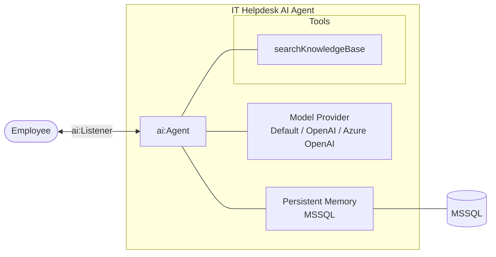

import ThemedImage from '@theme/ThemedImage';
import useBaseUrl from '@docusaurus/useBaseUrl';
import Tabs from '@theme/Tabs';
import TabItem from '@theme/TabItem';

# Building an IT Helpdesk AI Agent with Persistent Memory

## What you will build

In this tutorial, you will build an IT helpdesk AI agent that assists employees with technical support issues and remembers conversations across service restarts using persistent MSSQL-backed memory.

The AI agent exposes a chat interface using `ai:Listener`, responds to employee questions, searches an internal knowledge base for troubleshooting guidance, and maintains conversation history using `ballerinax/ai.memory.mssql`.

By persisting chat history using a database-backed memory store, employees can continue conversations using the same session ID without repeating previously shared information, even after the integration service restarts.

## What you will learn

In this tutorial, you will learn how to:

- Create an AI agent using the **Chat Agent Service** artifact
- Expose the agent through `ai:Listener`
- Persist conversation history across service restarts using MSSQL-backed memory
- Maintain employee-specific conversations using a session ID

## Prerequisites

Before getting started, ensure that the following requirements are met:

- Install the [WSO2 Integrator](../../get-started/setup/setup.md)
- Have an MSSQL database reachable (host, port, user, password) for agent memory persistence. Have the chat messages table (and, if you plan to use human-in-the-loop, the checkpoint table) created ahead of time. See [Memory](../../develop-and-test/integration-artifacts/ai-integrations/agents/memory.md) for the required schemas.
- Have a basic understanding of memory configuration concepts. For more information, refer to [Memory](../../develop-and-test/integration-artifacts/ai-integrations/agents/memory.md)

## Architecture



## Build the integration

In this section, you will create the integration project and configure the AI agent for the IT helpdesk system.

### Step 1: Create the integration project

Create a new integration project by following the instructions in [Create a project](../../develop-and-test/create-workspace/create-a-project.md).

### Step 2: Define the data type

Define the following data type.
<Tabs>
<TabItem value="code" label="Ballerina Code">
```ballerina
# types.bal
type KbArticle record {|
    string articleId;
    string title;
    string content;
    string category;
    string[] tags;
    float relevanceScore;
|};
```
</TabItem>
</Tabs>

Initialize the `kbArticles`.

<Tabs>
<TabItem value="code" label="Ballerina Code">
```ballerina
final KbArticle[] & readonly kbArticles = [
    {
        articleId: "KB-101",
        title: "VPN Troubleshooting",
        content: "Restart the VPN client and reconnect.",
        category: "network",
        tags: ["vpn"],
        relevanceScore: 0.95
    },
    {
        articleId: "KB-102",
        title: "Password Reset",
        content: "Use the self-service password reset portal.",
        category: "account",
        tags: ["password"],
        relevanceScore: 0.9
    }
];
```
</TabItem>
</Tabs>

The tool you add in Step 4 searches `kbArticles` by matching `tags` against the employee's query, and returns the `content` of the highest-`relevanceScore` match.

### Step 3: Create and configure the agent

<Tabs>
<TabItem value="ui" label="Visual Designer" default>

1. Open WSO2 Integrator, create or select your project.
2. On the **Design** tab, select **Add Artifact manually** (below the WSO2 Integrator Copilot's quick-start cards).
3. On the Artifacts page, under **AI Integration**, select **Chat Agent Service**.

<ThemedImage
    alt="Artifacts page with Chat Agent Service highlighted under AI Integration, alongside Durable Agentic Workflow and MCP Service"
    sources={{
        light: useBaseUrl('/img/genai/tutorials/it-helpdesk-chatbot-v5.1/01-create-agent-1-v5.1.png'),
        dark: useBaseUrl('/img/genai/tutorials/it-helpdesk-chatbot-v5.1/01-create-agent-1-v5.1.png'),
    }}
/>

4. On the **Create Chat Agent Service** form, set:
   - **Role** to `itHelpDesk`.
   - **Instructions** to:

```
You are an IT Helpdesk Assistant.

Rules:
  - ALWAYS call searchKnowledgeBase first.
  - ONLY use information returned by tools.
  - Do NOT generate additional troubleshooting steps.
  - Keep responses short.
  - Remember previous conversations.
```

   - **Model** as **Default WSO2 Model Provider**.
   - Leave **Maximum Iterations** at its default (`INFER_TOOL_COUNT`).

<ThemedImage
    alt="Create Chat Agent Service form with Role set to itHelpDesk, Instructions filled in, Model set to Default WSO2 Model Provider, and Maximum Iterations defaulting to INFER_TOOL_COUNT"
    sources={{
        light: useBaseUrl('/img/genai/tutorials/it-helpdesk-chatbot-v5.1/02-create-agent-2-v5.1.png'),
        dark: useBaseUrl('/img/genai/tutorials/it-helpdesk-chatbot-v5.1/02-create-agent-2-v5.1.png'),
    }}
/>

5. Leave **Verbose**, **Tool Loading Strategy**, and **Execute Tool Calls In Parallel** at their defaults.
6. Set **Agent Name** to `itHelpDeskAgent`.
7. Set **Service Base Path** to expose the chat service, for example `/it-helpdesk`.
8. Select **Create**.

<ThemedImage
    alt="Bottom of the Create Chat Agent Service form with Agent Name set to itHelpDeskAgent and Service Base Path set to /it-helpdesk"
    sources={{
        light: useBaseUrl('/img/genai/tutorials/it-helpdesk-chatbot-v5.1/03-create-agent-3-v5.1.png'),
        dark: useBaseUrl('/img/genai/tutorials/it-helpdesk-chatbot-v5.1/03-create-agent-3-v5.1.png'),
    }}
/>

This creates an **AI Agent Service** with a `POST /chat` resource and a `chatAgentListener`, plus the `itHelpDeskAgent` agent under **Agents**. Select **itHelpDeskAgent** under **Agents** to open its canvas: the **AI Agent** node is connected to the model provider, with a **+ Add Memory** button and a `+` icon at its bottom-right corner for adding tools.

<ThemedImage
    alt="AI Agent node for itHelpDeskAgent connected to the model provider, with an Add Memory button and a + icon for adding tools"
    sources={{
        light: useBaseUrl('/img/genai/tutorials/it-helpdesk-chatbot-v5.1/04-create-agent-4-v5.1.png'),
        dark: useBaseUrl('/img/genai/tutorials/it-helpdesk-chatbot-v5.1/04-create-agent-4-v5.1.png'),
    }}
/>

</TabItem>

<TabItem value="code" label="Ballerina Code">

```ballerina
# agents.bal
import ballerina/ai;

final ai:Agent itHelpDeskAgent = check new (
    systemPrompt = {
        role: string `itHelpDesk`,
        instructions: string `You are an IT Helpdesk Assistant.

Rules:
  - ALWAYS call searchKnowledgeBase first.
  - ONLY use information returned by tools.
  - Do NOT generate additional troubleshooting steps.
  - Keep responses short.
  - Remember previous conversations.`
    }, model = check ai:getDefaultModelProvider(), tools = []
);
```

**`main.bal`**: HTTP chat service:

```ballerina
import ballerina/ai;
import ballerina/http;

listener ai:Listener chatAgentListener = new (listenOn = check http:getDefaultListener());

service /it\-helpdesk on chatAgentListener {
    resource function post chat(@http:Payload ai:ChatReqMessage request) returns ai:ChatRespMessage|error {
        string stringResult = check itHelpDeskAgent.run(request.message, request.sessionId);
        return {message: stringResult};
    }
}
```
</TabItem>
</Tabs>

### Step 4: Add a tool to the agent

<Tabs>
<TabItem value="ui" label="Visual Designer" default>

1. Select the **+** at the bottom-right corner of the **AI Agent** node. The **Add Tool** panel opens, listing **Use Connection**, **Use Function**, **Use Agent**, **Use MCP Server**, and **Create Custom Tool**. Select **Create Custom Tool**.

<ThemedImage
    alt="Add Tool panel listing Use Connection, Use Function, Use Agent, Use MCP Server, and Create Custom Tool (highlighted), each with a short description"
    sources={{
        light: useBaseUrl('/img/genai/tutorials/it-helpdesk-chatbot-v5.1/05-add-tool-1-v5.1.png'),
        dark: useBaseUrl('/img/genai/tutorials/it-helpdesk-chatbot-v5.1/05-add-tool-1-v5.1.png'),
    }}
/>

2. Set:
   - **Name** to `searchKnowledgeBase`.
   - A parameter of **Type** `string` and **Name** `query`.
   - **Return Type** to `string`.
3. Leave **Requires Approval** unchecked and select **Create Tool**.

<ThemedImage
    alt="Add Tool - Create Custom Tool form with Name searchKnowledgeBase, a string query parameter, and Return Type string"
    sources={{
        light: useBaseUrl('/img/genai/tutorials/it-helpdesk-chatbot-v5.1/06-add-tool-2-v5.1.png'),
        dark: useBaseUrl('/img/genai/tutorials/it-helpdesk-chatbot-v5.1/06-add-tool-2-v5.1.png'),
    }}
/>

4. The tool now shows as a node connected to the agent. Select it to open its flow, and build the logic shown below: normalize the query, declare a `bestMatch` variable, loop over `kbArticles` and their `tags` to find the highest-`relevanceScore` match, then return its `content`, or fall back to a "no matching article" return.

<ThemedImage
    alt="Agent Tool searchKnowledgeBase flow: declaring normalizedQuery and bestMatch, looping over kbArticles and their tags to update bestMatch, then returning bestMatch.content or a fallback message"
    sources={{
        light: useBaseUrl('/img/genai/tutorials/it-helpdesk-chatbot-v5.1/07-add-tool-3-v5.1.png'),
        dark: useBaseUrl('/img/genai/tutorials/it-helpdesk-chatbot-v5.1/07-add-tool-3-v5.1.png'),
    }}
/>

This searches the `kbArticles` array you defined in Step 2 by matching `tags` against the query, so adding a new topic is a matter of adding a `KbArticle` entry rather than editing the tool's logic.

:::note
New tools open with a placeholder `panic error("not implemented")` statement after the last node you add. It becomes unreachable once your final `Return` is in place, so it's safe to leave it or delete it from the pro-code view. Either way, it doesn't affect the build.
:::

</TabItem>

<TabItem value="code" label="Ballerina Code">

```ballerina
# agents.bal
@ai:AgentTool
isolated function searchKnowledgeBase(string query) returns string {

    string normalizedQuery = query.toLowerAscii();
    KbArticle? bestMatch = ();

    foreach KbArticle article in kbArticles {
        foreach string tag in article.tags {
            if normalizedQuery.includes(tag) && (bestMatch is () || article.relevanceScore > bestMatch.relevanceScore) {
                bestMatch = article;
            }
        }
    }

    if bestMatch is KbArticle {
        return bestMatch.content;
    }

    return "No matching knowledge base article found.";
}
```
</TabItem>
</Tabs>

### Step 5: Add persistent memory to the agent

<Tabs>
<TabItem value="ui" label="Visual Designer" default>

1. Select **+ Add Memory** on the **AI Agent** node. The **Configure Memory** panel opens with **Select Memory** set to **Short Term Memory** and **Store** defaulting to **In-Memory Short Term Memory Store**.

<ThemedImage
    alt="Configure Memory panel with Select Memory set to Short Term Memory and no memory store created yet"
    sources={{
        light: useBaseUrl('/img/genai/tutorials/it-helpdesk-chatbot-v5.1/08-add-memory-1-v5.1.png'),
        dark: useBaseUrl('/img/genai/tutorials/it-helpdesk-chatbot-v5.1/08-add-memory-1-v5.1.png'),
    }}
/>

2. Select **+ Create New Memory Store**, then pick the **MS SQL**-backed store. Bind **MS SQL Client** to your database connection details using configurable values for `host`, `user`, `password`, `database`, and `port` (see the **Ballerina Code** tab for the corresponding `config.bal` declarations). Leave **Max Messages Per Key**, **Cache Config**, and **Table Name** at their defaults (the table name defaults to `ChatMessages`). Creating this table ahead of time is a prerequisite.

<ThemedImage
    alt="Create Memory Store panel with MS SQL Client bound to configurable host, user, password, database, and port values"
    sources={{
        light: useBaseUrl('/img/genai/tutorials/it-helpdesk-chatbot-v5.1/09-add-memory-2-v5.1.png'),
        dark: useBaseUrl('/img/genai/tutorials/it-helpdesk-chatbot-v5.1/09-add-memory-2-v5.1.png'),
    }}
/>

3. Leave **Memory Store Name** at its default (for example `mssqlShorttermmemorystore`). **Result Type** is fixed to `mssql:ShortTermMemoryStore`. Select **Save**.

<ThemedImage
    alt="Bottom of the Create Memory Store panel with Memory Store Name set and Result Type locked to mssql:ShortTermMemoryStore"
    sources={{
        light: useBaseUrl('/img/genai/tutorials/it-helpdesk-chatbot-v5.1/10-add-memory-3-v5.1.png'),
        dark: useBaseUrl('/img/genai/tutorials/it-helpdesk-chatbot-v5.1/10-add-memory-3-v5.1.png'),
    }}
/>

4. Back in the **Configure Memory** panel, the new store is selected under **Store**. Leave **Memory Name** at its default (for example `aiShorttermmemory`) and select **Save**.

<ThemedImage
    alt="Configure Memory panel with Store set to the newly created mssqlShorttermmemorystore and the AI Agent canvas showing a Memory node attached"
    sources={{
        light: useBaseUrl('/img/genai/tutorials/it-helpdesk-chatbot-v5.1/11-add-memory-4-v5.1.png'),
        dark: useBaseUrl('/img/genai/tutorials/it-helpdesk-chatbot-v5.1/11-add-memory-4-v5.1.png'),
    }}
/>

The AI Agent node now shows a **Memory** sub-node (**ShortTermMemory**) alongside its connection to the model provider and the `searchKnowledgeBase` tool.

</TabItem>

<TabItem value="code" label="Ballerina Code">

**`config.bal`**: configurable values for the MSSQL connection.

```ballerina
configurable string host = "<hostName>";
configurable string user = "<userName>";
configurable string password = "<password>";
configurable string database = "<databaseName>";
configurable int port = <port>;
```

Add the MSSQL-backed memory store to `agents.bal`, and wire it into the agent. This is the complete, final `agents.bal`:

```ballerina
# agents.bal
import ballerina/ai;
import ballerinax/ai.memory.mssql;

final ai:Agent itHelpDeskAgent = check new (
    systemPrompt = {
        role: string `itHelpDesk`,
        instructions: string `You are an IT Helpdesk Assistant.

Rules:
  - ALWAYS call searchKnowledgeBase first.
  - ONLY use information returned by tools.
  - Do NOT generate additional troubleshooting steps.
  - Keep responses short.
  - Remember previous conversations.`
    }, model = check ai:getDefaultModelProvider(), tools = [searchKnowledgeBase], memory = aiShorttermmemory
);

@ai:AgentTool
isolated function searchKnowledgeBase(string query) returns string {

    string normalizedQuery = query.toLowerAscii();
    KbArticle? bestMatch = ();

    foreach KbArticle article in kbArticles {
        foreach string tag in article.tags {
            if normalizedQuery.includes(tag) && (bestMatch is () || article.relevanceScore > bestMatch.relevanceScore) {
                bestMatch = article;
            }
        }
    }

    if bestMatch is KbArticle {
        return bestMatch.content;
    }

    return "No matching knowledge base article found.";
}

final mssql:ShortTermMemoryStore mssqlShorttermmemorystore = check new ({
    host: host,
    user: user,
    password: password,
    database: database,
    port: port
});
final ai:ShortTermMemory aiShorttermmemory = check new (mssqlShorttermmemorystore);
```
</TabItem>
</Tabs>

### Step 6: Run and test the integration

<Tabs>
<TabItem value="ui" label="Visual Designer" default>

1. Select **Run**. WSO2 Integrator applies the `--experimental` flag and compiles and starts the service, with progress shown in the integrated terminal.
2. Open the `chat` resource and select **Chat** in the toolbar (next to **Tracing**) to open the **Agent Chat** panel. Try the conversation below to exercise the tool and confirm the agent remembers earlier turns in the same session:

- *"My VPN is not working"*
- *"I already restarted it"*
- *"Any other suggestions?"*

<ThemedImage
    alt="Chat Agent Service resource flow alongside the Agent Chat panel showing the VPN troubleshooting conversation"
    sources={{
        light: useBaseUrl('/img/genai/tutorials/it-helpdesk-chatbot-v5.1/12-run-and-test-1-v5.1.png'),
        dark: useBaseUrl('/img/genai/tutorials/it-helpdesk-chatbot-v5.1/12-run-and-test-1-v5.1.png'),
    }}
/>

3. To prove memory survives a service restart, you need the session ID the Chat panel is using. Select the **ⓘ** icon at the top-left of the **Agent Chat** panel. It shows the **Session ID** and **Chat Endpoint** for the current conversation.

<ThemedImage
    alt="Agent Chat panel's info popover showing Session ID (redacted) and Chat Endpoint"
    sources={{
        light: useBaseUrl('/img/genai/tutorials/it-helpdesk-chatbot-v5.1/13-run-and-test-2-v5.1.png'),
        dark: useBaseUrl('/img/genai/tutorials/it-helpdesk-chatbot-v5.1/13-run-and-test-2-v5.1.png'),
    }}
/>

4. Stop the service, then select **Run** again to restart it. Once it's back up, send a request with the **same session ID**. Use either the one you copied from the info popover, or a session ID of your own choosing used consistently across requests. See the **Ballerina Code** tab for a full curl walkthrough using `EMP-1001`:

```bash
curl -X POST http://localhost:9090/it-helpdesk/chat \
  -H "Content-Type: application/json" \
  -d '{"sessionId": "<your session ID>", "message": "Do you remember my issue?"}'
```

<ThemedImage
    alt="Terminal showing the service restarting, then a curl request with a redacted session ID whose response confirms the agent still remembers the VPN issue"
    sources={{
        light: useBaseUrl('/img/genai/tutorials/it-helpdesk-chatbot-v5.1/14-run-and-test-3-v5.1.png'),
        dark: useBaseUrl('/img/genai/tutorials/it-helpdesk-chatbot-v5.1/14-run-and-test-3-v5.1.png'),
    }}
/>

The response confirms the agent remembers the VPN issue and that you'd already restarted the client. This proves the conversation history survived the restart because it's persisted in MSSQL, not held in process memory.

</TabItem>

<TabItem value="code" label="Ballerina Code">

1. Run the agent integration.
2. Ask a question as an employee:

<Tabs>
<TabItem value="bash" label="Curl Command" default>

```bash
curl -X POST http://localhost:9090/it-helpdesk/chat \
  -H "Content-Type: application/json" \
  -d '{
        "sessionId": "EMP-1001",
        "message": "My VPN is not working"
      }'
```

</TabItem>
</Tabs>

<Tabs>
<TabItem value="bash" label="Response" default>
```json
{
  "message":"Try restarting your VPN client and then reconnecting."
}
```
</TabItem>
</Tabs>

3. Continue the conversation using the same session ID:

<Tabs>
<TabItem value="bash" label="Curl Command" default>
```bash
curl -X POST http://localhost:9090/it-helpdesk/chat \
  -H "Content-Type: application/json" \
  -d '{
        "sessionId":"EMP-1001",
        "message":"I already restarted it"
      }'
```
</TabItem>
</Tabs>

<Tabs>
<TabItem value="bash" label="Response" default>

```json
{
  "message":"Since restarting the VPN client didn't work, please provide more details about the issue for further assistance."
}
```
</TabItem>
</Tabs>

4. Continue the conversation again using the same session ID:

<Tabs>
<TabItem value="bash" label="Curl Command" default>
```bash
curl -X POST http://localhost:9090/it-helpdesk/chat \
  -H "Content-Type: application/json" \
  -d '{
        "sessionId":"EMP-1001",
        "message":"Any other suggestions?"
      }'
```
</TabItem>
</Tabs>

<Tabs>
<TabItem value="bash" label="Response" default>

```json
{
  "message":"The only information available suggests restarting the VPN client and reconnecting. If that hasn't resolved the issue, please check your internet connection or consider contacting your network administrator."
}
```
</TabItem>
</Tabs>

5. Restart the service and reconnect using the same session ID:

<Tabs>
<TabItem value="bash" label="Curl Command" default>

```bash
curl -X POST http://localhost:9090/it-helpdesk/chat \
  -H "Content-Type: application/json" \
  -d '{
        "sessionId":"EMP-1001",
        "message":"Do you remember my issue?"
      }'
```
</TabItem>
</Tabs>

<Tabs>
<TabItem value="bash" label="Response" default>
```json
{
  "message":"Yes, your VPN is not working, and you've already restarted the client."
}
```
</TabItem>
</Tabs>

</TabItem>
</Tabs>

The AI agent remembers previous conversations because the conversation history is stored in persistent MSSQL-backed memory and retrieved using the same session ID.
