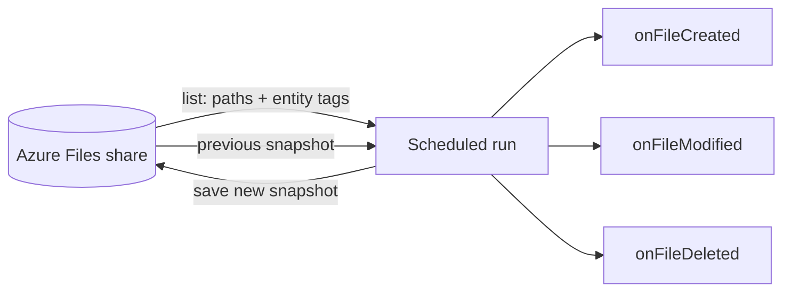

import ThemedImage from '@theme/ThemedImage';
import useBaseUrl from '@docusaurus/useBaseUrl';
import Tabs from '@theme/Tabs';
import TabItem from '@theme/TabItem';

# Track File Changes on an Azure Files Share

**Time:** About 20 minutes | **What you'll build:** A scheduled automation that reports every change on an Azure Files share, logging a "file created", "file modified", or "file deleted" event for each difference since its previous run.

Azure Files has no change feed and no file-level events, but many integrations genuinely need change events: syncing a share to another system, auditing edits, or triggering downstream work only when a file is new or different. In this guide you derive those events yourself, from information the share already keeps.

The key is the **entity tag (eTag)**, a value Azure replaces on every write to a file. The tracker you build runs on a schedule: each run lists the share, compares every file's entity tag against a snapshot saved by the previous run, fires a hook for each difference, saves the new snapshot back to the share, and exits. A listing carries metadata only, so a run never downloads file content: checking a share costs a few list calls whether it holds megabytes or terabytes. And because the snapshot lives on the share itself, runs need no local state, and deletions that happen between runs are still reported.

## How it works



The WSO2 Integrator Scheduler invokes the automation periodically, and each run follows the same short flow:

1. Load the snapshot the previous run saved on the share. On the very first run there is none, so the run starts from an empty baseline.
2. List the share with extended info, collecting each file's path and entity tag. The listing reads metadata only; no file content is transferred.
3. Compare the listing against the snapshot: an unknown path is a **creation**, a changed entity tag is a **modification**, and a snapshot entry missing from the listing is a **deletion**. Each difference fires the matching event hook, which is where your real integration logic goes.
4. Save the new snapshot to the share and exit.

## Before you begin

:::info Prerequisites

- A working WSO2 Integrator environment. Choose the path that fits how you want to work:
    - [Cloud setup](../../get-started/setup/cloud-setup.md) to launch WSO2 Integrator in a browser-based cloud editor.
    - [Local setup](../../get-started/setup/local-setup.md) to install and launch the WSO2 Integrator IDE on your machine.
- An Azure storage account with a file share, and its account name and access key. The [Azure Files connector setup guide](../../connectors/catalog/storage-file/azure.storage.files/setup-guide.md) walks through creating these.
- The share must already exist. A tracker watches a share, it does not provision one.

:::

## Build the change tracker

Build the automation in the **Visual Designer**; only the three event hooks are added in the code view. Switch to the **Ballerina Code** tab at any point to see the finished source.

<Tabs>
<TabItem value="ui" label="Visual Designer" default>

## Step 1: Create the automation

An [automation](../../develop/integration-artifacts/automation.md#creating-an-automation) runs on a schedule with no inbound request, which is the right artifact for a tracker: each run checks the share once and exits, so nothing stays resident between checks.

1. Create a new integration named `ChangeTracker` in a project named `azure-files-change-tracker`.
2. Add an **Automation** artifact to the integration.

You land in the flow editor with a single **Start** node, the entry point the scheduler will call.

<ThemedImage
    alt="Add Artifact panel with the Automation artifact selected for the ChangeTracker integration"
    sources={{
        light: useBaseUrl('/img/guides/usecases/azure-files-change-tracker/create-automation.png'),
        dark: useBaseUrl('/img/guides/usecases/azure-files-change-tracker/create-automation.png'),
    }}
/>

## Step 2: Connect to the share

The tracker lists the share and stores its snapshot through one connection.

1. Add a [connection](../../develop/integration-artifacts/supporting/connections.md#adding-a-connection): select **Add Connection**, open **Search Connectors**, then search for `azure.storage.files` and select **ballerinax/azure.storage.files**.
2. Configure the connection:

    | Field | Value |
    | --- | --- |
    | Share Name | The name of the share to watch |
    | Auth | The storage account name and access key |

    :::tip Best practice
    Don't hardcode these values into the connection. Click each field and select **Configurables** in the [Expression editor](../../develop/understand-ide/editors/expression-editor.md)'s helper pane, then click **New Configurable**, so the values are supplied at runtime instead of stored in the flow. The tracker uses three: `shareName`, `accountName`, and `accountKey`.
    :::

    <ThemedImage
        alt="Configure Files dialog with the share name and the credentials supplied through configurables"
        sources={{
            light: useBaseUrl('/img/guides/usecases/azure-files-change-tracker/add-connection.png'),
            dark: useBaseUrl('/img/guides/usecases/azure-files-change-tracker/add-connection.png'),
        }}
    />

3. Set **Connection Name** to `shareClient`, then select **Save Connection**.

## Step 3: Add the event hooks

The three hooks are where the tracker becomes *your* integration: the guide logs, but a real one might push a notification, enqueue downstream work, or sync the file elsewhere. Add them to `functions.bal` in the code view first, so the flow you build next can call them.

```ballerina
// Replace these three hooks with whatever the change should trigger.
isolated function onFileCreated(string path) {
    log:printInfo("file created", path = path);
}

isolated function onFileModified(string path) {
    log:printInfo("file modified", path = path);
}

isolated function onFileDeleted(string path) {
    log:printInfo("file deleted", path = path);
}
```

## Step 4: Build the diff flow

The flow makes three moves: load the previous run's view of the share, list what is there now, and report every difference before saving the new view. The snapshot lives at `/.change-tracker-snapshot.json` on the share itself, excluded from the diff so the tracker does not report its own bookkeeping. Build the moves on the canvas:

1. Add a **Declare Variable** node for `previous`, a `map<string>` of file path to entity tag, initialized to `{}`.
2. Add the `hasFile` operation from the `shareClient` connection, pointed at the snapshot path, with its result in `snapshotExists`.
3. Add an **If** node on `snapshotExists`. Inside it, the `getFile` operation reads the snapshot into `stored`, and an **Update Variable** node sets `previous` to `check stored.cloneWithType()`.
4. Add a **Declare Variable** node for `current` (another `map<string>`, `{}`), then the `list` operation with `recursive` and `includeExtendedInfo` enabled, its result in `entries`. A **Custom Expression** node drains the listing into `current`, keyed path to entity tag, skipping directories and the snapshot's own path.
5. Add a **Foreach** node over `current.entries()`. Inside it, declare `known = previous[path]`, and an **If** node calls `onFileCreated` when `known is ()` and `onFileModified` when `known != eTag`.
6. Close the flow with a **Foreach** over `previous` that calls `onFileDeleted` for every path missing from `current`, and the `upload` operation that saves `current` to the snapshot path.

Two details are load-bearing. The listing's `includeExtendedInfo` is what puts each file's entity tag on its listing entry; without it the tags are absent and every comparison would be meaningless. And the snapshot is saved only after every difference has been reported, so a run that fails midway reports the same differences again on its next attempt instead of losing them.

Your flow should match the checkpoint below.

<ThemedImage
    alt="Flow editor showing the tracker automation: the snapshot check with hasFile and getFile, the listing drain into the current map, and the comparison foreach"
    sources={{
        light: useBaseUrl('/img/guides/usecases/azure-files-change-tracker/automation-flow.png'),
        dark: useBaseUrl('/img/guides/usecases/azure-files-change-tracker/automation-flow.png'),
    }}
/>

</TabItem>
<TabItem value="code" label="Ballerina Code">

The Visual Designer keeps the source in sync as you build; only the three hooks in `functions.bal` are written by hand. The finished integration looks like this.

```ballerina
// config.bal
configurable string accountName = ?;
configurable string accountKey = ?;
configurable string shareName = ?;
```

```ballerina
// connections.bal
import ballerinax/azure.storage.files;

// The tracker lists the share and stores its snapshot through this client.
final files:Client shareClient = check new (shareName, auth = {accountName, accountKey});
```

```ballerina
// automation.bal
import ballerina/log;

import ballerinax/azure.storage.files;

// The snapshot the previous run saved on the share; excluded from the diff below.
const SNAPSHOT_PATH = "/.change-tracker-snapshot.json";

public function main() returns error? {
    do {
        // The previous run's view of the share: file path -> entity tag.
        map<string> previous = {};
        boolean snapshotExists = check shareClient->hasFile(SNAPSHOT_PATH);
        if snapshotExists {
            json stored = check shareClient->getFile(SNAPSHOT_PATH);
            previous = check stored.cloneWithType();
        }

        // The share's current files, each with its entity tag (a new tag on every write).
        map<string> current = {};
        stream<files:Entry, files:Error?> entries = check shareClient->list("/",
                {recursive: true, includeExtendedInfo: true});
        check entries.forEach(function(files:Entry entry) {
            if !entry.isDirectory && entry.path != SNAPSHOT_PATH {
                current[entry.path] = entry.eTag ?: "";
            }
        });

        // Report every difference since the previous run.
        foreach [string, string] [path, eTag] in current.entries() {
            string? known = previous[path];
            if known is () {
                onFileCreated(path);
            } else if known != eTag {
                onFileModified(path);
            }
        }
        foreach string path in previous.keys() {
            if !current.hasKey(path) {
                onFileDeleted(path);
            }
        }

        // Save the current view on the share for the next run.
        check shareClient->upload(current, SNAPSHOT_PATH);
    } on fail error e {
        log:printError("Error occurred", 'error = e);
        return e;
    }
}
```

```ballerina
// functions.bal
import ballerina/log;

// Replace these three hooks with whatever the change should trigger.
isolated function onFileCreated(string path) {
    log:printInfo("file created", path = path);
}

isolated function onFileModified(string path) {
    log:printInfo("file modified", path = path);
}

isolated function onFileDeleted(string path) {
    log:printInfo("file deleted", path = path);
}
```

</TabItem>
</Tabs>

## Run and verify

1. Go to **Configurations**, supply the storage account name, the access key, and the share name, then select **Run** on the integration overview.

2. The first run reports every file already on the share as created: there is no previous snapshot, so the first listing is the baseline. The run then saves `/.change-tracker-snapshot.json` to the share and exits.

3. Upload a file to the share, through the Azure portal, the Azure CLI, or an SMB mount, and run the automation again for a `file created` line. Overwrite the same file with different content and run again for `file modified`, and delete it and run once more for `file deleted`.

<ThemedImage
    alt="Automation flow with the terminal showing a file modified line and a file deleted line from a run"
    sources={{
        light: useBaseUrl('/img/guides/usecases/azure-files-change-tracker/run-output.png'),
        dark: useBaseUrl('/img/guides/usecases/azure-files-change-tracker/run-output.png'),
    }}
/>

To operate the tracker continuously, schedule the run instead of starting it by hand: push the integration to the cloud and schedule periodic runs there, or use a `cron` entry, a Kubernetes `CronJob`, or a host scheduler. Pick the cadence by how fresh the events must be: a run costs a few list calls regardless of the share's size, so even frequent schedules stay cheap.

## Try it yourself

The finished tracker is available as a ready-to-run sample. Deploy it directly, or clone the source and adapt the three event hooks to your own integration.

[](https://console.devant.dev/new?gh=wso2/integration-samples/tree/main/integrator-default-profile/samples/azure-files-change-tracker)

[View source on GitHub](https://github.com/wso2/integration-samples/tree/main/integrator-default-profile/samples/azure-files-change-tracker)

## What's next

Now that the tracker works, you can take it further:

- **Track changes within seconds.** If a schedule's granularity is too coarse, run the same diff resident: move the body of `main` into a function and invoke it from a `task:Listener` service with `trigger = {interval: ...}`. The diff stays metadata-only, so even a few-second interval costs only listing calls; the trade is a process that never exits.
- **Make the hooks idempotent.** The snapshot is saved only at the end of a run, so a run that fails after firing some hooks reports those same differences again on the next run. That at-least-once behavior is what keeps events from being lost, and hooks that tolerate a repeat make it harmless downstream.
- **Process the files themselves.** To act on file content as files arrive, use the [Azure Files trigger](../../connectors/catalog/storage-file/azure.storage.files/trigger-reference.md): it dispatches each file to a handler and fits consume-style processing, where each handled file is deleted or moved out of the watched path.
