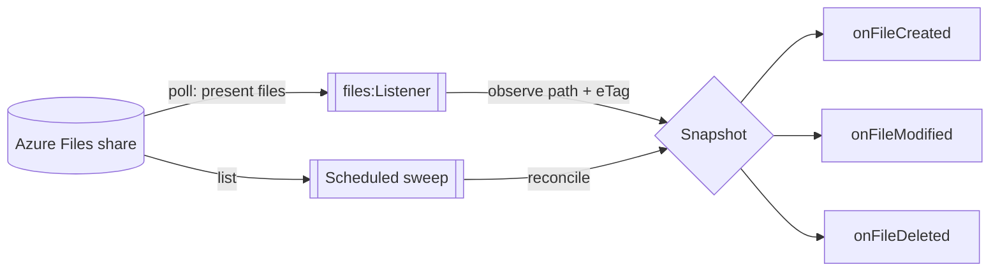

# Track File Changes on an Azure Files Share

**Time:** About 30 minutes | **What you'll build:** A live integration that watches an Azure Files share and reacts to every change on it, logging a "file created", "file modified", or "file deleted" event within seconds of the change happening.

Azure Files has no change feed and no file-level events. The Azure Files listener tells you what is *present* on the share on every poll, but it deliberately remembers nothing between polls, so it cannot tell you what *changed*. That is a sound design (it keeps the listener restart-safe), but many integrations genuinely need change events: syncing a share to another system, auditing edits, or triggering downstream work only when a file is new or different.

The good news is that everything you need to derive change events yourself is already in the listener's hands: every dispatched file carries its **entity tag (eTag)**, a value Azure replaces on every write. In this guide you build the missing piece, a small in-memory snapshot that turns presence into change: a file the snapshot has never seen is a **creation**, a file whose eTag differs is a **modification**, and a file that vanished from the share is a **deletion**.

## How it works



Two schedules cooperate around one shared snapshot:

1. The **Azure Files listener** polls the share and dispatches every present file to a handler. The handler asks the snapshot to classify the file: unseen path means created, changed eTag means modified, same eTag means nothing happened (the dispatch is absorbed silently).
2. A **scheduled sweep** covers the one thing a presence listener can never observe: absence. Each tick lists the share and reconciles the snapshot against what actually exists; every tracked path that is no longer present is a deletion.

Both feed the same three event hooks, which is where your real integration logic goes.

## Before you begin

:::info Prerequisites
- WSO2 Integrator installed and ready to use.
- An Azure storage account with a file share, and its account name and access key. The [Azure Files connector setup guide](../../connectors/catalog/storage-file/azure.storage.files/setup-guide.md) walks through creating these.
- Familiarity with creating an event integration with the Azure Files listener helps; the [connector example](../../connectors/catalog/storage-file/azure.storage.files/example.md) covers that flow step by step.
:::

## Step 1: Create the event integration

Create a new integration project and add an **Event Integration** backed by the Azure Files listener, watching the share root. The [connector example](../../connectors/catalog/storage-file/azure.storage.files/example.md) shows this flow in detail; the short version:

1. In the WSO2 Integrator panel, select **Add Artifact** and choose **Event Integration**.
2. Pick **Azure Files** as the trigger, and supply the share name and credentials as configurable values.
3. Set a short polling interval for snappy events; this guide uses 5 seconds.

The listener declaration this produces looks like this:

```ballerina
import ballerinax/azure.storage.files;

configurable string accountName = ?;
configurable string accountKey = ?;
configurable string shareName = ?;

listener files:Listener tracker = new (shareName,
    auth = {accountName, accountKey},
    pollingInterval = 5
);
```

## Step 2: Add the snapshot, the state that turns presence into change

The connector's listener keeps no per-file state, so the tracker owns it. Open the code view and first add the modules the tracker uses to the import block at the top of the file, alongside the generated connector import:

```ballerina
import ballerina/log;
import ballerina/task;
import ballerina/time;
```

Then add the snapshot: a record for what we remember about each file, and a class that classifies observations against that memory. Handlers can run concurrently, so the class is `isolated` and every access is inside a `lock`.

```ballerina
// What the tracker remembers about a file between polls. The eTag changes on
// every write, so it is the precise change signal; lastModified rides along
// for display.
type FileState record {|
    string eTag;
    time:Utc lastModified;
|};

const CREATED = "created";
const MODIFIED = "modified";

isolated class Snapshot {
    private final map<FileState> files = {};
    // When each path was last observed; reconcile uses it to leave alone any
    // file the sweep's listing is too old to know about.
    private final map<time:Utc> observedAt = {};

    // Classifies one observed file and records its latest state.
    // Returns () when the file is unchanged since the last observation.
    isolated function observe(string path, FileState state) returns CREATED|MODIFIED? {
        lock {
            FileState? known = self.files[path];
            self.files[path] = state.clone();
            self.observedAt[path] = time:utcNow();
            if known is () {
                return CREATED;
            }
            return known.eTag == state.eTag ? () : MODIFIED;
        }
    }

    // Drops every tracked file no longer present on the share, returning the
    // removed paths: those are the deletions since the previous sweep. A file
    // first observed after the sweep began is skipped: the sweep's listing
    // predates it and cannot testify about it.
    isolated function reconcile(string[] presentPaths, time:Utc sweepStart) returns string[] {
        lock {
            map<()> present = {};
            foreach string path in presentPaths.clone() {
                present[path] = ();
            }
            time:Utc boundary = sweepStart.clone();
            string[] removed = [];
            foreach string path in self.files.keys() {
                if present.hasKey(path) {
                    continue;
                }
                time:Utc? seen = self.observedAt[path];
                if seen is time:Utc && time:utcDiffSeconds(seen, boundary) > 0d {
                    continue;
                }
                removed.push(path);
                _ = self.files.remove(path);
                _ = self.observedAt.remove(path);
            }
            return removed.clone();
        }
    }
}

final Snapshot snapshot = new;
```

The `observe` logic is the heart of the tracker, and it is deliberately tiny: unseen path means created, different eTag means modified, same eTag means the listener re-dispatched an unchanged file, which the tracker absorbs as a no-op. That last case matters: the listener redelivers every present file on every poll, and this one line is what makes that harmless.

## Step 3: Classify arrivals in the listener handler

The listener's `onFile` handler receives every present file with its `FileInfo`, which carries the path and the eTag from the share listing. Feed it to the snapshot and fire the matching event:

```ballerina
service on tracker {

    remote function onFile(byte[] content, files:FileInfo file) returns error? {
        CREATED|MODIFIED? change = snapshot.observe(file.path,
                {eTag: file.eTag, lastModified: file.lastModified});
        if change == CREATED {
            onFileCreated(file);
        } else if change == MODIFIED {
            onFileModified(file);
        }
    }

    // Fires on a failed poll and on a file that was listed but could not be read.
    // Deliberately unannotated: an @files:FunctionConfig here would consume the file,
    // and a tracker must never alter the share it observes.
    remote function onError(files:Error err) returns error? {
        log:printError("change tracker listener error", 'error = err);
    }
}
```

Note what this service does **not** do: it never deletes or moves the files it observes. Most listener integrations consume each file after processing it; a tracker is the opposite, a pure observer, which is exactly why the unchanged-file absorption in Step 2 is essential. Keep it that way in the annotations too: `@files:FunctionConfig` is accepted on `onError` as well as on the content handlers, and any `afterProcess` or `afterError` there would delete or move the file, manufacturing a false deletion on the next sweep.

The `onError` handler keeps trouble visible. It fires on three things: a failed poll (an expired credential, a network problem), a file that was listed but whose content could not be read, and a content-binding failure. The middle one matters for a tracker: a file that cannot be read is never dispatched to `onFile`, so its created or modified event waits for a poll whose read succeeds, but because the *listing* still saw it, the sweep will not misreport it as deleted. Without `onError` you would see neither the delay nor its cause.

## Step 4: Catch deletions with a scheduled sweep

A presence listener cannot observe absence: a deleted file simply stops appearing, and no handler fires. The sweep closes that gap. Add a scheduled task on the same interval, list the share, and reconcile:

```ballerina
// The sweep's own client, sharing the listener's credentials.
final files:Client shareClient = check new (shareName, auth = {accountName, accountKey});

listener task:Listener sweeper = new (trigger = {interval: 5});

service on sweeper {

    isolated function execute() returns error? {
        time:Utc sweepStart = time:utcNow();
        stream<files:Entry, files:Error?>|files:Error listing = shareClient->list("/", {recursive: true});
        if listing is files:Error {
            log:printError("change tracker sweep failed", 'error = listing);
            return;
        }
        string[] present = [];
        while true {
            record {|files:Entry value;|}|files:Error? entry = listing.next();
            if entry is () {
                break;
            }
            if entry is files:Error {
                log:printError("change tracker sweep failed", 'error = entry);
                return;
            }
            if !entry.value.isDirectory {
                present.push(entry.value.path);
            }
        }
        foreach string path in snapshot.reconcile(present, sweepStart) {
            onFileDeleted(path);
        }
    }
}
```

The listing is drained with an explicit `next()` loop because a scheduled task's `execute` must be `isolated`, which a `forEach` closure over the local array would break.

The sweep timestamps its start before listing, and `reconcile` skips any file first observed after that moment: the listing predates such a file, so its absence there proves nothing. Without that boundary, a file arriving while the listing is in flight would be misreported as deleted and then created again on the next poll.

## Step 5: React to the events

The three hooks are where the tracker becomes *your* integration. This guide logs; a real integration might push a notification, enqueue downstream work, or sync the file elsewhere:

```ballerina
isolated function onFileCreated(files:FileInfo file) {
    log:printInfo("file created", path = file.path, sizeBytes = file.sizeBytes, eTag = file.eTag);
}

isolated function onFileModified(files:FileInfo file) {
    log:printInfo("file modified", path = file.path, sizeBytes = file.sizeBytes, eTag = file.eTag);
}

isolated function onFileDeleted(string path) {
    log:printInfo("file deleted", path = path);
}
```

## Run and verify

1. Go to **Configurations**, supply the storage account name, the access key, and the share name, then select **Run** on the integration overview.

2. On the first poll, every file already on the share is reported as created: the snapshot starts empty, so the first scan is the baseline.

3. Upload a file to the share (through the Azure portal, the Azure CLI, or an SMB mount) and watch a `file created` line appear within a few seconds. Overwrite the same file with different content for `file modified`, and delete it for `file deleted`.

## Going further

**Restart behavior.** The snapshot lives in memory, so a restart re-baselines: every present file is reported as created again, and deletions that happened while the tracker was down are missed. If that matters for your integration, persist the snapshot map (as JSON to a local file, or even to a file on the share itself): load it at startup, save it after each sweep. The event hooks make natural save points.

**Delivery semantics.** The derived events are best-effort, weaker than the listener's own at-least-once file delivery: `observe` and `reconcile` commit the snapshot state before your hook runs, so a crash between the commit and the hook drops that one event, while a restart re-baselines the snapshot and replays every present file as created. A third gap is narrower but now visible: a file the listener lists and then fails to read is not dispatched, so its event waits for a later poll. `onError` reports it, and because the sweep works off the listing rather than the read, that file is never mistaken for a deletion. Plan for all three. Make the hooks idempotent so replays are harmless downstream, and if an event must never be lost, persist the snapshot only after the hook has handed the event off durably, so a crash replays the event instead of dropping it.

**Interval tuning.** The listener's poll and the sweep run on independent schedules; 5 seconds each makes a responsive demo. For large shares, lengthen both, and remember each tick lists the share, so the cost scales with the share's file count, not with how much changed.

**The scheduled alternative.** If you do not need events within seconds, you do not need a resident listener at all: the same snapshot-diff idea works as a bounded program that runs on a schedule, compares the share against a snapshot file saved by its previous run, logs the differences, and exits. As a bonus, the persisted snapshot catches deletions across downtime, the one blind spot of the in-memory tracker above. Pick by latency: live events warrant the listener, periodic reconciliation warrants the scheduled run.
