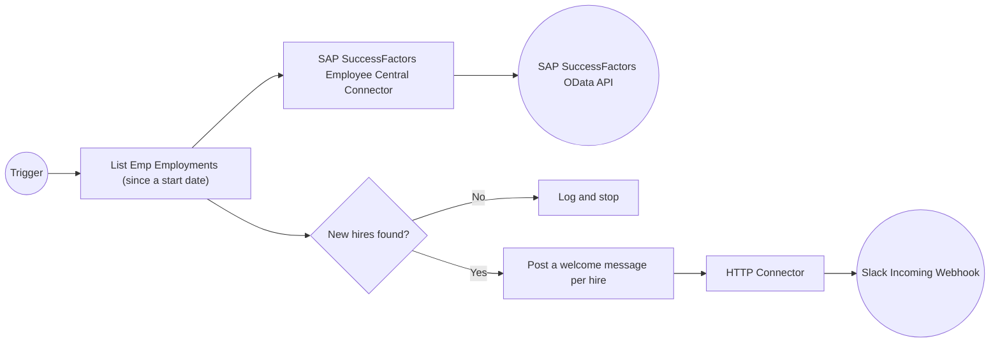

import ThemedImage from '@theme/ThemedImage';
import useBaseUrl from '@docusaurus/useBaseUrl';
import Tabs from '@theme/Tabs';
import TabItem from '@theme/TabItem';

# Send Slack Welcome Messages for New SAP SuccessFactors Hires

**Time:** About 20 minutes | **What you'll build:** An automation that polls SAP SuccessFactors Employee Central for employees hired since a given date and posts a welcome message to a Slack channel for each one, with no code to write.

HR systems know about a new hire the moment onboarding starts. Everyone else finds out days later, if at all, from a calendar invite or a Slack message someone remembered to send. In this guide you build an automation that checks SAP SuccessFactors Employee Central for newly onboarded employees and posts a welcome message straight to Slack for each one.

## How it works



Each run follows the same short flow:

1. Read `EmpEmployment` records from Employee Central, filtered to those with a start date on or after a configurable cutoff.
2. If nothing new turned up, log a note and stop.
3. Otherwise, for each new hire, post a welcome message to Slack through an Incoming Webhook and log the outcome.

## Before you begin

:::info Prerequisites

- A working WSO2 Integrator environment. Choose the path that fits how you want to work:
    - [Cloud setup](../../get-started/setup/cloud-setup.md) to launch WSO2 Integrator in a browser-based cloud editor.
    - [Local setup](../../get-started/setup/local-setup.md) to install and launch the WSO2 Integrator IDE on your machine.
- Access to a SAP SuccessFactors Employee Central OData API server, with a username, password, and hostname. See the [setup guide](../../connectors/catalog/hrms/sap.successfactors.ecemploymentinformation/setup-guide.md) if you need to register OAuth2/basic credentials first.
- A Slack workspace where you can add an [Incoming Webhook](https://api.slack.com/messaging/webhooks) to the channel you want to notify. Slack gives you a single URL for it — that's the only Slack-side setup this guide needs.

:::

## Build the automation

Build the flow in the **Visual Designer**, or switch to the **Ballerina Code** tab to see the equivalent source the designer generates for you.

<Tabs>
<TabItem value="ui" label="Visual Designer" default>

## Step 1: Create the automation

An [automation](../../develop/integration-artifacts/automation.md#creating-an-automation) runs with no inbound request, which makes it the right artifact for a periodic Employee Central check.

1. Create a new integration named `NewHireSlackNotifier`.
2. Add an **Automation** artifact to the integration.

You land in the [flow editor](../../develop/understand-ide/editors/flow-diagram-editor/flow-diagram-editor.md) with a single **Start** node.

## Step 2: Connect to SAP SuccessFactors Employee Central

1. Add a [connection](../../develop/integration-artifacts/supporting/connections.md#adding-a-connection): **Add Connection → Search Connectors**, then search for `sap.successfactors.ecemploymentinformation` and select the **Ecemploymentinformation** connector card.

    <ThemedImage
        alt="Connector search palette with sap.successfactors.ecemploymentinformation entered and the Ecemploymentinformation connector card showing"
        sources={{
            light: useBaseUrl('/img/guides/usecases/sap-successfactors-new-hire-slack-notifications/connector-palette.png'),
            dark: useBaseUrl('/img/guides/usecases/sap-successfactors-new-hire-slack-notifications/connector-palette.png'),
        }}
    />

2. Configure the connection:

    | Field | Value |
    | --- | --- |
    | Config | An expression with the `auth` record — bind `username` to a `sfUsername` configurable and `password` to a `sfPassword` configurable |
    | Hostname | Your SAP SuccessFactors OData API hostname, for example `api68sales.successfactors.com` — bind to a `sfHostname` configurable |

    :::tip Best practice
    Don't hardcode credentials into the connection. Click each field and select **Configurables** in the [Expression editor](../../develop/understand-ide/editors/expression-editor.md)'s helper pane, then click **New Configurable**, so the value is supplied at runtime instead of stored in the flow.
    :::

    <ThemedImage
        alt="Configure Ecemploymentinformation connection dialog with the auth username and password bound to configurables, and Hostname bound to sfHostname"
        sources={{
            light: useBaseUrl('/img/guides/usecases/sap-successfactors-new-hire-slack-notifications/sf-connection-form.png'),
            dark: useBaseUrl('/img/guides/usecases/sap-successfactors-new-hire-slack-notifications/sf-connection-form.png'),
        }}
    />

3. Name the connection `sfClient`.

## Step 3: Connect to Slack through the HTTP connector

SAP SuccessFactors doesn't post to Slack — you do that yourself with a plain HTTP POST to the Incoming Webhook URL. WSO2 Integrator's built-in [HTTP connector](../../connectors/catalog/built-in/http/overview.md) is all you need for that.

1. Add another connection: search for `http` and select the built-in **HTTP** connector.
2. Set **URL** to your Slack Incoming Webhook URL, bound to a `slackWebhookUrl` configurable.
3. Name the connection `slackHttpClient`.

    <ThemedImage
        alt="Configure HTTP connection dialog with URL bound to a slackWebhookUrl configurable and the connection named slackHttpClient"
        sources={{
            light: useBaseUrl('/img/guides/usecases/sap-successfactors-new-hire-slack-notifications/http-connection-form.png'),
            dark: useBaseUrl('/img/guides/usecases/sap-successfactors-new-hire-slack-notifications/http-connection-form.png'),
        }}
    />

Both connections now appear under **Connections**.

<ThemedImage
    alt="Connections panel listing both sfClient and slackHttpClient"
    sources={{
        light: useBaseUrl('/img/guides/usecases/sap-successfactors-new-hire-slack-notifications/connections-list.png'),
        dark: useBaseUrl('/img/guides/usecases/sap-successfactors-new-hire-slack-notifications/connections-list.png'),
    }}
/>

## Step 4: List employees hired since a given date

1. After the **Start** node, select the **+** icon and expand `sfClient` to see its operations.

    <ThemedImage
        alt="Node panel with the sfClient connection expanded to display its operations, including List Emp Employments"
        sources={{
            light: useBaseUrl('/img/guides/usecases/sap-successfactors-new-hire-slack-notifications/node-panel-sfclient-expanded.png'),
            dark: useBaseUrl('/img/guides/usecases/sap-successfactors-new-hire-slack-notifications/node-panel-sfclient-expanded.png'),
        }}
    />

2. Select **List Emp Employments** and configure it:

    | Field | Value |
    | --- | --- |
    | \$filter | Bound to a `startDateFilter` configurable, defaulted to `"startDate ge datetime'2000-01-01T00:00:00'"` |
    | Result | Leave the default, `ecemploymentinformationWrapper1` |

    :::note
    The **\$filter** field is a Ballerina expression, not a plain string box — the OData filter text itself has to be wrapped in quotes, as shown above. This is the same OData `\$filter` syntax used across the SAP SuccessFactors Employee Central connectors: adjust the date to whatever cutoff makes sense for your run (a scheduler could compute "yesterday" or "since the last run" instead of a fixed date).
    :::

    <ThemedImage
        alt="List Emp Employments operation configured with the dollar filter parameter bound to startDateFilter and Result set to ecemploymentinformationWrapper1"
        sources={{
            light: useBaseUrl('/img/guides/usecases/sap-successfactors-new-hire-slack-notifications/list-emp-employments-config.png'),
            dark: useBaseUrl('/img/guides/usecases/sap-successfactors-new-hire-slack-notifications/list-emp-employments-config.png'),
        }}
    />

3. Select **Save**. The operation appears between **Start** and **Error Handler**.

    <ThemedImage
        alt="Flow with the List Emp Employments operation added between Start and Error Handler"
        sources={{
            light: useBaseUrl('/img/guides/usecases/sap-successfactors-new-hire-slack-notifications/list-emp-employments-added.png'),
            dark: useBaseUrl('/img/guides/usecases/sap-successfactors-new-hire-slack-notifications/list-emp-employments-added.png'),
        }}
    />

## Step 5: Extract the new hires and skip empty runs

1. Add a [**Declare Variable**](../../develop/understand-ide/editors/flow-diagram-editor/statement.md#declare-variable) node after the operation that assigns `ecemploymentinformationWrapper1.d?.results ?: []` to a variable named `newHires` (type `EmpEmployment[]`).

    <ThemedImage
        alt="Flow with a Declare Variable node creating newHires from ecemploymentinformationWrapper1.d?.results ?: []"
        sources={{
            light: useBaseUrl('/img/guides/usecases/sap-successfactors-new-hire-slack-notifications/declare-newhires-added.png'),
            dark: useBaseUrl('/img/guides/usecases/sap-successfactors-new-hire-slack-notifications/declare-newhires-added.png'),
        }}
    />

2. Add a [**Control**](../../develop/understand-ide/editors/flow-diagram-editor/control.md) node after it. The node panel groups **If**, **Match**, **While**, **Foreach**, and **Return** together under **Control** — you'll use several of these in this guide.

    <ThemedImage
        alt="Node panel Control category listing If, Match, While, Foreach, and Return"
        sources={{
            light: useBaseUrl('/img/guides/usecases/sap-successfactors-new-hire-slack-notifications/node-panel-control-category.png'),
            dark: useBaseUrl('/img/guides/usecases/sap-successfactors-new-hire-slack-notifications/node-panel-control-category.png'),
        }}
    />

3. Select **If** with the condition `newHires.length() == 0`.
4. Inside the branch, add a **Log Info** node with the message `"No new hires found."`.
5. After the log, add a [**Return**](../../develop/understand-ide/editors/flow-diagram-editor/control.md#return) node with no value.
6. After the **If**, add one more **Log Info** node with the message `` string `Found ${newHires.length()} new hire(s). Sending Slack notifications...` ``.

Your flow now branches and returns early when there is nothing new, and otherwise announces how many new hires it found.

<ThemedImage
    alt="Flow with the If branch built: when newHires is empty it logs No new hires found and returns, otherwise it logs how many new hires were found"
    sources={{
        light: useBaseUrl('/img/guides/usecases/sap-successfactors-new-hire-slack-notifications/if-empty-check-added.png'),
        dark: useBaseUrl('/img/guides/usecases/sap-successfactors-new-hire-slack-notifications/if-empty-check-added.png'),
    }}
/>

## Step 6: Build the per-hire payload

1. Add a [**Foreach**](../../develop/understand-ide/editors/flow-diagram-editor/control.md#foreach) node after the log, looping over `newHires` with the item variable `hire` (type `EmpEmployment`).
2. Inside the loop, add three **Declare Variable** nodes:

    | Variable | Type | Expression |
    | --- | --- | --- |
    | `userId` | `string` | `hire.userId ?: "Unknown"` |
    | `startDate` | `string` | `(hire["startDate"] ?: "Unknown").toString()` |
    | `slackPayload` | `json` | `` { "text": string `:wave: *New Employee Onboarded!*\n• *Employee ID:* ${userId}\n• *Start Date:* ${startDate}\nWelcome to the team!` } `` |

    `userId` and `startDate` are optional fields on `EmpEmployment`, so each gets a fallback with `?:` before use. `slackPayload` builds the exact JSON body Slack's Incoming Webhook API expects: a single `text` field with the message.

    <ThemedImage
        alt="Foreach loop over newHires with three Declare Variable nodes building userId, startDate, and slackPayload"
        sources={{
            light: useBaseUrl('/img/guides/usecases/sap-successfactors-new-hire-slack-notifications/foreach-declare-vars-added.png'),
            dark: useBaseUrl('/img/guides/usecases/sap-successfactors-new-hire-slack-notifications/foreach-declare-vars-added.png'),
        }}
    />

## Step 7: Post to Slack and handle the result

1. Still inside the loop, select the **+** icon, expand `slackHttpClient`, and add its **post** operation.
2. Configure it:

    | Field | Value |
    | --- | --- |
    | Path | `""` (the webhook URL already points at the exact endpoint) |
    | Message | `slackPayload` |
    | Result | `result` |

3. Add an **If** node with the condition `result is error`.
4. In the **If** branch, add a **Log Error** node with the message `` string `Failed to notify Slack for ${userId}: ${result.message()}` ``.
5. In the **Else** branch, add a **Log Info** node with the message `` string `Slack notification sent for employee: ${userId}` ``.

The loop now builds a Slack message for each new hire, posts it, and logs whether it succeeded.

<ThemedImage
    alt="Foreach loop completed with the slackHttpClient post operation and an If block logging success or failure per hire"
    sources={{
        light: useBaseUrl('/img/guides/usecases/sap-successfactors-new-hire-slack-notifications/slack-post-and-result-handling-added.png'),
        dark: useBaseUrl('/img/guides/usecases/sap-successfactors-new-hire-slack-notifications/slack-post-and-result-handling-added.png'),
    }}
/>

Your flow is complete: it reads new hires since the cutoff date, exits early when there are none, and otherwise posts a Slack welcome message and logs the outcome for each one.

</TabItem>
<TabItem value="code" label="Ballerina Code">

You design this on the canvas and never write any of it. The Visual Designer keeps the source in sync across `connections.bal`, `config.bal`, and `automation.bal`.

```ballerina
// connections.bal
import ballerina/http;
import ballerinax/sap.successfactors.ecemploymentinformation;

final ecemploymentinformation:Client sfClient = check new ({auth: {username: sfUsername, password: sfPassword}}, sfHostname);
final http:Client slackHttpClient = check new (slackWebhookUrl);
```

```ballerina
// config.bal
configurable string sfUsername = ?;
configurable string sfPassword = ?;
configurable string sfHostname = ?;
configurable string slackWebhookUrl = ?;
configurable string startDateFilter = "startDate ge datetime'2000-01-01T00:00:00'";
```

```ballerina
// automation.bal
import ballerina/http;
import ballerina/log;
import ballerinax/sap.successfactors.ecemploymentinformation;

public function main() returns error? {
    do {
        ecemploymentinformation:Wrapper_1 ecemploymentinformationWrapper1 = check sfClient->listEmpEmployments(\$filter = startDateFilter);
        ecemploymentinformation:EmpEmployment[] newHires = ecemploymentinformationWrapper1.d?.results ?: [];

        if newHires.length() == 0 {
            log:printInfo("No new hires found.");
            return;
        }

        log:printInfo(string `Found ${newHires.length()} new hire(s). Sending Slack notifications...`);

        foreach ecemploymentinformation:EmpEmployment hire in newHires {
            string userId = hire.userId ?: "Unknown";
            string startDate = (hire["startDate"] ?: "Unknown").toString();

            json slackPayload = {
                "text": string `:wave: *New Employee Onboarded!*\n• *Employee ID:* ${userId}\n• *Start Date:* ${startDate}\nWelcome to the team!`
            };

            http:Response|error result = slackHttpClient->post("", slackPayload);
            if result is error {
                log:printError(string `Failed to notify Slack for ${userId}: ${result.message()}`);
            } else {
                log:printInfo(string `Slack notification sent for employee: ${userId}`);
            }
        }
    } on fail error e {
        log:printError("Error occurred", 'error = e);
        return e;
    }
}
```

The `ecemploymentinformation:Client` and the `http:Client` are generated when you add the connections; the flow logic, as you build the canvas.

</TabItem>
</Tabs>

## Run and verify

1. Go to **Configurations** and supply your SAP SuccessFactors credentials, hostname, and Slack Incoming Webhook URL:

    <ThemedImage
        alt="Configurable Variables panel listing sfUsername, sfPassword, sfHostname, slackWebhookUrl, and startDateFilter, all empty"
        sources={{
            light: useBaseUrl('/img/guides/usecases/sap-successfactors-new-hire-slack-notifications/configurable-variables-empty.png'),
            dark: useBaseUrl('/img/guides/usecases/sap-successfactors-new-hire-slack-notifications/configurable-variables-empty.png'),
        }}
    />

    :::tip Try it without a real Slack channel first
    Not ready to post into a live channel yet? Point `slackWebhookUrl` at a local HTTP listener (for example, a few lines of Python's `http.server`) to see exactly what gets posted before wiring up the real webhook — see the note at the end of this section.
    :::

2. Select **Run** on the integration. The terminal compiles the project, connects to SAP SuccessFactors, and logs one line per new hire as it posts to Slack.

    <ThemedImage
        alt="Terminal output from a run: the integration compiles, then logs a Slack notification sent line for each new hire's employee ID"
        sources={{
            light: useBaseUrl('/img/guides/usecases/sap-successfactors-new-hire-slack-notifications/run-terminal-output.png'),
            dark: useBaseUrl('/img/guides/usecases/sap-successfactors-new-hire-slack-notifications/run-terminal-output.png'),
        }}
    />

3. Check the Slack channel tied to your webhook — each new hire since the cutoff date should have its own welcome message.

    If you pointed `slackWebhookUrl` at a local listener instead, its output shows the exact JSON payload Slack would have received for each hire — the message text, the employee ID, and the start date pulled straight from Employee Central:

    <ThemedImage
        alt="Terminal running a local mock listener, showing the JSON payloads it received for several new hires"
        sources={{
            light: useBaseUrl('/img/guides/usecases/sap-successfactors-new-hire-slack-notifications/mock-listener-payloads.png'),
            dark: useBaseUrl('/img/guides/usecases/sap-successfactors-new-hire-slack-notifications/mock-listener-payloads.png'),
        }}
    />

    Once the payload looks right, switch `slackWebhookUrl` back to your real Slack Incoming Webhook URL — the same `post` call delivers straight to the channel.

## What's next

Now that the automation works, you can take it further:

- **Deploy and schedule it.** Ship it to [WSO2 Cloud](../../deploy/cloud/overview.md), a [Docker container](../../deploy/self-hosted/containerized-deployment.md#docker-deployment), [Kubernetes](../../deploy/self-hosted/containerized-deployment.md#kubernetes-deployment), or a [virtual machine](../../deploy/self-hosted/vm-deployment.md), then schedule periodic runs there (a `cron` entry, a Kubernetes `CronJob`, a host scheduler, or the WSO2 Integration Platform) so it checks for new hires on its own.
- **Track the cutoff automatically.** Instead of a fixed `startDateFilter`, compute it from the previous run's timestamp (for example, persisted to a file or a small database) so every run only ever sees hires added since the last check.
- **Enrich the message.** Pull additional fields from the [SAP SuccessFactors Employee Central connectors](../../connectors/catalog/hrms/sap.successfactors.ecemployeeprofile/overview.md) — department, manager, or job title — and format them into Slack's [Block Kit](https://api.slack.com/block-kit) for a richer welcome message.
