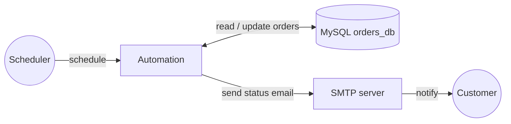

import ThemedImage from '@theme/ThemedImage';
import useBaseUrl from '@docusaurus/useBaseUrl';
import Tabs from '@theme/Tabs';
import TabItem from '@theme/TabItem';

# Send MySQL order status emails over SMTP

**Time:** About 25 minutes | **What you'll build:** A scheduled automation that finds newly placed orders, emails each customer, and advances the order to processing, with no code to write.

Every new order needs two things to happen: the customer should hear it is being handled, and the order should move from `PLACED` to `PROCESSING` so it is never picked up twice. In this guide you build a scheduled automation that does both, bridging your order database and your email server, designed entirely on the canvas in the Visual Designer.

:::info What you will build

An **automation** that, on each run, reads every `PLACED` order from a MySQL `orders_db`, emails the customer, advances the order to `PROCESSING`, and logs a summary. The first run notifies the two waiting customers and moves their orders forward; a second run finds nothing to do and exits after one log line.

:::

## How it works



There is no listener or inbound request. A scheduler invokes the automation periodically, and each run follows the same short flow:

1. Read the `orders` table for rows whose status is still `PLACED`.
2. If nothing is waiting, log a note and stop.
3. Otherwise, for each waiting order, email the customer and update the order to `PROCESSING`.
4. Log a one-line summary of how much work the run did.

You assemble that flow from a handful of visual building blocks:

| Building block | Role in the flow | Learn more |
| --- | --- | --- |
| **Connection** (`ordersDB`) | Reads and updates orders in MySQL | [Connections](../../develop/integration-artifacts/supporting/connections.md), [Persist tool](../../develop/tools/integration-tools/persist-tool.md) |
| **Connection** (`emailSmtpclient`) | Sends customer emails through an SMTP server | [Email connector](../../connectors/catalog/built-in/email/email.md) |
| **Automation** | The scheduled entry point that runs the logic with no inbound request | [Automation](../../develop/integration-artifacts/automation.md) |
| **Get rows** | Reads the orders still waiting to be processed | [Persist tool](../../develop/tools/integration-tools/persist-tool.md#use-the-generated-client) |
| **If** + **Return** | Exits the run early when there is nothing to do | [Control](../../develop/understand-ide/editors/flow-diagram-editor/control.md) |
| **Foreach** | Iterates the waiting orders | [Control](../../develop/understand-ide/editors/flow-diagram-editor/control.md#foreach) |
| **Send Message** + **Update row** | Emails the customer, then advances the order | [Email connector](../../connectors/catalog/built-in/email/email.md), [Persist tool](../../develop/tools/integration-tools/persist-tool.md#use-the-generated-client) |
| **Log Info** | Records progress and a final summary | [Logging](../../develop/understand-ide/editors/flow-diagram-editor/logging.md) |

## Before you begin

:::info Prerequisites

- A working WSO2 Integrator environment. Choose the path that fits how you want to work:
    - [Cloud setup](../../get-started/setup/cloud-setup.md) to launch WSO2 Integrator in a browser-based cloud editor.
    - [Local setup](../../get-started/setup/local-setup.md) to install and launch the WSO2 Integrator IDE on your machine.
- MySQL Server 8.0 or later running on `localhost:3306`. If you need to install or configure it, follow the [MySQL connector setup guide](../../connectors/catalog/database/mysql/setup-guide.md).
- The sample `orders_db` database, seeded with the data below.
- An SMTP-enabled email account to send the customer notifications, configured per the [Email connector setup guide](../../connectors/catalog/built-in/email/setup-guide.md) (for example, Gmail with an App Password).

:::

### Set up the sample database

Run this against your MySQL server to create the database, user, tables, and seed data. Two orders start as `PLACED` (the work to pick up) and two as `PROCESSING`.

<details>
<summary>View the database setup script</summary>

```sql
-- Create the database and a dedicated user
CREATE DATABASE IF NOT EXISTS orders_db;
CREATE USER IF NOT EXISTS 'orders_user'@'localhost' IDENTIFIED BY 'orders_pass';
GRANT SELECT, UPDATE ON orders_db.* TO 'orders_user'@'localhost';
FLUSH PRIVILEGES;

USE orders_db;

-- Tables
CREATE TABLE customers (
    customer_id VARCHAR(20) PRIMARY KEY,
    name        VARCHAR(100),
    email       VARCHAR(100),
    address     VARCHAR(255)
);

CREATE TABLE products (
    product_id   VARCHAR(20) PRIMARY KEY,
    product_name VARCHAR(100),
    category     VARCHAR(50),
    price        DECIMAL(10,2)
);

CREATE TABLE orders (
    order_id    VARCHAR(20) PRIMARY KEY,
    customer_id VARCHAR(20),
    product_id  VARCHAR(20),
    amount      DECIMAL(10,2),
    status      VARCHAR(20) DEFAULT 'PLACED',
    placed_at   TIMESTAMP DEFAULT CURRENT_TIMESTAMP,
    FOREIGN KEY (customer_id) REFERENCES customers(customer_id),
    FOREIGN KEY (product_id)  REFERENCES products(product_id)
);

-- Seed data
INSERT INTO customers VALUES
    ('CUST-001', 'Ada Lovelace',   'ada@example.com',   '10 Analytical Way'),
    ('CUST-002', 'Alan Turing',    'alan@example.com',  '24 Enigma Street'),
    ('CUST-003', 'Grace Hopper',   'grace@example.com', '7 Compiler Lane'),
    ('CUST-004', 'Edsger Dijkstra','ed@example.com',    '3 Shortest Path');

INSERT INTO products VALUES
    ('PROD-001', 'Mechanical Keyboard', 'Peripherals', 79.99),
    ('PROD-002', 'USB-C Hub',           'Accessories', 34.50),
    ('PROD-003', 'Standing Desk',       'Furniture',   129.00),
    ('PROD-004', 'Desk Lamp',           'Lighting',    49.99);

INSERT INTO orders (order_id, customer_id, product_id, amount, status) VALUES
    ('ORD-001', 'CUST-001', 'PROD-001', 79.99,  'PLACED'),
    ('ORD-002', 'CUST-002', 'PROD-002', 34.50,  'PLACED'),
    ('ORD-003', 'CUST-003', 'PROD-003', 129.00, 'PROCESSING'),
    ('ORD-004', 'CUST-004', 'PROD-004', 49.99,  'PROCESSING');
```

</details>

## Build the automation

Build the flow in the **Visual Designer**, or switch to the **Ballerina Code** tab to see the equivalent source the designer generates for you.

<Tabs>
<TabItem value="ui" label="Visual Designer" default>

## Step 1: Create the automation

An [automation](../../develop/integration-artifacts/automation.md#creating-an-automation) runs on a schedule with no inbound request, which makes it the right artifact for a recurring job.

1. Create a new integration named `OrderProcessingAutomation` in a project named `order-management-automation`.
2. Add an **Automation** artifact to the integration.

You land in the [flow editor](../../develop/understand-ide/editors/flow-diagram-editor/flow-diagram-editor.md) with a single **Start** node, the entry point the scheduler will call.

## Step 2: Connect to the order database

1. Add a [connection](../../develop/integration-artifacts/supporting/connections.md#adding-a-connection): **Add Connection → Connect to a Database → MySQL**.
2. Enter the credentials below, then [introspect](../../develop/tools/integration-tools/persist-tool.md#connect-to-a-database) the schema.
3. Select all tables.
4. Name the connection `ordersDB`.

| Field | Value |
| --- | --- |
| Host | `localhost` |
| Port | `3306` |
| Database | `orders_db` |
| Username | `orders_user` |
| Password | `orders_pass` |

WSO2 Integrator generates a typed client and record types from the schema, and stores the connection settings as [configurable values](../../develop/tools/integration-tools/persist-tool.md#use-the-generated-client) so you can repoint it per environment.

The `ordersDB` connection now appears under **Connections**.

<ThemedImage
    alt="Flow editor showing the ordersDB connection available after the wizard completes"
    sources={{
        light: useBaseUrl('/img/guides/usecases/order-management-automation/db-connection-saved.png'),
        dark: useBaseUrl('/img/guides/usecases/order-management-automation/db-connection-saved.png'),
    }}
/>

## Step 3: Read the orders waiting to be processed

1. After the **Start** node, add the `ordersDB` connection's `Get rows from orders table` operation.
2. Set **Result** to `placedOrders` and check **Select All Fields**.
3. Under **Advanced Configurations**, set the **Where Clause** to `status = ${"PLACED"}` so it returns only the waiting orders.

You type just the condition; WSO2 Integrator turns it into a safe parameterized query.

Your **Where Clause** should match the checkpoint below.

<ThemedImage
    alt="Get rows operation configured with Result placedOrders, Select All Fields, and a Where Clause filtering on status PLACED"
    sources={{
        light: useBaseUrl('/img/guides/usecases/order-management-automation/get-rows-config.png'),
        dark: useBaseUrl('/img/guides/usecases/order-management-automation/get-rows-config.png'),
    }}
/>

## Step 4: Skip the run when nothing is waiting

Exit early when there is nothing to do, so an empty run stays cheap and quiet.

1. Add an [**If**](../../develop/understand-ide/editors/flow-diagram-editor/control.md#if) node after **get** with the condition `placedOrders.length() == 0`.
2. Inside the branch, add a **Log Info** node with the message `"No new orders to process."`
3. After the log, add a [**Return**](../../develop/understand-ide/editors/flow-diagram-editor/control.md#return) node with no value.

Your flow should now branch and return early when nothing is waiting.

<ThemedImage
    alt="Flow with the If branch built: when placedOrders is empty it logs No new orders to process and returns"
    sources={{
        light: useBaseUrl('/img/guides/usecases/order-management-automation/if-return-flow.png'),
        dark: useBaseUrl('/img/guides/usecases/order-management-automation/if-return-flow.png'),
    }}
/>

## Step 5: Notify the customer and advance the order

To reach your mail server, add an [**Email Smtp**](../../connectors/catalog/built-in/email/email.md) connection named `emailSmtpclient`, binding **Host**, **Username**, **Password**, and **Port** to configurable values and setting **Security** to match your server.

Then build the loop:

1. Add a [**Foreach**](../../develop/understand-ide/editors/flow-diagram-editor/control.md#foreach) node after the **If**, looping over `placedOrders` with the item variable `placedOrder` (type `PlacedOrdersType`).
2. Inside the loop, add the `ordersDB` **Update row in orders table.** operation: **orderId** = `placedOrder.orderId`, **Value** = `{status: "PROCESSING"}`, **Result** = `updatedOrder`.
3. Inside the loop, add the `emailSmtpclient` **Send Message** operation. In the **Email** record, set **to** to `placedOrder.customer.email`, **subject** to `placedOrder.orderId + ": status update"`, and **body** to `"Hi " + placedOrder.customer.name + ", your order " + placedOrder.orderId + " is now being processed."`.
4. Inside the loop, add a **Log Info** node with the message `` string `Order advanced to PROCESSING: ${updatedOrder.orderId}` ``.

The loop now advances each order, emails its customer, and logs the result.

<ThemedImage
    alt="Foreach loop that updates the order to PROCESSING, sends the customer an email through emailSmtpclient, and logs the advance"
    sources={{
        light: useBaseUrl('/img/guides/usecases/order-management-automation/foreach-complete.png'),
        dark: useBaseUrl('/img/guides/usecases/order-management-automation/foreach-complete.png'),
    }}
/>

## Step 6: Log a summary

After the **Foreach** node, add a final [**Log Info**](../../develop/understand-ide/editors/flow-diagram-editor/logging.md#log-info) node with the message `` string `Done - processed ${placedOrders.length()} orders` ``.

Your flow is complete: it reads the waiting orders, exits early when there are none, advances each one, and reports a summary.

<ThemedImage
    alt="Complete automation flow: Start, get placed orders, If empty branch with log and return, then Foreach with update, send email, and log"
    sources={{
        light: useBaseUrl('/img/guides/usecases/order-management-automation/full-flow.png'),
        dark: useBaseUrl('/img/guides/usecases/order-management-automation/full-flow.png'),
    }}
/>

</TabItem>
<TabItem value="code" label="Ballerina Code">

You design this on the canvas and never write any of it. The Visual Designer keeps the source in sync across `connections.bal`, `types.bal`, and `automation.bal`.

```ballerina
// connections.bal
import orderprocessingautomation.ordersdb;

import ballerina/email;

final ordersdb:Client ordersDB = check new (ordersDBHost, ordersDBPort, ordersDBUser, ordersDBPassword, ordersDBDatabase);

final email:SmtpClient emailSmtpclient = check new (string `${emailHost}`, string `${emailUserName}`, string `${emailPassword}`, port = emailPort, security = "START_TLS_NEVER");
```

```ballerina
// types.bal
import ballerina/time;

public type PlacedOrdersType record {|
    string orderId;
    decimal amount;
    string status;
    time:Civil placedAt;
    string customerId;
    string productId;
    PlacedOrdersCustomerType customer;
    PlacedOrdersProductType product;
|};

public type PlacedOrdersCustomerType record {|
    string customerId;
    string name;
    string email;
    string address;
|};

public type PlacedOrdersProductType record {|
    string productId;
    string productName;
    string category;
    decimal price;
|};
```

```ballerina
// automation.bal
import orderprocessingautomation.ordersdb;

import ballerina/log;

public function main() returns error? {
    do {
        PlacedOrdersType[] placedOrders = check ordersDB->/orders.get(whereClause = `status = ${"PLACED"}`);
        if placedOrders.length() == 0 {
            log:printInfo("No new orders to process.");
            return;
        }
        foreach PlacedOrdersType placedOrder in placedOrders {
            ordersdb:Order updatedOrder = check ordersDB->/orders/[placedOrder.orderId].put({status: "PROCESSING"});
            check emailSmtpclient->sendMessage({
                to: placedOrder.customer.email,
                subject: placedOrder.orderId + ": status update",
                body: "Hi " + placedOrder.customer.name + ", your order " + placedOrder.orderId + " is now being processed."
            });
            log:printInfo(string `Order advanced to PROCESSING: ${updatedOrder.orderId}`);
        }
        log:printInfo(string `Done - processed ${placedOrders.length()} orders`);
    } on fail error e {
        log:printError("Error occurred", 'error = e);
        return e;
    }
}
```

The clients and the typed [`PlacedOrdersType` record](../../develop/integration-artifacts/supporting/types.md) are generated when you create the connections; the flow logic, as you build the canvas.

</TabItem>
</Tabs>

## Run and verify

1. Select **Run** on the integration overview. When prompted, create the `Config.toml` and supply the database password and your SMTP server details:

    ```toml
    ordersDBPassword = "orders_pass"
    emailHost = "smtp.example.com"
    emailUserName = "orders@example.com"
    emailPassword = "<your-smtp-password>"
    emailPort = 465
    ```

2. Watch the terminal. Each waiting order advances, its customer is emailed, and a final line reports the count:

    ```
    time=2026-06-22T15:30:03.334+05:30 level=INFO module=.../orderprocessingautomation message="Order advanced to PROCESSING: ORD-001"
    time=2026-06-22T15:30:03.366+05:30 level=INFO module=.../orderprocessingautomation message="Order advanced to PROCESSING: ORD-002"
    time=2026-06-22T15:30:03.367+05:30 level=INFO module=.../orderprocessingautomation message="Done - processed 2 orders"
    ```

<ThemedImage
    alt="Integration overview with the terminal showing two orders advanced to PROCESSING and a processed-2-orders summary"
    sources={{
        light: useBaseUrl('/img/guides/usecases/order-management-automation/run-terminal-output.png'),
        dark: useBaseUrl('/img/guides/usecases/order-management-automation/run-terminal-output.png'),
    }}
/>

3. Confirm the change landed in the database:

    ```sql
    SELECT order_id, status FROM orders_db.orders WHERE order_id IN ('ORD-001', 'ORD-002');
    ```

    Both rows now read `PROCESSING`, and the two customers (`ada@example.com` and `alan@example.com`) have each received a status-update email.

4. Run the automation a second time. Nothing is waiting, so the early exit kicks in and the terminal shows a single line:

    ```
    message="No new orders to process."
    ```

:::tip Reset to a clean state

To run the walkthrough again from the start, move the two sample orders back to `PLACED`:

```sql
UPDATE orders_db.orders SET status = 'PLACED' WHERE order_id IN ('ORD-001', 'ORD-002');
```
:::

## What's next

Now that the automation works, you can take it further:

- **Deploy and schedule it.** Ship it to [WSO2 Cloud](../../deploy/cloud/overview.md), a [container](../../deploy/self-hosted/containerized-deployment.md), or a [virtual machine](../../deploy/self-hosted/vm-deployment.md), then schedule periodic runs there (a `cron` entry, a Kubernetes `CronJob`, a host scheduler, or the WSO2 Integration Platform).
- **Richen the notification.** The [Email connector](../../connectors/catalog/built-in/email/email.md) also supports HTML bodies, CC/BCC, and attachments, so the plain note can become a branded confirmation.
- **Reach other channels.** Drop another [connector](../../connectors/overview.md) into the loop to post each order to a fulfillment service, message broker, or chat channel like Slack.
- **Handle more of the lifecycle.** Reuse the pattern to move orders from `PROCESSING` to `SHIPPED` or flag stale ones, shaping data with your own [types](../../develop/integration-artifacts/supporting/types.md#adding-a-type) or the [Data Mapper](../../develop/integration-artifacts/supporting/data-mapper/data-mapper.md).
