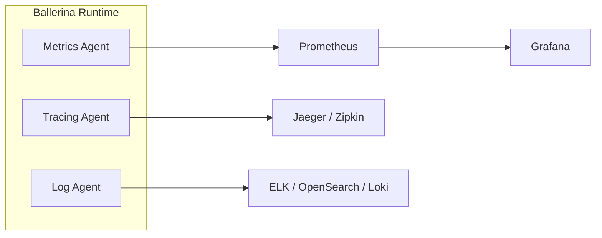

# Observe

Observability is how you understand an integration's runtime behavior, using metrics, logs, and traces. WSO2 Integrator emits all three, and you choose where they go.

Two distinct activities sit under this heading, and it is worth keeping them apart:

- **Monitoring** answers *"is it behaving as expected?"* It watches known indicators and alerts when they fall outside expected ranges. Useful for problems you anticipated.
- **Diagnosis** answers *"why is it behaving this way?"* It uses logs, metrics, and traces to explain what is actually happening. Useful for problems you did not anticipate.

:::info Observability follows your deployment
Like [managing](../manage.md) integrations, how you observe them depends on where they run:

- **Deployed to WSO2 Cloud:** observability is built in, with nothing to set up. See <CloudDocsLink to="/observe">Observe on WSO2 Cloud</CloudDocsLink>.
- **Running on your own infrastructure:** the [Integration Control Plane](../icp/index.md) surfaces health, metrics, and logs, and you can send the same telemetry to the open-source or commercial tools below.
:::

## The three pillars of observability

| Pillar | Purpose | Key Metrics | Built-in Support |
|--------|---------|-------------|-----------------|
| **Metrics** | Quantitative measurements of system behavior | Request counts, latency, error rates, throughput | Prometheus-compatible endpoint |
| **Logging** | Structured event records for debugging and auditing | Log entries with context, error details, request tracing | Ballerina `log` module with configurable levels |
| **Distributed Tracing** | End-to-end request flow across services | Span duration, service dependencies, bottlenecks | OpenTelemetry-based tracing |

## Architecture

## Instrument your integration

<PaletteGrid>

<PaletteCard icon="logging" href="/observe/logging">
  <h3 class="palette-card-title">Logging</h3>
  <ul class="palette-card-list">
    <li>Structured logging and log levels</li>
    <li>Log aggregation approaches</li>
  </ul>
</PaletteCard>

<PaletteCard icon="metrics" href="/observe/metrics">
  <h3 class="palette-card-title">Metrics</h3>
  <ul class="palette-card-list">
    <li>Prometheus metrics endpoint</li>
    <li>Built-in and custom metrics</li>
  </ul>
</PaletteCard>

<PaletteCard icon="event" href="/observe/tracing">
  <h3 class="palette-card-title">Distributed Tracing</h3>
  <ul class="palette-card-list">
    <li>Enable tracing and sampling</li>
    <li>Choose a tracing backend</li>
  </ul>
</PaletteCard>

</PaletteGrid>

## Monitor with the Integration Control Plane

<PaletteGrid>

<PaletteCard icon="manage-observe" href="/observe/icp-observability">
  <h3 class="palette-card-title">ICP Observability Setup</h3>
  <ul class="palette-card-list">
    <li>View logs and metrics in the ICP console</li>
    <li>Fluent Bit and OpenSearch setup</li>
  </ul>
</PaletteCard>

</PaletteGrid>

## Send telemetry to your own stack

<PaletteGrid>

<PaletteCard icon="external">
  <h3 class="palette-card-title">Open Source</h3>
  
Deploy and manage your own observability stack.

  

    <PaletteChip href="/observe/open-source/prometheus-grafana">Prometheus and Grafana</PaletteChip>
    <PaletteChip href="/observe/open-source/jaeger">Jaeger</PaletteChip>
    <PaletteChip href="/observe/open-source/zipkin">Zipkin</PaletteChip>
    <PaletteChip href="/observe/open-source/elastic-stack-elk">Elastic Stack (ELK)</PaletteChip>
    <PaletteChip href="/observe/open-source/opensearch">OpenSearch</PaletteChip>
    <PaletteChip href="/observe/open-source/opentelemetry">OpenTelemetry</PaletteChip>
  

</PaletteCard>

<PaletteCard icon="cloud">
  <h3 class="palette-card-title">Commercial Platforms</h3>
  
Send telemetry to a managed observability platform.

  

    <PaletteChip href="/observe/commercial/datadog">Datadog</PaletteChip>
    <PaletteChip href="/observe/commercial/new-relic">New Relic</PaletteChip>
    <PaletteChip href="/observe/commercial/moesif">Moesif</PaletteChip>
  

</PaletteCard>

<PaletteCard icon="template">
  <h3 class="palette-card-title">Recipes</h3>
  
Step-by-step setups for a complete stack.

  

    <PaletteChip href="/observe/recipes/local-development-stack">Local development</PaletteChip>
    <PaletteChip href="/observe/recipes/kubernetes-production-stack">Kubernetes production</PaletteChip>
    <PaletteChip href="/observe/recipes/elk-stack">ELK stack</PaletteChip>
    <PaletteChip href="/observe/recipes/opensearch-log-analytics">OpenSearch</PaletteChip>
    <PaletteChip href="/observe/recipes/datadog-setup">Datadog</PaletteChip>
  

</PaletteCard>

</PaletteGrid>
