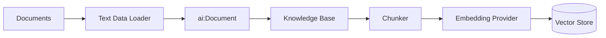

# RAG Ingestion

The ingestion integration converts raw documents into vectors that the RAG query integration can retrieve. It runs once (or on a schedule) to populate your vector knowledge base. The query integration then searches that knowledge base at runtime.

This page covers building the ingestion integration in WSO2 Integrator: creating an automation, wiring up a data loader, a knowledge base, and running the integration. For retrieval and query, see [RAG query](rag-query.md).

---

## What the RAG ingestion does

The `ingest` action on the Knowledge Base handles everything after document loading: it chunks each document, calls the embedding provider to produce vectors, and persists the resulting entries in the vector store.

---

:::info Prerequisites

- A document to ingest (Markdown, plain text, or other supported format).
- A configured embedding provider. The default WSO2 provider works out of the box. Run the WSO2 Integrator command `Ballerina: Configure default WSO2 model provider` if you haven't already.

---

## Step 1: Create an automation artifact

An **Automation** runs on integration startup. It is the right artifact type for a one-shot ingestion job.

1. On the **Design** tab, select **Add Artifact manually** (below the WSO2 Integrator Copilot's quick-start cards). If the project already has other artifacts, this same button appears directly as **+ Add Artifact** instead.
2. On the Artifacts page, select **Automation** and click **Create**.

    <ThemedImage
        alt="Artifacts page with Automation selected, showing the artifact-type filter tabs (All, Automation, Workflow, AI, API, Event, File, Other)."
        sources={{
            light: useBaseUrl('/img/genai/develop/rag-v5.1/rag-ingestion/01-rag-ingestion-artifacts-v5.1.png'),
            dark: useBaseUrl('/img/genai/develop/rag-v5.1/rag-ingestion/01-rag-ingestion-artifacts-v5.1.png'),
        }}
    />

---

## Step 2: Add a text data loader

A **Text Data Loader** reads a file from disk and wraps its content as an `ai:Document`. For the full list of available loaders, see [Data Loaders](../ai-building-blocks/data-loaders.md).

1. In the flow editor, click **+** to open the **Add Node** panel.
2. Go to **AI > RAG > Data Loader**.
3. Click **Add Data Loader**. The picker lists **Text Data Loader** and **Microsoft SharePoint Text Data Loader**. Select **Text Data Loader**.

    <ThemedImage
        alt="Data Loaders picker listing Text Data Loader and Microsoft SharePoint Text Data Loader, with Text Data Loader selected."
        sources={{
            light: useBaseUrl('/img/genai/develop/rag-v5.1/rag-ingestion/02-add-dataloader-v5.1.png'),
            dark: useBaseUrl('/img/genai/develop/rag-v5.1/rag-ingestion/02-add-dataloader-v5.1.png'),
        }}
    />

4. In the configuration panel, the **Data Loader Name** field auto-fills a generated name (for example `aiTextdataloader`). Rename it to something descriptive, and set **Paths**:

    | Field | Value |
    | --- | --- |
    | **Paths** | Path to the file you want to ingest, relative to the project root, for example `resources/knowledge.md`. Do not add a leading `/`; a leading slash is treated as an absolute path and the file won't be found. |
    | **Data Loader Name** | A variable name for the loader, for example `loader` |
    | **Result Type** | The variable type, locked to `ai:TextDataLoader`. |

    <ThemedImage
        alt="Text Data Loader configuration form with Paths set to a relative file path, Data Loader Name set to loader, and Result Type ai:TextDataLoader."
        sources={{
            light: useBaseUrl('/img/genai/develop/rag-v5.1/rag-ingestion/03-dataloader-form-v5.1.png'),
            dark: useBaseUrl('/img/genai/develop/rag-v5.1/rag-ingestion/03-dataloader-form-v5.1.png'),
        }}
    />

5. Click **Save**.

The node appears on the right panel. It does not load yet. You call its `load` function next.

---

## Step 3: Load the documents

Call the loader's `load` function to execute the read and get back an `ai:Document[]`.

1. Click on the `loader` connection and select the **Load** action, *"Loads documents as TextDocuments from a source."*

    <ThemedImage
        alt="loader connection expanded showing the Load action with its tooltip."
        sources={{
            light: useBaseUrl('/img/genai/develop/rag-v5.1/rag-ingestion/04-call-load-action-v5.1.png'),
            dark: useBaseUrl('/img/genai/develop/rag-v5.1/rag-ingestion/04-call-load-action-v5.1.png'),
        }}
    />

2. In the form that appears, set the result variable name, for example `documents`.

    `ai:Document` is a generic content container. It holds the raw text from the source plus optional metadata (file name, URL, category) that you can use to filter results during retrieval.

    <ThemedImage
        alt="Load action form with result variable name set to documents."
        sources={{
            light: useBaseUrl('/img/genai/develop/rag-v5.1/rag-ingestion/05-load-form-v5.1.png'),
            dark: useBaseUrl('/img/genai/develop/rag-v5.1/rag-ingestion/05-load-form-v5.1.png'),
        }}
    />

3. Click **Save**.

    <ThemedImage
        alt="Flow editor showing the load action node added to the automation flow."
        sources={{
            light: useBaseUrl('/img/genai/develop/rag-v5.1/rag-ingestion/06-load-node-v5.1.png'),
            dark: useBaseUrl('/img/genai/develop/rag-v5.1/rag-ingestion/06-load-node-v5.1.png'),
        }}
    />

---

## Step 4: Create a vector knowledge base

The **Vector Knowledge Base** owns the three pluggable parts of a RAG store: a vector store, an embedding provider, and a chunker.

1. Click **+** to add a node.
2. Go to **AI > RAG > Knowledge Base**. Click **Add Knowledge Base**. The picker lists **Vector Knowledge Base**, **Azure AI Search Knowledge Base**, and **WSO2 Cloud Knowledge Base**. Select **Vector Knowledge Base**.

    <ThemedImage
        alt="Knowledge Bases picker listing Vector Knowledge Base, Azure AI Search Knowledge Base, and WSO2 Cloud Knowledge Base."
        sources={{
            light: useBaseUrl('/img/genai/develop/rag-v5.1/rag-ingestion/07-knowledge-base-v5.1.png'),
            dark: useBaseUrl('/img/genai/develop/rag-v5.1/rag-ingestion/07-knowledge-base-v5.1.png'),
        }}
    />

3. The **ai : Vector Knowledge Base** form opens with three required building blocks, each created inline:

    | Field | Required | Values |
    | --- | --- | --- |
    | **Vector Store** | Yes | Click **+ Create New Vector Store** to pick from In Memory, Milvus, Pgvector, Pinecone, or Weaviate, then fill in its own create form (for the in-memory store, just a name; the **Similarity Metric** defaults to `COSINE`). |
    | **Embedding Model** | Yes | Click **+ Create New Embedding Model** to pick from Default Embedding Provider (WSO2), Azure, Google Vertex, OpenAI, or OpenRouter, then fill in its own create form. Produces 1536-dimensional dense vectors. |
    | **Chunker** | No | `AUTO` is the default and works for most cases. Switch to a specific chunker if retrieval quality degrades: use **Markdown** for `.md` files, **HTML** for web pages, or **Generic Recursive** for plain text. |
    | **Knowledge Base Name** | Yes | Auto-fills a generated name, for example `aiVectorknowledgebase`. |

    Each inline creation returns you to this form with the field filled in, and the new connection also appears in the left **Connections** tree.

    <ThemedImage
        alt="Completed ai : Vector Knowledge Base form with Vector Store, Embedding Model, Chunker set to AUTO, and Knowledge Base Name filled in."
        sources={{
            light: useBaseUrl('/img/genai/develop/rag-v5.1/rag-ingestion/08-vector-knowledge-base-form-v5.1.png'),
            dark: useBaseUrl('/img/genai/develop/rag-v5.1/rag-ingestion/08-vector-knowledge-base-form-v5.1.png'),
        }}
    />

4. Click **Save**.

 In-memory storage is not durable and is local to the current integration runtime. All vectors are lost when the integration stops. Use **In-Memory Vector Store** only when ingestion and query run in the same integration runtime/process for local development or testing. If ingestion and query run as separate integrations or processes, configure an external vector store such as Pinecone, pgvector, Weaviate, or Milvus, and set `vectorDimension: 1536` to match the WSO2 embedding provider's output.

Use the same embedding provider for ingestion and retrieval. Vectors produced by different providers are not comparable. If you ingest with the WSO2 default provider and retrieve with OpenAI (or vice versa), the similarity search returns no useful results.

See [Vector Stores](../ai-building-blocks/vector-stores.md) and [Knowledge Bases](../ai-building-blocks/knowledge-bases.md) for the full configuration reference.

---

## Step 5: Ingest the documents

Call `ingest` on the knowledge base to chunk, embed, and persist the loaded documents.

1. Click **+** after the knowledge base creation node.
2. Select the `aiVectorknowledgebase` connection and choose **Ingest**, *"Indexes a collection of chunks. Converts each chunk to an embedding and stores it in the vector store, making the chunk searchable through the retriever."*

    <ThemedImage
        alt="aiVectorknowledgebase connection expanded showing Ingest, Retrieve, and Delete By Filter actions, with the Ingest tooltip visible."
        sources={{
            light: useBaseUrl('/img/genai/develop/rag-v5.1/rag-ingestion/09-ingest-action-v5.1.png'),
            dark: useBaseUrl('/img/genai/develop/rag-v5.1/rag-ingestion/09-ingest-action-v5.1.png'),
        }}
    />

3. The **Documents** field defaults to **Record** mode. Switch it to **Expression** mode and set it to the `documents` variable from Step 3.

    <ThemedImage
        alt="Ingest action form with the Documents field in Expression mode, set to the documents variable."
        sources={{
            light: useBaseUrl('/img/genai/develop/rag-v5.1/rag-ingestion/10-ingest-doc-form-v5.1.png'),
            dark: useBaseUrl('/img/genai/develop/rag-v5.1/rag-ingestion/10-ingest-doc-form-v5.1.png'),
        }}
    />

4. Click **Save**.

    <ThemedImage
        alt="Flow editor showing the ingest node added after the knowledge base node."
        sources={{
            light: useBaseUrl('/img/genai/develop/rag-v5.1/rag-ingestion/11-with-ingest-node-v5.1.png'),
            dark: useBaseUrl('/img/genai/develop/rag-v5.1/rag-ingestion/11-with-ingest-node-v5.1.png'),
        }}
    />

The `ingest` action:

1. Passes each `ai:Document` through the configured Chunker.
2. Sends each chunk to the Embedding Provider to produce a vector.
3. Persists the vector + chunk content in the Vector Store.

---

## Step 6: Add a completion log

Add a **Log Info** node (under **Logging** in the Add Node panel, tooltip *"Prints info logs."*) after the ingest call to confirm the integration finished.

| Field | Value |
| --- | --- |
| **Msg** | For example, `"RAG ingestion complete."` |

This is optional but useful during development and when the automation runs on a schedule.

<ThemedImage
    alt="Completed RAG ingestion flow: Start, ai:load, ai:ingest, log:printInfo, and Error Handler."
    sources={{
        light: useBaseUrl('/img/genai/develop/rag-v5.1/rag-ingestion/12-full-rag-ingestion-pipeline-v5.1.png'),
        dark: useBaseUrl('/img/genai/develop/rag-v5.1/rag-ingestion/12-full-rag-ingestion-pipeline-v5.1.png'),
    }}
/>

---

## Running the integration

Click **Run** at the top right of the project view. WSO2 Integrator compiles and starts the integration. Because the artifact is an Automation, the ingestion function executes immediately on startup.

Watch the terminal output for the log message. If the run fails with `File does not exist`, check:

- The file path in **Paths** is relative to the project root and does not start with `/`. A leading slash is treated as an absolute path, so `resources/knowledge.md` works but `/resources/knowledge.md` does not.
- The WSO2 model provider is configured (`Ballerina: Configure default WSO2 model provider`).
- The embedding provider and vector store are reachable (for external stores).

    <ThemedImage
        alt="Terminal output showing the RAG ingestion integration completed successfully with the &quot;RAG ingestion complete.&quot; log message."
        sources={{
            light: useBaseUrl('/img/genai/develop/rag-v5.1/rag-ingestion/13-run-rag-ingestion-pipeline-v5.1.png'),
            dark: useBaseUrl('/img/genai/develop/rag-v5.1/rag-ingestion/13-run-rag-ingestion-pipeline-v5.1.png'),
        }}
    />

---

## Keeping the knowledge base up to date

The in-memory store is rebuilt on every restart, so re-running the integration re-ingests automatically. For durable stores:

- Use **Delete By Filter** before re-ingesting a document to avoid duplicates. Filter by a metadata field like `source` or `version`.
- Schedule the automation with a trigger (for example, an HTTP call, a cron, or a file-watch event) rather than running it once.

See [Knowledge Bases: delete by filter](../ai-building-blocks/knowledge-bases.md#available-actions) for details.

---

## What's next

- **[RAG query](rag-query.md)** — retrieve chunks at runtime and generate grounded responses.
- **[Data Loaders](../ai-building-blocks/data-loaders.md)** — read documents from disk, SharePoint, and other sources.
- **[Knowledge Bases](../ai-building-blocks/knowledge-bases.md)** — ingest, retrieve, and delete-by-filter reference.
- **[Vector Stores](../ai-building-blocks/vector-stores.md)** — picking and configuring a production store.
- **[Embedding Providers](../ai-building-blocks/embedding-providers.md)** — available providers and dimension requirements.
- **[Chunkers](../ai-building-blocks/chunkers.md)** — controlling how documents are split before ingest.
